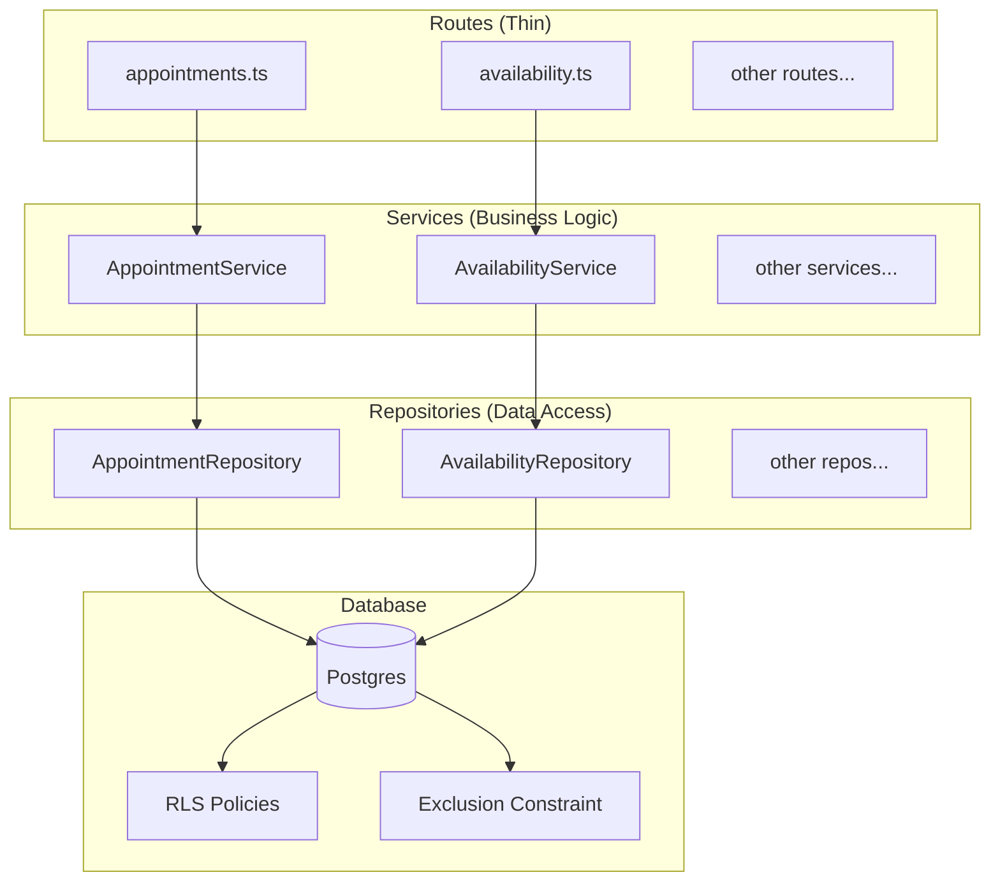

# Detailed Design — v2 Hardening & Improvements

## Overview

Phase 2 improvements for the scheduling platform focusing on testing, code quality, performance, and security. Building on the complete v1 implementation (14/15 steps done), this phase addresses gaps identified during codebase review.

**Goals:**
- Achieve full route test coverage with reliable test infrastructure
- Refactor heavy route files into clean Repository + Service architecture
- Strengthen linting with oxlint plugins and categories
- Improve booking performance with optimistic locking
- Harden authentication with secure cookie settings

## Detailed Requirements

### 1. Testing (Priority 1)

**Scope:** Full route coverage + critical path unit tests

| Requirement | Details |
|-------------|---------|
| Route integration tests | All CRUD routes: appointments, calendars, locations, resources, appointment-types, availability, clients, api-tokens, audit |
| Concurrent booking tests | Verify only one booking succeeds when two requests target same slot |
| Test infrastructure | Test helpers that bypass auth, inject context directly |
| Test database | Continue using PGLite (in-memory Postgres) |
| Existing tests to keep | availability-engine, RLS, DTO schemas, health endpoint |

**Not in scope:** Playwright e2e tests for admin UI

### 2. Code Refactor (Priority 2)

**Pattern:** Repository + Service layer separation

```
apps/api/src/
├── repositories/          # Data access layer
│   ├── appointments.ts
│   ├── calendars.ts
│   ├── locations.ts
│   ├── resources.ts
│   ├── appointment-types.ts
│   ├── availability.ts
│   ├── clients.ts
│   └── base.ts           # Shared query helpers
├── services/              # Business logic layer
│   ├── appointments.ts    # Orchestrates booking, validation
│   ├── calendars.ts
│   ├── locations.ts
│   ├── resources.ts
│   ├── appointment-types.ts
│   ├── availability.ts
│   └── clients.ts
├── routes/                # Thin HTTP handlers
│   └── (existing, refactored to call services)
```

**Heavy files to refactor:**
- `appointments.ts` (784 lines) → ~150 lines
- `availability.ts` (887 lines) → ~200 lines
- `appointment-types.ts` (579 lines) → ~100 lines

### 3. Linting (Priority 3)

**Configuration:** Strict with plugins

```json
{
  "plugins": ["typescript", "react", "import", "unicorn"],
  "categories": {
    "correctness": "error",
    "suspicious": "warn",
    "perf": "warn"
  }
}
```

**Rollout:**
1. Enable new rules as warnings first
2. Fix violations
3. Promote to errors

### 4. Performance (Priority 4)

#### 4.1 Optimistic Locking with Exclusion Constraint

**Current (pessimistic):**
```sql
SELECT id FROM calendars WHERE id = $1 FOR UPDATE;
-- + serializable isolation
```

**New (optimistic):**
```sql
-- Add exclusion constraint
ALTER TABLE appointments ADD CONSTRAINT no_overlapping_appointments
  EXCLUDE USING gist (
    calendar_id WITH =,
    tstzrange(start_at, end_at) WITH &&
  ) WHERE (status != 'cancelled');

-- No FOR UPDATE needed
-- Use READ COMMITTED (default)
-- Catch 23P01 exclusion violation
```

**Benefits:**
- Non-overlapping slots for same calendar can book concurrently
- Database enforces constraint (can't be bypassed)
- Simpler application code

#### 4.2 Availability Engine Query Optimization

**Current:** 7+ database round trips
```
1. Load appointment type
2. Get valid calendars
3. Load scheduling limits
4. Load availability rules
5. Load overrides
6. Load blocked times
7. Load existing appointments
8. Load resource constraints
```

**Optimized:** 2 queries
```
Query 1: Load all configuration data with JOINs
  - Appointment type + calendars + rules + overrides + limits + resources

Query 2: Load existing appointments for conflict checking
  - Filtered by date range and calendar IDs
```

### 5. Auth (Priority 5)

#### 5.1 RLS Enhancement (Hybrid)

Add RLS to `org_memberships` for defense-in-depth:

```sql
-- Add user context function
CREATE OR REPLACE FUNCTION current_user_id() RETURNS uuid AS $$
  SELECT nullif(current_setting('app.current_user_id', true), '')::uuid;
$$ LANGUAGE SQL STABLE;

-- Enable RLS on org_memberships
ALTER TABLE org_memberships ENABLE ROW LEVEL SECURITY;

CREATE POLICY user_memberships ON org_memberships
  FOR ALL
  USING (user_id = current_user_id())
  WITH CHECK (user_id = current_user_id());
```

Keep explicit check in auth middleware for clear error messages.

#### 5.2 Better Auth Hardening (Basic)

```typescript
advanced: {
  useSecureCookies: process.env.NODE_ENV === 'production',
  defaultCookieAttributes: {
    httpOnly: true,
    secure: process.env.NODE_ENV === 'production',
    sameSite: 'lax',
  },
  disableCSRFCheck: false,
}
```

**Deferred:** Rate limiting, password policy, IP tracking, email verification

## Architecture Overview



## Components and Interfaces

### Repository Interface Pattern

```typescript
// repositories/base.ts
export interface Repository<T, CreateInput, UpdateInput> {
  findById(id: string): Promise<T | null>
  findMany(filters: FilterOptions): Promise<PaginatedResult<T>>
  create(input: CreateInput): Promise<T>
  update(id: string, input: UpdateInput): Promise<T>
  delete(id: string): Promise<void>
}

// repositories/appointments.ts
export class AppointmentRepository {
  constructor(private db: Database) {}

  async findById(id: string): Promise<Appointment | null> { ... }
  async findOverlapping(calendarId: string, start: Date, end: Date): Promise<Appointment[]> { ... }
  async create(input: CreateAppointmentInput): Promise<Appointment> { ... }
  async updateStatus(id: string, status: AppointmentStatus): Promise<Appointment> { ... }
  async listWithFilters(filters: AppointmentFilters): Promise<PaginatedResult<Appointment>> { ... }
}
```

### Service Interface Pattern

```typescript
// services/appointments.ts
export class AppointmentService {
  constructor(
    private appointmentRepo: AppointmentRepository,
    private availabilityEngine: AvailabilityEngine,
    private eventEmitter: EventEmitter,
    private auditService: AuditService,
  ) {}

  async create(input: CreateAppointmentInput, context: AuthContext): Promise<Appointment> {
    // 1. Validate input
    // 2. Check availability
    // 3. Create via repository (handles exclusion constraint)
    // 4. Emit events
    // 5. Record audit
  }

  async cancel(id: string, reason: string, context: AuthContext): Promise<Appointment> { ... }
  async reschedule(id: string, newStart: Date, context: AuthContext): Promise<Appointment> { ... }
}
```

### Test Helper Interface

```typescript
// test-utils/context.ts
export function createTestContext(
  orgId: string,
  userId: string,
  role: 'admin' | 'staff' = 'admin'
): Context {
  return {
    orgId,
    userId,
    sessionId: null,
    tokenId: null,
    authMethod: 'test',
    role,
  }
}

// Usage in tests
const ctx = createTestContext(org.id, user.id)
const result = await appointmentService.create(input, ctx)
```

## Data Models

### New Migration: Exclusion Constraint

```sql
-- Migration: 0003_exclusion_constraint.sql

-- Enable btree_gist extension for exclusion constraints
CREATE EXTENSION IF NOT EXISTS btree_gist;

-- Add exclusion constraint to prevent overlapping appointments
ALTER TABLE appointments ADD CONSTRAINT no_overlapping_appointments
  EXCLUDE USING gist (
    calendar_id WITH =,
    tstzrange(start_at, end_at, '[)') WITH &&
  ) WHERE (status != 'cancelled');

-- Add index for availability queries
CREATE INDEX idx_appointments_calendar_time
  ON appointments (calendar_id, start_at, end_at)
  WHERE status != 'cancelled';
```

### New Migration: User RLS

```sql
-- Migration: 0004_user_rls.sql

-- User context function
CREATE OR REPLACE FUNCTION current_user_id() RETURNS uuid AS $$
  SELECT nullif(current_setting('app.current_user_id', true), '')::uuid;
$$ LANGUAGE SQL STABLE;

-- RLS on org_memberships
ALTER TABLE org_memberships ENABLE ROW LEVEL SECURITY;

CREATE POLICY user_memberships ON org_memberships
  FOR ALL
  USING (user_id = current_user_id())
  WITH CHECK (user_id = current_user_id());
```

## Error Handling

### Exclusion Constraint Violation

```typescript
// services/appointments.ts
async create(input: CreateAppointmentInput, context: AuthContext): Promise<Appointment> {
  try {
    return await this.appointmentRepo.create(input)
  } catch (error: any) {
    // PostgreSQL exclusion violation
    if (error.code === '23P01') {
      throw new ORPCError('CONFLICT', {
        message: 'SLOT_UNAVAILABLE: Time slot is no longer available',
      })
    }
    throw error
  }
}
```

## Testing Strategy

### Test File Structure

```
apps/api/src/
├── routes/
│   ├── appointments.test.ts      # Route integration tests
│   ├── calendars.test.ts
│   ├── locations.test.ts
│   ├── resources.test.ts
│   ├── appointment-types.test.ts
│   ├── availability.test.ts      # Existing, expand
│   ├── clients.test.ts
│   ├── api-tokens.test.ts
│   └── audit.test.ts
├── services/
│   ├── appointments.test.ts      # Service unit tests
│   └── ...
└── test-utils/
    ├── context.ts                # Test context helpers
    ├── factories.ts              # Test data factories
    └── setup.ts                  # Global test setup
```

### Test Categories

1. **Route Integration Tests**
   - Test full request → response cycle
   - Use test context (bypass auth)
   - Verify HTTP status codes, response shapes
   - Test error cases (not found, validation, conflicts)

2. **Service Unit Tests**
   - Test business logic in isolation
   - Mock repositories
   - Test edge cases and error handling

3. **Concurrent Booking Tests**
   - Parallel requests to same slot
   - Verify exactly one succeeds
   - Verify others get SLOT_UNAVAILABLE

### Test Data Factories

```typescript
// test-utils/factories.ts
export const factories = {
  org: (overrides?: Partial<Org>) => ({
    id: randomUUID(),
    name: 'Test Org',
    ...overrides,
  }),

  appointment: (overrides?: Partial<Appointment>) => ({
    id: randomUUID(),
    status: 'scheduled',
    startAt: new Date(),
    endAt: new Date(Date.now() + 60 * 60 * 1000),
    ...overrides,
  }),

  // ... other factories
}
```

## Appendices

### A. oxlint Configuration

```json
{
  "$schema": "https://raw.githubusercontent.com/oxc-project/oxc/main/npm/oxlint/configuration_schema.json",
  "plugins": ["typescript", "react", "import", "unicorn"],
  "categories": {
    "correctness": "error",
    "suspicious": "warn",
    "perf": "warn"
  },
  "rules": {
    "no-unused-vars": "error",
    "no-undef": "error",
    "no-console": "warn",
    "eqeqeq": "error",
    "no-var": "error",
    "prefer-const": "error",
    "typescript/no-explicit-any": "warn",
    "import/no-cycle": "error"
  },
  "settings": {
    "typescript": {
      "tsconfig": "./tsconfig.json"
    }
  },
  "ignorePatterns": ["node_modules", "dist", "*.d.ts"]
}
```

### B. Better Auth Configuration

```typescript
// apps/api/src/lib/auth.ts
export const auth = betterAuth({
  database: drizzleAdapter(db, {
    provider: 'pg',
    schema: {
      user: schema.users,
      session: schema.sessions,
      account: schema.accounts,
      verification: schema.verifications,
    },
  }),
  secret: config.auth.secret,
  baseURL: config.auth.baseUrl,
  emailAndPassword: {
    enabled: true,
    requireEmailVerification: false,
  },
  session: {
    expiresIn: 60 * 60 * 24 * 7,
    updateAge: 60 * 60 * 24,
  },
  advanced: {
    useSecureCookies: process.env.NODE_ENV === 'production',
    defaultCookieAttributes: {
      httpOnly: true,
      secure: process.env.NODE_ENV === 'production',
      sameSite: 'lax',
    },
    disableCSRFCheck: false,
  },
})
```

### C. Files to Modify

| File | Change |
|------|--------|
| `oxlintrc.json` | Add plugins and categories |
| `apps/api/src/lib/auth.ts` | Add advanced config |
| `apps/api/src/middleware/rls.ts` | Set user context |
| `apps/api/src/routes/appointments.ts` | Extract to service/repo |
| `apps/api/src/routes/availability.ts` | Extract to service/repo |
| `apps/api/src/routes/appointment-types.ts` | Extract to service/repo |
| `packages/db/src/migrations/` | Add exclusion constraint, user RLS |
