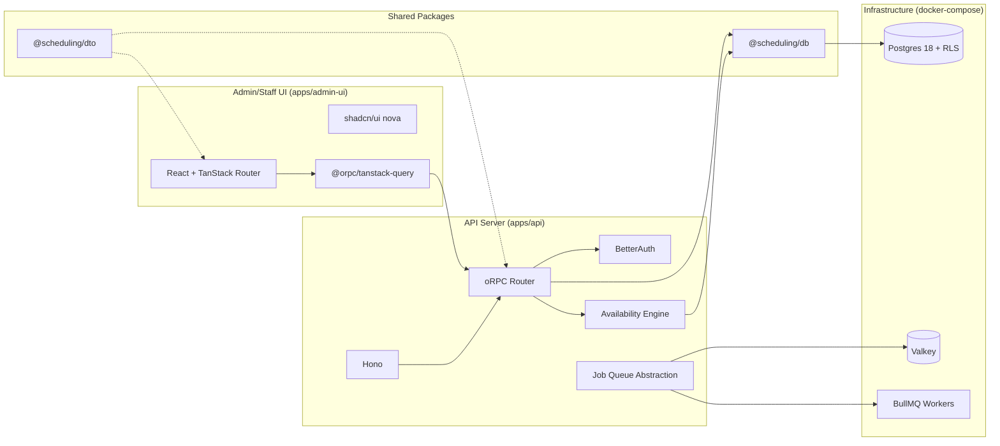

# Detailed Design — Acuity-style Scheduling (v1)

## Overview

Build an API-first scheduling platform matching core Acuity capabilities for appointments, appointment types, calendars, resources, locations, and availability with sophisticated scheduling rules. The system is multi-tenant (users can belong to multiple orgs), uses Postgres 18 with RLS for tenancy, runs on Bun with Hono + oRPC, and exposes a REST API under `/v1` with auto-generated OpenAPI spec. Admin/staff users interact through a React + TanStack Router UI (shadcn/ui nova style). Payments, SMS, and client-facing booking UI are out of scope for v1.

## Monorepo Structure

```
scheduling-app/
├── apps/
│   ├── admin-ui/          # React + TanStack Router + shadcn/ui
│   └── api/               # Bun + Hono + oRPC
├── packages/
│   ├── db/                # @scheduling/db - Drizzle schema, migrations
│   └── dto/               # @scheduling/dto - Shared types, oRPC contracts
├── docker-compose.yml     # Postgres 18 + Valkey
├── .env                   # Shared environment config
├── pnpm-workspace.yaml
└── package.json
```

### Package Naming

All packages use scoped names:
- `@scheduling/db` - Drizzle schema and migrations
- `@scheduling/dto` - Shared types and oRPC router definitions

## Detailed Requirements

### Functional Scope

- **Appointments**
  - Create, read, update, reschedule, cancel, mark no-show
  - List with filters (calendar, appointment type, client info, date/time range)
  - Assign staff/resource and enforce availability rules
  - Store client info for bookings (no public UI yet)

- **Appointment Types**
  - CRUD (admin/staff)
  - Duration, padding before/after, capacity (class size), price optional
  - Offered across multiple locations/calendars

- **Calendars**
  - CRUD (admin/staff)
  - Calendar timezone and availability rules
  - Calendar-level scheduling limits that override global defaults

- **Locations**
  - CRUD (admin/staff)
  - Location default timezone

- **Resources**
  - CRUD (admin/staff)
  - Assignable to locations and appointment types
  - Capacity enforcement for concurrent appointments

- **Availability**
  - Weekly recurring hours
  - Per-date overrides and temporary repeating hours
  - Blocked time (single, multi-day, recurring)
  - Min/max notice windows
  - Start-time interval rule
  - Appointment type groups (availability + limits by group)
  - Slot generation that respects duration + padding
  - Resource constraints and capacity per slot

- **Webhook/Notification Framework**
  - Domain events emitted on key entity changes
  - Event outbox table for eventual webhook delivery
  - No SMS/notifications in v1

### Non-functional

- Multi-tenant data isolation enforced via Postgres RLS
- Timezone-aware data model; default timezone on location and calendar; appointment can override
- REST API under `/v1` with OpenAPI spec generation
- Admin/staff auth via BetterAuth (session) + API tokens for server-to-server
- Bun runtime; BullMQ with Valkey for background jobs

## Architecture Overview



## Technology Stack

| Layer | Technology |
|-------|------------|
| Runtime | Bun |
| API Framework | Hono |
| RPC/API | oRPC (OpenAPI generation) |
| Frontend | React + TanStack Router |
| UI Components | shadcn/ui (nova style, Base UI) |
| Data Fetching | @orpc/tanstack-query |
| Database | Postgres 18 (UUID7, RLS) |
| ORM | Drizzle v1 |
| Auth | BetterAuth + Drizzle adapter |
| Job Queue | BullMQ + Valkey |
| Testing | Vitest + PGLite |
| Linting | oxlint (strict, native TS parser) |
| Formatting | oxfmt |
| Config | standard-env |
| Package Manager | pnpm workspaces |

## Components and Interfaces

### API Layer (apps/api)

```
apps/api/
├── src/
│   ├── index.ts           # Hono server entry
│   ├── config.ts          # standard-env config
│   ├── routes/            # oRPC route handlers
│   │   ├── appointments.ts
│   │   ├── calendars.ts
│   │   ├── appointment-types.ts
│   │   ├── locations.ts
│   │   ├── resources.ts
│   │   └── availability.ts
│   ├── middleware/
│   │   ├── auth.ts        # BetterAuth middleware
│   │   └── rls.ts         # Sets Postgres RLS context
│   ├── services/
│   │   ├── availability-engine.ts
│   │   └── jobs.ts        # Job queue abstraction
│   └── lib/
│       └── orpc.ts        # oRPC instance setup
└── package.json
```

**oRPC Setup:**

```typescript
// lib/orpc.ts
import { os } from '@orpc/server'
import { RPCHandler } from '@orpc/server/fetch'

export const o = os.context<{ orgId: string; userId: string }>()

// routes/appointments.ts
import { o } from '../lib/orpc'
import { z } from 'zod'
import { AppointmentSchema, CreateAppointmentSchema } from '@scheduling/dto'

export const listAppointments = o
  .route({ method: 'GET', path: '/v1/appointments' })
  .input(z.object({
    calendarId: z.string().uuid().optional(),
    startDate: z.string().datetime().optional(),
    endDate: z.string().datetime().optional(),
  }))
  .output(z.array(AppointmentSchema))
  .handler(async ({ input, context }) => {
    // Implementation using @scheduling/db
  })
```

**Hono Integration:**

```typescript
// index.ts
import { Hono } from 'hono'
import { RPCHandler } from '@orpc/server/fetch'
import { router } from './routes'
import { authMiddleware } from './middleware/auth'
import { rlsMiddleware } from './middleware/rls'

const app = new Hono()

app.use('*', authMiddleware)
app.use('*', rlsMiddleware)

const handler = new RPCHandler(router)

app.use('/v1/*', async (c, next) => {
  const { matched, response } = await handler.handle(c.req.raw, {
    prefix: '/v1',
    context: { orgId: c.get('orgId'), userId: c.get('userId') }
  })
  if (matched) return c.newResponse(response.body, response)
  await next()
})

export default app
```

### Shared Types (packages/dto)

```
packages/dto/
├── src/
│   ├── index.ts
│   ├── schemas/           # Zod schemas
│   │   ├── appointment.ts
│   │   ├── calendar.ts
│   │   ├── appointment-type.ts
│   │   ├── location.ts
│   │   ├── resource.ts
│   │   └── availability.ts
│   └── contracts/         # oRPC contract types (inferred from routes)
└── package.json
```

### Database Layer (packages/db)

```
packages/db/
├── src/
│   ├── index.ts           # Drizzle client export
│   ├── schema/
│   │   ├── index.ts
│   │   ├── orgs.ts
│   │   ├── users.ts
│   │   ├── appointments.ts
│   │   ├── calendars.ts
│   │   ├── appointment-types.ts
│   │   ├── locations.ts
│   │   ├── resources.ts
│   │   ├── availability.ts
│   │   └── auth.ts        # BetterAuth tables
│   └── migrations/
├── drizzle.config.ts
└── package.json
```

### Admin UI (apps/admin-ui)

```
apps/admin-ui/
├── src/
│   ├── main.tsx
│   ├── routes/
│   │   ├── __root.tsx
│   │   ├── appointments/
│   │   ├── calendars/
│   │   ├── appointment-types/
│   │   ├── locations/
│   │   └── resources/
│   ├── components/
│   │   └── ui/            # shadcn/ui components
│   ├── lib/
│   │   ├── api.ts         # oRPC client setup
│   │   └── query.ts       # TanStack Query setup
│   └── styles/
│       └── globals.css    # Tailwind
├── index.html
├── tailwind.config.ts
└── package.json
```

**oRPC Client Setup:**

```typescript
// lib/api.ts
import { createORPCClient } from '@orpc/client'
import { createORPCQueryUtils } from '@orpc/tanstack-query'
import type { Router } from '@scheduling/dto/contracts'

export const client = createORPCClient<Router>({
  baseURL: '/v1',
})

export const orpc = createORPCQueryUtils(client)

// Usage in component
const { data } = orpc.appointments.list.useQuery({
  calendarId: selectedCalendar,
})
```

### Auth & Tenancy

- BetterAuth for session auth (admin/staff UI)
- API tokens for server-to-server access
- Postgres RLS enforces org isolation
- Middleware sets `app.current_org_id` session variable for each request

```typescript
// middleware/rls.ts
import { db } from '@scheduling/db'
import { sql } from 'drizzle-orm'

export async function rlsMiddleware(c, next) {
  const orgId = c.get('orgId')
  await db.execute(sql`SET app.current_org_id = ${orgId}`)
  await next()
}
```

### Availability Engine

- Input: appointment type, calendar(s), date range, timezone
- Output: available dates and times, plus "check" capability
- Core steps:
  1. Load calendar availability rules (weekly + overrides + blocked)
  2. Apply scheduling limits (min/max notice, intervals, per-slot caps)
  3. Generate candidate slots based on duration + padding
  4. Filter by existing appointments
  5. Filter by resource capacity/constraints

### Background Jobs

- Abstract `JobQueue` interface with BullMQ + Valkey implementation
- Jobs: webhook delivery, audit log compaction, availability cache refresh

```typescript
// services/jobs.ts
import { Queue, Worker } from 'bullmq'
import { config } from '../config'

const connection = { host: config.valkey.host, port: config.valkey.port }

export const webhookQueue = new Queue('webhooks', { connection })

export const webhookWorker = new Worker('webhooks', async (job) => {
  // Deliver webhook
}, { connection })
```

## Data Models

### Core Tables (Drizzle Schema)

```typescript
// packages/db/src/schema/index.ts
import { pgTable, uuid, text, timestamp, integer, boolean, jsonb } from 'drizzle-orm/pg-core'
import { sql } from 'drizzle-orm'

const id = uuid('id').primaryKey().default(sql`uuidv7()`)
const orgId = uuid('org_id').notNull().references(() => orgs.id)
const timestamps = {
  createdAt: timestamp('created_at', { withTimezone: true }).defaultNow().notNull(),
  updatedAt: timestamp('updated_at', { withTimezone: true }).defaultNow().notNull(),
}

export const orgs = pgTable('orgs', {
  id,
  name: text('name').notNull(),
  ...timestamps,
})

export const users = pgTable('users', {
  id,
  email: text('email').notNull().unique(),
  name: text('name'),
  ...timestamps,
})

export const orgMemberships = pgTable('org_memberships', {
  id,
  orgId,
  userId: uuid('user_id').notNull().references(() => users.id),
  role: text('role').notNull(), // 'admin' | 'staff'
  ...timestamps,
})

export const locations = pgTable('locations', {
  id,
  orgId,
  name: text('name').notNull(),
  timezone: text('timezone').notNull(),
  ...timestamps,
})

export const calendars = pgTable('calendars', {
  id,
  orgId,
  locationId: uuid('location_id').references(() => locations.id),
  name: text('name').notNull(),
  timezone: text('timezone').notNull(),
  ...timestamps,
})

export const appointmentTypes = pgTable('appointment_types', {
  id,
  orgId,
  name: text('name').notNull(),
  durationMin: integer('duration_min').notNull(),
  paddingBeforeMin: integer('padding_before_min').default(0),
  paddingAfterMin: integer('padding_after_min').default(0),
  capacity: integer('capacity').default(1),
  metadata: jsonb('metadata'),
  ...timestamps,
})

export const appointmentTypeCalendars = pgTable('appointment_type_calendars', {
  id,
  appointmentTypeId: uuid('appointment_type_id').notNull().references(() => appointmentTypes.id),
  calendarId: uuid('calendar_id').notNull().references(() => calendars.id),
})

export const resources = pgTable('resources', {
  id,
  orgId,
  locationId: uuid('location_id').references(() => locations.id),
  name: text('name').notNull(),
  quantity: integer('quantity').default(1).notNull(),
  ...timestamps,
})

export const appointmentTypeResources = pgTable('appointment_type_resources', {
  id,
  appointmentTypeId: uuid('appointment_type_id').notNull().references(() => appointmentTypes.id),
  resourceId: uuid('resource_id').notNull().references(() => resources.id),
  quantityRequired: integer('quantity_required').default(1).notNull(),
})

export const clients = pgTable('clients', {
  id,
  orgId,
  firstName: text('first_name').notNull(),
  lastName: text('last_name').notNull(),
  email: text('email'),
  phone: text('phone'),
  ...timestamps,
})

export const appointments = pgTable('appointments', {
  id,
  orgId,
  calendarId: uuid('calendar_id').notNull().references(() => calendars.id),
  appointmentTypeId: uuid('appointment_type_id').notNull().references(() => appointmentTypes.id),
  clientId: uuid('client_id').references(() => clients.id),
  startAt: timestamp('start_at', { withTimezone: true }).notNull(),
  endAt: timestamp('end_at', { withTimezone: true }).notNull(),
  timezone: text('timezone').notNull(),
  status: text('status').notNull(), // 'scheduled' | 'confirmed' | 'cancelled' | 'no_show'
  notes: text('notes'),
  ...timestamps,
})

export const availabilityRules = pgTable('availability_rules', {
  id,
  calendarId: uuid('calendar_id').notNull().references(() => calendars.id),
  weekday: integer('weekday').notNull(), // 0-6
  startTime: text('start_time').notNull(), // HH:MM
  endTime: text('end_time').notNull(),
  intervalMin: integer('interval_min'),
  groupId: uuid('group_id'),
})

export const availabilityOverrides = pgTable('availability_overrides', {
  id,
  calendarId: uuid('calendar_id').notNull().references(() => calendars.id),
  date: text('date').notNull(), // YYYY-MM-DD
  startTime: text('start_time'),
  endTime: text('end_time'),
  isBlocked: boolean('is_blocked').default(false),
  intervalMin: integer('interval_min'),
  groupId: uuid('group_id'),
})

export const blockedTime = pgTable('blocked_time', {
  id,
  calendarId: uuid('calendar_id').notNull().references(() => calendars.id),
  startAt: timestamp('start_at', { withTimezone: true }).notNull(),
  endAt: timestamp('end_at', { withTimezone: true }).notNull(),
  recurringRule: text('recurring_rule'), // RRULE
})

export const schedulingLimits = pgTable('scheduling_limits', {
  id,
  calendarId: uuid('calendar_id').references(() => calendars.id),
  groupId: uuid('group_id'),
  minNoticeHours: integer('min_notice_hours'),
  maxNoticeDays: integer('max_notice_days'),
  maxPerSlot: integer('max_per_slot'),
  maxPerDay: integer('max_per_day'),
  maxPerWeek: integer('max_per_week'),
})

export const eventOutbox = pgTable('event_outbox', {
  id,
  orgId,
  type: text('type').notNull(),
  payload: jsonb('payload').notNull(),
  status: text('status').notNull(), // 'pending' | 'delivered' | 'failed'
  nextAttemptAt: timestamp('next_attempt_at', { withTimezone: true }),
  ...timestamps,
})
```

### RLS Policies

```sql
-- Enable RLS on all tenant tables
ALTER TABLE appointments ENABLE ROW LEVEL SECURITY;

CREATE POLICY org_isolation ON appointments
  USING (org_id = current_setting('app.current_org_id')::uuid);

-- Repeat for all org-scoped tables
```

## Configuration

```typescript
// apps/api/src/config.ts
import { envParse } from 'standardenv'
import { z } from 'zod'

export const config = envParse(process.env, {
  server: {
    port: {
      format: z.string().transform(Number),
      default: 3000,
      env: 'PORT',
    },
  },
  db: {
    url: {
      format: z.string(),
      env: 'DATABASE_URL',
    },
  },
  valkey: {
    host: {
      format: z.string(),
      default: 'localhost',
      env: 'VALKEY_HOST',
    },
    port: {
      format: z.string().transform(Number),
      default: 6380,
      env: 'VALKEY_PORT',
    },
  },
  auth: {
    secret: {
      format: z.string(),
      env: 'AUTH_SECRET',
    },
  },
})
```

## Docker Compose

```yaml
# docker-compose.yml
services:
  postgres:
    image: postgres:18-alpine
    ports:
      - "5433:5432"
    environment:
      POSTGRES_USER: scheduling
      POSTGRES_PASSWORD: scheduling
      POSTGRES_DB: scheduling
    volumes:
      - postgres-data:/var/lib/postgresql/data

  valkey:
    image: valkey/valkey:8-alpine
    ports:
      - "6380:6379"
    volumes:
      - valkey-data:/data
    command: valkey-server --appendonly yes

volumes:
  postgres-data:
  valkey-data:
```

## Error Handling

- API returns structured errors (code, message, details)
- 400 for validation errors
- 401/403 for auth/tenancy
- 404 for missing resources
- 409/422 for conflict/time unavailable

```typescript
// Consistent error response shape
{
  error: {
    code: 'SLOT_UNAVAILABLE',
    message: 'The requested time slot is no longer available',
    details: { requestedSlot: '2024-01-15T10:00:00Z' }
  }
}
```

## Testing Strategy

### Test Infrastructure

- **Vitest** for all tests
- **PGLite** for database tests (in-process Postgres, no server needed)

```typescript
// packages/db/src/test-utils.ts
import { PGlite } from '@electric-sql/pglite'
import { drizzle } from 'drizzle-orm/pglite'
import * as schema from './schema'

export async function createTestDb() {
  const client = new PGlite()
  const db = drizzle(client, { schema })
  // Run migrations
  return db
}
```

### Test Categories

- **Unit tests** for availability engine (slot generation, overrides, limits, resources)
- **Integration tests** for appointment create/reschedule/cancel enforcing rules
- **RLS tests** to verify org isolation
- **API tests** for CRUD endpoints and filters

## Development Workflow

```bash
# Start infrastructure (once)
docker compose up -d

# Install dependencies
pnpm install

# Run database migrations
pnpm --filter @scheduling/db migrate

# Start development servers
pnpm dev  # Runs api + admin-ui concurrently

# Run tests
pnpm test

# Lint and format
pnpm lint
pnpm format
```

## Appendices

### Technology Choices

| Decision | Choice | Rationale |
|----------|--------|-----------|
| RPC Framework | oRPC over tRPC | OpenAPI spec generation for external consumers |
| Database | Postgres 18 | Native UUID7, mature RLS support |
| ORM | Drizzle v1 | Type-safe, lightweight, good migration story |
| Test DB | PGLite | Fast, no server, real Postgres compatibility |
| Queue | Valkey + BullMQ | Redis-compatible, Linux Foundation backed |
| Monorepo | pnpm workspaces | Fast, disk-efficient, native workspace support |

### Research Findings (Summary)

- Acuity availability flow: dates → times → check-times → book
- Scheduling rules: weekly hours, overrides, blocked time, min/max notice, intervals, padding, appointment type groups
- Resources are internal, quantity-based, cross-calendar within same timezone
- Webhooks use HMAC of raw payload and emit appointment events

### Alternative Approaches Considered

- **Pure tRPC API** - Rejected; need REST for external consumers
- **Single-tenant architecture** - Rejected; must support multi-org
- **Redis** - Replaced with Valkey (compatible, better governance)
- **bun:test** - Replaced with Vitest (better ecosystem, watch mode)
