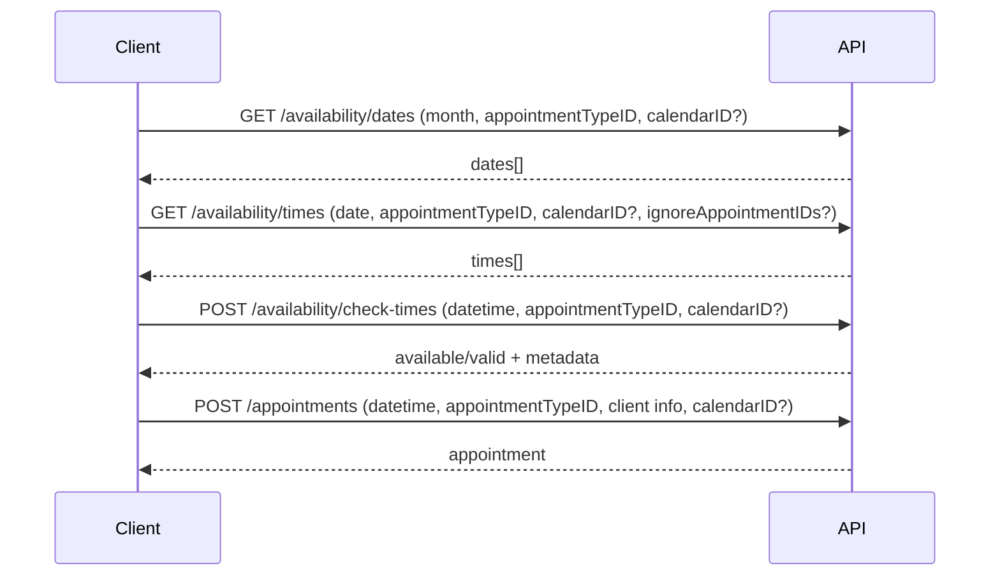

# Acuity API Research Notes (public docs)

## Scope covered
- Appointments (list/get/create/update/cancel/reschedule)
- Appointment types
- Availability (dates/times/check-times)
- Calendars (list)
- Webhooks (static + dynamic)

## Core endpoints and behaviors

### Appointments
- `GET /appointments` supports rich filtering (calendar, appointment type, client, date/time window, status, pagination, field filters).
- `POST /appointments` creates a booking and can fail with availability conflicts (e.g., `double_booked`, `time_unavailable`).
- `PUT /appointments/{id}` updates client/contact fields and can move calendar without changing time.
- `PUT /appointments/{id}/cancel` cancels or marks a no-show; supports `admin=true` and `noEmail=true` in query.
- `PUT /appointments/{id}/reschedule` changes time (and optional calendar) and supports `admin=true` and `noEmail=true` in query. Rescheduling can use `ignoreAppointmentIDs` on availability lookup to keep the existing slot visible during reschedule.

### Appointment types
- `GET /appointment-types` returns appointment type fields including duration, padding before/after, class size, and the calendar IDs where each type is offered.

### Availability
- `GET /availability/dates` returns dates (by month) with at least one slot.
- `GET /availability/times` returns time slots for a date; use together with `availability/dates`.
- `POST /availability/check-times` validates a time slot and can be called with an array to check multiple times at once. Docs note validation happens per calendar, and global limits like resources are considered per individual calendar when checking multiple calendars at once. The response includes a `valid` boolean.

### Calendars
- `GET /calendars` lists calendars with timezone and other metadata.

### Webhooks
- Static webhooks: configured in Acuity UI; sends `application/x-www-form-urlencoded` payloads with `action`, `id`, `calendarID`, `appointmentTypeID` (plus order events for packages/gift certificates/subscriptions).
- Dynamic webhooks: create/list/delete via API; events include `appointment.scheduled`, `appointment.rescheduled`, `appointment.canceled`, `appointment.changed`, `order.completed`. Max 25 webhooks per account. Target URL must be on port 80 or 443.
- Signature verification: `x-acuity-signature` is Base64 HMAC-SHA256 of raw request body using API key as secret (admin API key for static, user API key for dynamic). Webhooks are retried with exponential backoff for up to 24 hours on 500/connection failures.

## Availability/booking flow (from docs)

## Key items to map into our system
- Appointment type padding (before/after) and class size map directly to availability rules.
- Availability APIs show a two-phase lookup (dates -> times -> check) that we should preserve for v1 parity.
- Reschedule flow depends on availability checks that can ignore the current appointment ID.
- Webhook signatures require access to raw request body; capture before JSON parsing.

## Open questions / gaps (not in these docs)
- Detailed scheduling rule semantics: min/max notice windows, blackout dates, location-specific hours, resource constraints beyond class size.
- Resource model specifics and how multiple resources interact with appointment types across multiple locations.
- Location entities are referenced in UI but not explicit in these endpoint docs.

## Sources
- https://developers.acuityscheduling.com/reference/appointment-types
- https://developers.acuityscheduling.com/reference/get-availability-dates
- https://developers.acuityscheduling.com/reference/get-availability-times
- https://developers.acuityscheduling.com/reference/availability-check-times
- https://developers.acuityscheduling.com/reference/put-appointments-id-reschedule
- https://developers.acuityscheduling.com/docs/webhooks
- https://developers.acuityscheduling.com/page/webhooks-webhooks-webhooks
- https://developers.acuityscheduling.com/page/how-to-schedule-an-appointment-with-the-acuity-scheduling-api
