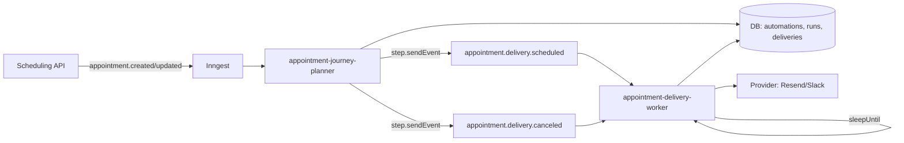
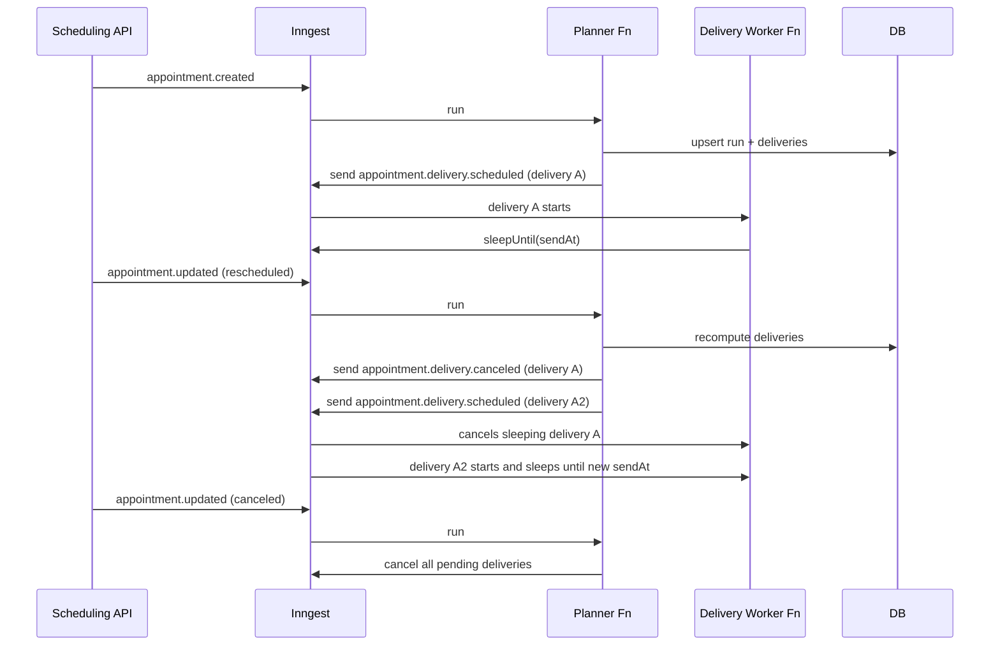
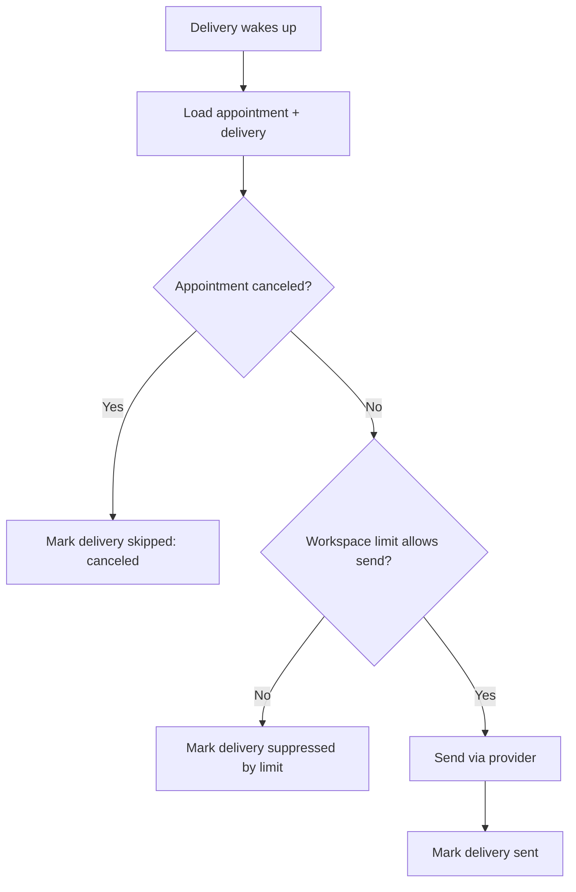

# Design Doc: Appointment Journey Automations (Notifications Only)

## 1) Scope

We will implement automations that trigger **only** on appointment lifecycle events:

* **Scheduled** (appointment created)
* **Rescheduled** (appointment updated, time-related change)
* **Canceled** (appointment updated, status change)

Out of scope:

* Triggers on any other domain models (clients, calendars, availability, etc.). Those already exist as webhooks via Svix and are not part of this system.

Primary use case:

* Notification workflows (SMS, email, Slack), with time-based waits relative to the appointment start time.

---

## 2) Product Principles

1. **Appointment-centric mental model**

* Users think: “For each appointment, send these notifications.”
* The system must keep future notifications in sync if the appointment time changes.

2. **Intent-first UX**

* Avoid developer-centric terms (correlation, restart events).
* Make “what ends this journey” explicit (Exit condition).

3. **Safe defaults**

* Default behavior prevents duplicate notifications and wrong-time reminders.

---

## 3) Key UX Concepts and Naming

### 3.1 Canonical terms

* **Appointment Journey**: a workflow that tracks one appointment through time.
* **Start condition**: what begins the journey for an appointment.
* **Exit condition**: what ends the journey for an appointment.
* **If already running**: what to do if the start condition happens again for the same appointment.
* **Keep in sync**: whether reschedules update future waits and notifications.
* **Message limits**: workspace-level caps for sends.

### 3.2 “One workflow per appointment” definition

Default rule:

* One active journey run per `(automation, appointmentId)`.

Important clarification:

* You can have multiple automations per appointment. Example:

  * Automation A: “Reminders”
  * Automation B: “Cancellation notification”
    Each is independent and still “one per appointment” within that automation.

---

## 4) Builder UX Specification

### 4.1 Replace “Switch node” with an Appointment Journey Trigger node

We remove the need for “fork by create/update/delete” at the top of the workflow.

Instead, a single trigger node defines:

* Start condition
* Keep in sync behavior
* Exit condition
* Re-entry behavior

#### Canvas (ASCII)

```
┌──────────────────────────┐
│ Appointment Journey       │
│ Trigger                  │
└─────────────┬────────────┘
              │
          (nodes...)
              │
      ┌───────▼────────┐
      │ Wait            │
      │ (relative time) │
      └───────┬────────┘
              │
      ┌───────▼────────┐
      │ Send SMS        │
      └────────────────┘
```

### 4.2 Appointment Journey Trigger properties (ASCII)

```
┌───────────────────────────────────────────────┐
│ Appointment Journey Trigger                     │
├───────────────────────────────────────────────┤
│ Start condition                                 │
│   Start when:  [ Appointment scheduled ▾ ]      │
│                                                   │
│ If already running for this appointment           │
│   (•) Keep running                                │
│       Meaning: ignore duplicate start, keep plan  │
│   ( ) Start over                                  │
│       Meaning: end previous run as Superseded and │
│       create a new one                            │
│       Note: does NOT run Exit path                │
│                                                   │
│ Keep in sync (recommended)                        │
│   [x] When appointment is rescheduled             │
│       Behavior: Update future timing              │
│       (no separate “On update” branch in v1)      │
│                                                   │
│ Exit condition                                   │
│   Exit when: [x] Appointment canceled             │
│                                                   │
│ Advanced ▸                                        │
│   Key: Appointment ID (read-only in v1)           │
│   Event mapping (internal)                        │
└───────────────────────────────────────────────┘
```

Decisions incorporated:

* “On exit path runs on start over”: **No** (start over ends as Superseded only).
* “On update path”: **Hidden** (no separate branch in v1).

### 4.3 Wait node (appointment-relative, reschedule-aware)

Wait is a first-class node because reminders depend on time.

#### Wait node (ASCII)

```
┌───────────────────────────────────────────────┐
│ Wait                                            │
├───────────────────────────────────────────────┤
│ Wait until                                       │
│   [ 1 hour before appointment start ]            │
│                                                   │
│ If appointment time changes                       │
│   (•) Reschedule automatically                    │
│   ( ) Keep original schedule (advanced)           │
│   ( ) Exit journey (advanced)                     │
└───────────────────────────────────────────────┘
```

Default:

* Reschedule automatically.

### 4.4 Notification nodes: provider-specific action nodes

Use explicit provider actions in v1:

* `Send Resend` (email)
* `Send Slack` (Slack message)

This keeps journey authoring explicit while preserving message-limit governance.

---

## 5) Workspace Message Limits (Global Notification Governance)

### 5.1 Problem

Even with correct scheduling semantics, a workspace may:

* Send too many messages per day
* Over-message during operational incidents (mass reschedules)

We need workspace-level controls similar to Customer.io’s “message limits” concept, including:

* A limit + time frame (max timeframe up to 7 days in Customer.io) ([Customer.io][1])
* Ability for messages to count toward or ignore the limit ([Customer.io][1])
* Optional retry behavior for messages that hit the limit (Customer.io supports auto-retry concepts) ([Customer.io][1])

### 5.2 Proposed workspace settings UX (ASCII)

```
┌───────────────────────────────────────────────┐
│ Workspace Settings: Message Limits              │
├───────────────────────────────────────────────┤
│ Enable message limits:   [x]                    │
│                                                   │
│ Limits (per channel)                              │
│   SMS:    Max [ 500 ] per [ 24 hours ▾ ]          │
│   Email:  Max [ 2000 ] per [ 24 hours ▾ ]         │
│   Slack:  Max [ 1000 ] per [ 24 hours ▾ ]         │
│                                                   │
│ When limit is reached                             │
│   (•) Suppress messages (mark as “Not sent”)      │
│   ( ) Delay messages until capacity returns        │
│                                                   │
│ Retry policy (optional)                           │
│   Retry suppressed time-sensitive messages for:    │
│   [ 0 hours ▾ ] (advanced)                         │
└───────────────────────────────────────────────┘
```

### 5.3 Semantics

* Message limits are evaluated **at send time**.
* Each send action node can opt in/out of counting toward limits (default: counts).
* If suppressed:

  * Record a delivery event as “Suppressed by message limits”
  * Continue workflow execution (default behavior)
  * Optional advanced mode: retry until expiration

### 5.4 Engineering enforcement approach (v1)

Implement in our DB/service layer (not Inngest config) because:

* Workspace limits must be per-tenant configurable.
* Inngest throttling/rate limits are configured per function definition and are not suitable for per-workspace variable limits (they are still useful for provider protection; see Section 8.6).

Data model recommendation:

* `workspace_message_limits(workspace_id, channel, period_seconds, max_count, mode, retry_seconds)`
* `message_deliveries(id, workspace_id, appointment_id, automation_id, node_id, channel, scheduled_for, attempted_at, status, reason)`

Counting window:

* Use fixed windows per `period_seconds` to keep v1 simple.
* Window key: `window_start = floor(now / period) * period`

Atomic check:

* `message_limit_counters(workspace_id, channel, window_start, count)`
* Transaction:

  * lock counter row
  * if count >= max_count: suppress
  * else increment and allow

---

## 6) Event Model (Appointments Only)

### 6.1 Incoming events

We will only ingest:

* `appointment.created`
* `appointment.updated`

All events include:

* `data` (current appointment)
* `previous` (prior appointment snapshot)

Decision incorporated:

* We rely on `previous` to classify lifecycle transitions.

### 6.2 Derived lifecycle classification

From incoming events:

**Scheduled**

* `appointment.created`

**Canceled**

* `appointment.updated` where `previous.status != "canceled"` and `data.status == "canceled"`

**Rescheduled**

* `appointment.updated` where any of:

  * `startAt` changed
  * `duration` changed
  * `timezone` changed (if relevant)
    and not canceled

All other updates:

* Ignored by this automation system (v1).

---

## 7) Runtime Semantics (Appointment Journeys)

### 7.1 Identity

* `journeyKey = automationId + ":" + appointmentId`

### 7.2 States

* `Active`
* `Completed`
* `Exited` (canceled)
* `Superseded` (start condition received again and re-entry policy is “Start over”)

### 7.3 Re-entry behavior

* **Keep running** (default): ignore duplicate start; update appointment snapshot.
* **Start over**:

  * Mark previous run as `Superseded`
  * Create a new run from scratch
  * Do not execute exit behavior for the superseded run (per decision)

---

## 8) Inngest Implementation Plan (Specific Features and Patterns)

### 8.1 Overview of Inngest building blocks we will use

* `step.sleepUntil` to schedule future execution without compute while waiting ([Inngest][2])
* `cancelOn` to cancel long sleeps when an appointment is canceled or rescheduled (pattern supported by Inngest) ([Inngest][3])
* Concurrency keys to serialize per appointmentId and avoid race conditions ([Inngest][4])
* `step.sendEvent` for reliable internal fan-out events ([Inngest][5])
* Event idempotency via event `id` (24h dedupe) and function idempotency keys as a backstop ([Inngest][6])
* Optional debounce for “noisy reschedule bursts” if we add it later ([Inngest][7])

### 8.2 Core architecture: Planner + Delivery model

To keep reminders correct under reschedules and cancellations, we will split responsibilities:

1. **Journey Planner function**

* Triggered by appointment lifecycle events (created/updated)
* Determines which deliveries should exist (what, when)
* Creates, updates, or cancels “Delivery jobs”

2. **Delivery function (one per message)**

* Sleeps until send time
* Can be canceled (cancelOn) if appointment changes
* Sends through provider and records result

This avoids long-running “single function with many waits” complexity and makes cancellations and reschedules explicit and reliable using `cancelOn` + `step.sleepUntil`. ([Inngest][3])

### 8.3 Functions

#### A) `appointment-journey-planner`

Trigger:

* `appointment.created`
* `appointment.updated`

Responsibilities:

* Classify lifecycle: scheduled/rescheduled/canceled (using `previous`)
* Load automations enabled for this workspace (appointment-only)
* For each automation:

  * Ensure a run record exists for `(automationId, appointmentId)`
  * Compute intended deliveries from the graph (see 8.4)
  * For each delivery:

    * Upsert a delivery record
    * Emit `appointment.delivery.scheduled` event with deterministic id
  * For removed deliveries:

    * Emit `appointment.delivery.canceled` event

Internal events emitted with `step.sendEvent` for reliability. ([Inngest][5])

#### B) `appointment-delivery-worker`

Trigger:

* `appointment.delivery.scheduled`

Config:

* `cancelOn`:

  * cancel when `appointment.delivery.canceled` matches deliveryId
  * cancel when `appointment.updated` indicates cancellation for same appointmentId (optional shortcut)
  * cancel when `appointment.updated` indicates reschedule for same appointmentId (optional shortcut)

Cancel-on-events uses `if` matching between trigger event and cancellation event. ([Inngest][3])

Inside:

* `step.sleepUntil("sleep", scheduledFor)`
* Before sending:

  * Reload appointment snapshot
  * If appointment is canceled, do not send
  * Enforce workspace message limits
* Send message (Resend/Slack)
* Persist delivery result

Concurrency:

* Concurrency key on `deliveryId` to ensure at most one sender step executes per delivery. ([Inngest][8])

### 8.4 Compiling the workflow graph to deliveries (v1 constraints)

To keep scope tight and implementable:

Supported node types in v1:

* Wait (relative to appointment start)
* Send Resend
* Send Slack
* Log (optional internal only)

Supported structure:

* Linear path from trigger
* Optional conditions can be added later

Planner compilation logic:

* Traverse nodes sequentially
* Maintain a “current offset” relative to appointment start
* Each Wait adjusts offset
* Each send action produces one delivery with:

  * `scheduledFor = appointment.startAt + offset`
  * `expiresAt` (default: scheduledFor + 6h, configurable per node later)

Reschedule:

* Recompute all `scheduledFor` values
* For any changed delivery time:

  * cancel old delivery job
  * schedule new one

Cancel:

* cancel all pending deliveries

### 8.5 Idempotency strategy

Event-level dedupe:

* When emitting `appointment.delivery.scheduled`, set deterministic event `id` so duplicates do not create duplicate function runs in a 24h window. ([Inngest][6])

Delivery-level dedupe:

* Unique DB constraint on `(automationId, appointmentId, nodeId, scheduledFor)` or `(deliveryId)`.

Provider-level idempotency:

* Use `deliveryId` as idempotency key where provider supports it.
* Always record “sent” state before acknowledging success.

### 8.6 Optional Inngest flow-control for provider protection (not workspace message limits)

Inngest throttling and concurrency are still useful to protect provider APIs:

* Throttling delays function run starts when capacity is exceeded, FIFO, non-lossy. ([Inngest][9])
* Concurrency limits actively executing steps, sleeping does not count. ([Inngest][4])

We can add:

* `throttle: { limit: X, period: "1m" }` on the delivery worker to smooth spikes to Resend/Slack if needed. ([Inngest][9])

Do not rely on Inngest throttling for per-workspace configurable message limits (those belong in our DB policy layer).

---

## 9) Mermaid Diagrams

### 9.1 System architecture



### 9.2 Reschedule and cancellation behavior



### 9.3 Message limits enforcement (send time)



---

## 10) Validation, Warnings, and Preview (UX Requirements)

### 10.1 Publish-time checks

* If an automation contains any Wait node, enforce:

  * Keep in sync must be enabled (reschedule-aware), otherwise warn: “Reminder may send at wrong time if appointment changes.”

* If a send action node is immediate on “rescheduled” start condition and duplicates could happen:

  * Recommend adding a short debounce option later (not in v1).

### 10.2 Timeline preview (required)

Given an example appointment:

* Show each send action node’s computed scheduled time.
* Show what changes when startAt changes.
* Show that cancellation removes pending deliveries.

This is the primary user confidence mechanism for time-based notifications.

---

## 11) Deliverables for Engineering

### 11.1 V1 milestones

1. **Automation definition model** (appointment-only, linear)
2. **Planner function** (created/updated, classify transitions using previous)
3. **Delivery worker** (sleepUntil + cancelOn + send)
4. **Workspace message limits** (DB-enforced, UI + per-node “count toward limits”)
5. **Preview + basic warnings**

### 11.2 Explicit decisions to implement

* Start over marks prior run as `Superseded`, does not execute any exit behavior.
* No “On update path” branch in v1.
* All appointment events include `previous`; use it to classify scheduled/rescheduled/canceled.

---

## 12) Notes on Inngest Docs Used

Key Inngest features referenced:

* `cancelOn` for canceling sleeping/long-running functions on events. ([Inngest][3])
* `step.sleepUntil` for durable scheduling of future execution. ([Inngest][2])
* Concurrency behavior and the fact that sleeping/waiting does not count toward concurrency. ([Inngest][4])
* `step.sendEvent` for reliable fan-out from within functions. ([Inngest][5])
* Idempotency via event ids and function idempotency configuration. ([Inngest][6])

Customer.io message limits used as product prior art:

* Workspace message limit setup and per-message enablement, max timeframe 7 days, and behavior for undeliverable messages. ([Customer.io][1])

[1]: https://docs.customer.io/journeys/message-limits/?utm_source=chatgpt.com "Message Limits"
[2]: https://www.inngest.com/docs/features/inngest-functions/steps-workflows/sleeps?utm_source=chatgpt.com "Sleeps - Inngest Documentation"
[3]: https://www.inngest.com/docs/features/inngest-functions/cancellation/cancel-on-events "Cancel on Events - Inngest Documentation"
[4]: https://www.inngest.com/docs/guides/concurrency?utm_source=chatgpt.com "Concurrency management - Inngest Documentation"
[5]: https://www.inngest.com/docs/reference/functions/step-send-event?utm_source=chatgpt.com "Send Event"
[6]: https://www.inngest.com/docs/guides/handling-idempotency?utm_source=chatgpt.com "Handling idempotency - Inngest Documentation"
[7]: https://www.inngest.com/docs/reference/functions/debounce?utm_source=chatgpt.com "Debounce functions - Inngest Documentation"
[8]: https://www.inngest.com/docs/functions/concurrency?utm_source=chatgpt.com "Managing concurrency - Inngest Documentation"
[9]: https://www.inngest.com/docs/guides/throttling "Throttling - Inngest Documentation"
