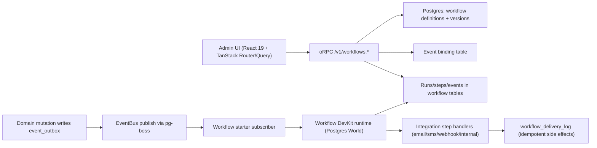

# Workflow Builder Research and Technical Design (React 19 + TanStack Router/Query, No Next.js)

Date: 2026-02-10  
Repo: `/Users/alancohen/projects/scheduling-app`  
Requested scope: architecture, graph engine/library options, node/edge model, versioning, validation, execution mapping, UX constraints, phased implementation plan, and a concrete design proposal for this stack.

## 1. Executive Summary

The strongest path for this repo is:

1. Build the workflow builder UI in `apps/admin-ui` using `@xyflow/react` (React Flow) and existing TanStack Router/Query + oRPC patterns.
2. Store workflow definitions as immutable versions in Postgres with org-scoped RLS tables, plus a compiled execution plan artifact.
3. Trigger execution from domain events via the accepted Event Bus direction (`pg-boss` + Workflow DevKit Postgres World).
4. Keep execution semantics server-side and deterministic with explicit idempotency keys, cancellation links, and publish-time validation.
5. Roll out in phases: read/write graph MVP, validation/publish, runtime mapping, observability, then advanced UX.

This matches the accepted RFC in this repo (`docs/event-bus-workflow-runtime-rfc.md`) and avoids Next.js-specific assumptions from Vercel examples.

## 2. Repository Constraints and Existing Direction

### 2.1 Stack and architecture constraints

- Frontend is React 19 + Vite + TanStack Router/Query (`apps/admin-ui/package.json`).
- API is Hono + oRPC on Bun (`apps/api/package.json`).
- Data model is Drizzle with org-scoped RLS, UUIDv7 IDs, and shared DTO schemas (`packages/db/src/schema/index.ts`, `packages/dto/src/schemas/*`).

### 2.2 Accepted runtime direction already in this repo

The accepted RFC states:

- migrate async runtime from BullMQ/Valkey to `pg-boss`, and
- adopt Workflow DevKit Postgres World for durable orchestration.

Source: `docs/event-bus-workflow-runtime-rfc.md`

The builder design below is intentionally aligned to that accepted direction.

## 3. Primary Sources and Current Examples

### 3.1 Workflow builder examples (current)

- workflow-builder.dev: [workflow-builder.dev](https://workflow-builder.dev)
- Vercel template: [vercel-labs/workflow-builder-template](https://github.com/vercel-labs/workflow-builder-template)
- Vercel starter: [vercel/workflow-builder-starter](https://github.com/vercel/workflow-builder-starter)

Key reference files used:

- State and autosave patterns:
  - [workflow-builder-template/lib/workflow-store.ts](https://github.com/vercel-labs/workflow-builder-template/blob/main/lib/workflow-store.ts)
  - [workflow-builder-starter/lib/workflow-store.ts](https://github.com/vercel/workflow-builder-starter/blob/main/lib/workflow-store.ts)
- Canvas/node handling:
  - [workflow-builder-starter/components/workflow/workflow-canvas.tsx](https://github.com/vercel/workflow-builder-starter/blob/main/components/workflow/workflow-canvas.tsx)
- Execution mapping in example app:
  - [workflow-builder-starter/lib/workflow-executor.workflow.ts](https://github.com/vercel/workflow-builder-starter/blob/main/lib/workflow-executor.workflow.ts)
- Validation/issues UX:
  - [workflow-builder-template/components/overlays/workflow-issues-overlay.tsx](https://github.com/vercel-labs/workflow-builder-template/blob/main/components/overlays/workflow-issues-overlay.tsx)
  - [workflow-builder-template/lib/condition-validator.ts](https://github.com/vercel-labs/workflow-builder-template/blob/main/lib/condition-validator.ts)

### 3.2 Workflow DevKit and Postgres World

- Hono guide: [docs/getting-started/hono](https://github.com/vercel/workflow/blob/main/docs/content/docs/getting-started/hono.mdx)
- Vite guide: [docs/getting-started/vite](https://github.com/vercel/workflow/blob/main/docs/content/docs/getting-started/vite.mdx)
- Postgres World: [docs/deploying/world/postgres-world](https://github.com/vercel/workflow/blob/main/docs/content/docs/deploying/world/postgres-world.mdx)
- Workflows/steps: [docs/foundations/workflows-and-steps](https://github.com/vercel/workflow/blob/main/docs/content/docs/foundations/workflows-and-steps.mdx)
- Idempotency: [docs/foundations/idempotency](https://github.com/vercel/workflow/blob/main/docs/content/docs/foundations/idempotency.mdx)
- Errors/retries: [docs/foundations/errors-and-retries](https://github.com/vercel/workflow/blob/main/docs/content/docs/foundations/errors-and-retries.mdx)
- Event sourcing model: [docs/how-it-works/event-sourcing](https://github.com/vercel/workflow/blob/main/docs/content/docs/how-it-works/event-sourcing.mdx)
- Start/getWorld API docs:
  - [start](https://github.com/vercel/workflow/blob/main/docs/content/docs/api-reference/workflow-api/start.mdx)
  - [getWorld](https://github.com/vercel/workflow/blob/main/docs/content/docs/api-reference/workflow-api/get-world.mdx)

### 3.3 Graph/UI engine and layout options

- React Flow (`@xyflow/react`): [xyflow README](https://github.com/xyflow/xyflow/tree/main/packages/react)
- Dagre layout: [dagre README](https://github.com/dagrejs/dagre)
- ELK.js layout: [elkjs README](https://github.com/kieler/elkjs)
- Rete.js engine/editor: [rete README](https://github.com/retejs/rete)
- AntV X6: [X6 README](https://github.com/antvis/X6)

### 3.4 TanStack Router/Query primary docs

- Router search params: [Search Params Guide](https://tanstack.com/router/latest/docs/framework/react/guide/search-params)
- Router data loading: [Data Loading Guide](https://tanstack.com/router/latest/docs/framework/react/guide/data-loading)
- Query keys: [Query Keys Guide](https://tanstack.com/query/latest/docs/framework/react/guides/query-keys)
- Mutation invalidation: [Invalidations from Mutations](https://tanstack.com/query/latest/docs/framework/react/guides/invalidations-from-mutations)
- Optimistic updates: [Optimistic Updates](https://tanstack.com/query/latest/docs/framework/react/guides/optimistic-updates)

### 3.5 Queue/runtime infrastructure

- pg-boss primary docs: [pg-boss README](https://github.com/timgit/pg-boss)

## 4. What to Reuse vs What to Avoid from Vercel Examples

### 4.1 Reuse patterns

- Controlled graph canvas with React Flow nodes/edges and explicit state updates.
- Issue overlay pattern that blocks execution on known graph/config errors.
- Autosave behavior and dirty-state indicator.
- Separation between graph definition and runtime execution logs.

### 4.2 Do not copy directly

- Next.js routing/data fetching assumptions.
- Template-specific auth/session and API route shape.
- Direct expression `Function(...)` evaluation approach for arbitrary user logic.

The local equivalent should use TanStack Router loaders/search-params + TanStack Query + oRPC.

## 5. Architecture Proposal for This Repo (Concrete)



### 5.1 UI layer (`apps/admin-ui`)

- New route family under authenticated area, e.g.:
  - `/_authenticated/workflows`
  - `/_authenticated/workflows/$workflowId`
- Use TanStack Router search params for builder UI state (`selectedNodeId`, `tab`, `runId`) with validation.
- Use TanStack Query + existing `orpc` utilities for all CRUD and validation endpoints.
- Keep modal behavior consistent with existing URL-driven modal pattern already used in repo.

### 5.2 API layer (`apps/api`)

Add new oRPC router namespace, e.g. `workflowRoutes`, on UI router only:

- `workflow.listDefinitions`
- `workflow.getDefinition`
- `workflow.createDefinition`
- `workflow.updateDraftGraph`
- `workflow.validateDraft`
- `workflow.publishDraft`
- `workflow.listRuns`
- `workflow.getRun`
- `workflow.cancelRun`

Authorization model:

- Use `authed` for read actions.
- Use `adminOnly` for create/update/publish/cancel in same style as existing admin mutations.

### 5.3 Runtime layer (`apps/api` worker)

- Subscribe to domain events and resolve active workflow bindings.
- Start runs through Workflow DevKit runtime APIs (orchestrator workflow function + step handlers).
- Map run IDs and business entities to cancellation linkage table.

## 6. Graph Engine and Library Options

## 6.1 Evaluated options

| Option | Strengths | Weaknesses | Fit for this repo |
| --- | --- | --- | --- |
| React Flow (`@xyflow/react`) | Mature React-first graph editor, controlled nodes/edges, large ecosystem | Layout is external concern, you own many editor behaviors | Best fit; closest to Vercel examples and React stack |
| Rete.js | Powerful graph engine + plugin architecture | Heavier conceptual model, more custom integration | Good if building compiler-first DSL tool, likely overkill for v1 |
| AntV X6 | Rich diagramming surface | Less common in React/TanStack ecosystem, steeper adoption | Medium fit; higher integration cost |
| Custom SVG/canvas | Full control | High maintenance, reinvents core graph editor behaviors | Not recommended |

Recommendation: use `@xyflow/react` for v1.

## 6.2 Auto-layout engines (secondary choice)

| Engine | Best for | Tradeoffs | Recommendation |
| --- | --- | --- | --- |
| Dagre | Fast layered DAG layouts | Simpler heuristics | Default for v1 auto-layout |
| ELK.js | Complex constraints and large graphs | Heavier and slower | Add as optional advanced mode later |

## 7. Node and Edge Data Model

## 7.1 Canonical persisted graph document

Store graph document as immutable version payload (`graph_json`) with explicit schema version.

```ts
export type WorkflowGraphDocumentV1 = {
  schemaVersion: 1;
  metadata: {
    name: string;
    description?: string;
    timezone?: string;
  };
  nodes: WorkflowNodeV1[];
  edges: WorkflowEdgeV1[];
};

export type WorkflowNodeV1 = {
  id: string; // uuidv7 generated in app layer
  nodeType: "trigger" | "action" | "control";
  typeKey: string; // ex: "appointment.created", "wait", "send.email"
  position: { x: number; y: number };
  label?: string;
  enabled: boolean;
  config: Record<string, unknown>;
  ui?: {
    width?: number;
    collapsed?: boolean;
  };
};

export type WorkflowEdgeV1 = {
  id: string;
  sourceNodeId: string;
  sourcePort: string; // ex: "out", "true", "false"
  targetNodeId: string;
  targetPort: string; // ex: "in"
  condition?: {
    kind: "always" | "expression";
    expression?: string;
  };
  priority?: number;
};
```

### 7.2 Node catalog (v1)

Initial node catalog tailored to this product:

- Trigger nodes:
  - `event.trigger` with `eventType` constrained to DTO webhook/domain event types in `packages/dto/src/schemas/webhook.ts`.
- Control nodes:
  - `wait.duration`
  - `if.condition`
- Action nodes:
  - `send.email`
  - `send.sms`
  - `http.request`
  - `internal.webhook`

Keep catalog minimal in v1. Expand only with real product use cases.

### 7.3 Edge semantics

- One inbound edge per node in v1 except explicit merge/branch nodes.
- Branching represented by source ports (`true`, `false`) from `if.condition`.
- Enforce DAG in v1 (no cycles).

## 8. Database and Versioning Design

## 8.1 Proposed tables (org-scoped + RLS)

Aligning to existing schema conventions (`org_id`, uuidv7, timestamps, RLS policies), add:

1. `workflow_definitions`
2. `workflow_definition_versions`
3. `workflow_bindings`
4. `workflow_run_entity_links` (already proposed in RFC)
5. `workflow_delivery_log` (already proposed in RFC)

Suggested shape:

```sql
workflow_definitions
- id uuid primary key default uuidv7()
- org_id uuid not null references orgs(id)
- key text not null
- name text not null
- status text not null -- draft | active | archived
- active_version_id uuid null
- created_at timestamptz not null default now()
- updated_at timestamptz not null default now()
- unique(org_id, key)

workflow_definition_versions
- id uuid primary key default uuidv7()
- org_id uuid not null references orgs(id)
- definition_id uuid not null references workflow_definitions(id) on delete cascade
- version integer not null
- graph_schema_version integer not null
- graph_json jsonb not null
- compiled_plan_json jsonb not null
- checksum text not null
- created_by uuid references users(id)
- created_at timestamptz not null default now()
- unique(definition_id, version)

workflow_bindings
- id uuid primary key default uuidv7()
- org_id uuid not null references orgs(id)
- definition_id uuid not null references workflow_definitions(id) on delete cascade
- version_id uuid not null references workflow_definition_versions(id)
- event_type text not null
- enabled boolean not null default true
- created_at timestamptz not null default now()
- unique(org_id, definition_id, event_type)
```

### 8.2 Version lifecycle

- Draft is mutable.
- Publish creates immutable `workflow_definition_versions` row.
- `workflow_definitions.active_version_id` points to current published version.
- Runs always reference an immutable version ID.
- No in-place edits of published graph.

### 8.3 Concurrency model

- Optimistic concurrency on draft updates via `updated_at` or `revision` integer.
- Publish checks revision to avoid lost updates.

## 9. Validation Strategy

Use a layered validation pipeline:

1. Structural validation (graph integrity)
2. Node config validation (schema and required fields)
3. Binding validation (trigger compatibility)
4. Runtime-compile validation (execution plan generation)

### 9.1 Structural checks

- At least one trigger node.
- Exactly one `event.trigger` in v1 (keeps semantics simple).
- All edges reference existing nodes and valid ports.
- No cycles (topological sort succeeds).
- Reachability: every non-trigger node reachable from trigger.

### 9.2 Node config checks

- Per-node Zod schemas in `packages/dto` (or new shared workflow DTO module).
- Integration references must belong to current org/user context.
- Required field checks should produce machine-readable issues for inline UI display.

### 9.3 Expression safety

Vercel example currently uses expression prevalidation + `Function(...)` evaluation in its template code. For this repo, prefer a strict DSL parser/evaluator and avoid executing arbitrary JavaScript in user-authored expressions.

Minimum requirement for v1:

- allowlist operators and methods,
- reject assignment/import/eval/new,
- static parse before save and before publish.

### 9.4 Validation API shape

`workflow.validateDraft` returns:

```ts
type ValidationIssue = {
  code:
    | "MISSING_REQUIRED_FIELD"
    | "BROKEN_REFERENCE"
    | "INVALID_EDGE"
    | "CYCLE_DETECTED"
    | "UNREACHABLE_NODE"
    | "INVALID_EXPRESSION"
    | "MISSING_INTEGRATION";
  severity: "error" | "warning";
  nodeId?: string;
  edgeId?: string;
  field?: string;
  message: string;
};
```

## 10. Execution Mapping (Graph to Runtime)

## 10.1 Compile step

On publish, compile graph JSON to normalized plan JSON:

- resolved topological order,
- branch tables,
- node handler IDs,
- validated config payload per node,
- deterministic step identity templates.

This avoids doing expensive graph analysis at run time.

## 10.2 Runtime execution model

When an event arrives:

1. EventBus subscriber finds enabled bindings for `event.type`.
2. Load active version and compiled plan.
3. Start workflow run via Workflow DevKit APIs.
4. Execute steps using node handler registry.
5. Record outbound side effects with deterministic idempotency key in `workflow_delivery_log`.

Idempotency key strategy:

- Use deterministic key per run+node+target, and where possible map provider idempotency key to Workflow step identity (`stepId`) per Workflow DevKit idempotency guidance.

### 10.3 Cancellation mapping

Use `workflow_run_entity_links` to map runs to domain entities (appointment, client, etc.), then:

- on disqualifying events (cancel/reschedule/opt-out), resolve impacted runs,
- cancel via world run APIs,
- enforce send-time guard checks before each external send.

### 10.4 Retry semantics

- Let Workflow DevKit retry step failures (default retry behavior),
- use `FatalError` for non-retryable business failures,
- use `RetryableError` for throttled/transient cases with explicit backoff.

## 11. UX Constraints and Interaction Design

## 11.1 Consistency constraints for this codebase

- Follow existing TanStack route + search-param state patterns.
- Use immediate local-close-before-URL-clear modal behavior to avoid close flicker.
- Keep keyboard and command-palette patterns consistent with existing shortcut system.

## 11.2 Canvas UX constraints

- Performance target: smooth interaction up to ~300 nodes (v1 soft limit).
- Autosave debounce for text edits; immediate save for graph topology edits.
- Always show unsaved/publishing/validation states explicitly.
- Prevent destructive edits while run is live unless user confirms.

### 11.3 Validation UX constraints

- Do not allow publish when validation has errors.
- Allow run with warnings only via explicit confirmation.
- Issues panel must deep-link to node/field.

### 11.4 Accessibility constraints

- Keyboard equivalents for add node, delete, connect mode, run, save.
- ARIA labels and focus management for inspector and issue list.
- Contrast and focus indicators must match existing UI standards.

## 12. TanStack Router/Query Integration Blueprint

### 12.1 Route shape

- `/_authenticated/workflows` list route
- `/_authenticated/workflows/$workflowId` editor route
- Search params (validated):
  - `selectedNodeId?: string`
  - `tab?: "properties" | "runs" | "issues"`
  - `runId?: string`

### 12.2 Query keys and invalidation

Define query key factories in one module:

- `workflowKeys.list()`
- `workflowKeys.detail(id)`
- `workflowKeys.validation(id)`
- `workflowKeys.runs(id, filters)`

Mutation invalidation rules:

- `updateDraftGraph` invalidates `detail` + `validation`.
- `publishDraft` invalidates `detail`, `list`, `runs`.
- `cancelRun` invalidates `runs` + `runDetail`.

## 13. Phased Implementation Plan

## Phase 0: Technical spike and guardrails

Deliverables:

- React Flow canvas spike in admin-ui route.
- Runtime compatibility spike for Workflow DevKit Postgres World in this Bun/Hono deployment model.
- Finalized workflow node catalog v1.

Exit criteria:

- Decision doc for runtime process model (same worker process vs sidecar if needed).
- Measured canvas performance baseline.

## Phase 1: Definitions and versioning backend

Deliverables:

- Drizzle schema updates for workflow definition/version/binding tables.
- oRPC CRUD for draft and version lifecycle.
- RLS policies for all workflow tables.

Exit criteria:

- Create/edit/publish archived round-trip works end to end.

## Phase 2: Builder UI MVP

Deliverables:

- List + editor routes in TanStack Router.
- Canvas with add/remove/connect/move nodes.
- Inspector pane with node config forms.
- Autosave and unsaved changes state.

Exit criteria:

- Users can build and publish a valid graph without JSON editing.

## Phase 3: Validation and issues UX

Deliverables:

- Validation endpoint and structured issues payload.
- Issue panel/overlay with jump-to-field behavior.
- Publish guard rails.

Exit criteria:

- Invalid graphs are blocked from publish.
- Validation messages are actionable from UI.

## Phase 4: Runtime mapping and event triggers

Deliverables:

- Event binding resolution and workflow start path.
- Compiled plan executor and step handler registry.
- Run listing/details/cancel APIs.

Exit criteria:

- Published workflow triggers from real domain events.
- Run lifecycle visible in admin UI.

## Phase 5: Idempotency, cancellation, and observability hardening

Deliverables:

- `workflow_delivery_log` uniqueness constraints and retry-safe side effects.
- Run-entity linkage and cancellation on disqualifying events.
- Operational dashboards and alert thresholds.

Exit criteria:

- Duplicate side effects prevented in retry scenarios.
- Cancellation correctness proven in integration tests.

## Phase 6: Advanced UX and scale features

Deliverables:

- Auto-layout, templates, duplication, import/export.
- Branch debugging and richer run timeline.
- Performance tuning for larger graphs.

Exit criteria:

- Editor remains usable at target graph sizes.

## 14. Risks and Mitigations

| Risk | Impact | Mitigation |
| --- | --- | --- |
| Workflow runtime/process mismatch in Bun deployment model | High | Complete Phase 0 spike before schema lock-in; use sidecar runtime if necessary |
| Unsafe expression execution | High | Enforce strict expression DSL and static validation, avoid arbitrary JS evaluation |
| Postgres load increase from queue + workflow runtime | High | Capacity tests, queue tuning, retention settings, and staged rollout |
| Multi-tenant data leakage in workflow tooling | High | RLS on all workflow tables + strict `org_id` checks in oRPC handlers |
| Graph schema drift over time | Medium | Explicit `graph_schema_version` + compile-time migration strategy |
| UX complexity and state bugs in URL-driven editor | Medium | Follow existing URL-modal patterns and validate search params |

## 15. Concrete Technical Design Decision Set

For this repo, implement the following by default:

1. `@xyflow/react` canvas in `apps/admin-ui`.
2. Workflow definition persistence as immutable versions in Postgres.
3. Node catalog v1 limited to event trigger, wait, condition, and 3-4 core actions.
4. Publish-time compile to normalized execution plan JSON.
5. EventBus trigger integration through accepted pg-boss + Workflow DevKit path.
6. Deterministic idempotency keys + unique delivery log constraints.
7. TanStack Router search-param driven editor state with existing modal-close pattern.
8. Validation-first UX where publish is blocked on errors.

This gives a durable foundation without Next.js coupling, while remaining consistent with the repository architecture and accepted runtime RFC.

## 16. Source Index

### Builder examples

- [workflow-builder.dev](https://workflow-builder.dev)
- [vercel-labs/workflow-builder-template](https://github.com/vercel-labs/workflow-builder-template)
- [workflow-store.ts (template)](https://github.com/vercel-labs/workflow-builder-template/blob/main/lib/workflow-store.ts)
- [workflow-issues overlay (template)](https://github.com/vercel-labs/workflow-builder-template/blob/main/components/overlays/workflow-issues-overlay.tsx)
- [condition-validator.ts (template)](https://github.com/vercel-labs/workflow-builder-template/blob/main/lib/condition-validator.ts)
- [vercel/workflow-builder-starter](https://github.com/vercel/workflow-builder-starter)
- [workflow-canvas.tsx (starter)](https://github.com/vercel/workflow-builder-starter/blob/main/components/workflow/workflow-canvas.tsx)
- [workflow-executor.workflow.ts (starter)](https://github.com/vercel/workflow-builder-starter/blob/main/lib/workflow-executor.workflow.ts)

### Workflow runtime

- [Workflow DevKit repo](https://github.com/vercel/workflow)
- [Hono getting started](https://github.com/vercel/workflow/blob/main/docs/content/docs/getting-started/hono.mdx)
- [Vite getting started](https://github.com/vercel/workflow/blob/main/docs/content/docs/getting-started/vite.mdx)
- [Postgres World](https://github.com/vercel/workflow/blob/main/docs/content/docs/deploying/world/postgres-world.mdx)
- [Workflows and steps](https://github.com/vercel/workflow/blob/main/docs/content/docs/foundations/workflows-and-steps.mdx)
- [Idempotency](https://github.com/vercel/workflow/blob/main/docs/content/docs/foundations/idempotency.mdx)
- [Errors and retries](https://github.com/vercel/workflow/blob/main/docs/content/docs/foundations/errors-and-retries.mdx)
- [Event sourcing model](https://github.com/vercel/workflow/blob/main/docs/content/docs/how-it-works/event-sourcing.mdx)
- [start API](https://github.com/vercel/workflow/blob/main/docs/content/docs/api-reference/workflow-api/start.mdx)
- [getWorld API](https://github.com/vercel/workflow/blob/main/docs/content/docs/api-reference/workflow-api/get-world.mdx)

### Graph/libraries

- [React Flow / xyflow](https://github.com/xyflow/xyflow/tree/main/packages/react)
- [Dagre](https://github.com/dagrejs/dagre)
- [ELK.js](https://github.com/kieler/elkjs)
- [Rete.js](https://github.com/retejs/rete)
- [AntV X6](https://github.com/antvis/X6)

### TanStack docs

- [TanStack Router search params](https://tanstack.com/router/latest/docs/framework/react/guide/search-params)
- [TanStack Router data loading](https://tanstack.com/router/latest/docs/framework/react/guide/data-loading)
- [TanStack Query query keys](https://tanstack.com/query/latest/docs/framework/react/guides/query-keys)
- [TanStack Query invalidation from mutations](https://tanstack.com/query/latest/docs/framework/react/guides/invalidations-from-mutations)
- [TanStack Query optimistic updates](https://tanstack.com/query/latest/docs/framework/react/guides/optimistic-updates)

### Queue runtime

- [pg-boss README](https://github.com/timgit/pg-boss)

### Repo-local references

- `/Users/alancohen/projects/scheduling-app/docs/event-bus-workflow-runtime-rfc.md`
- `/Users/alancohen/projects/scheduling-app/docs/ARCHITECTURE.md`
- `/Users/alancohen/projects/scheduling-app/apps/admin-ui/src/lib/query.ts`
- `/Users/alancohen/projects/scheduling-app/apps/admin-ui/src/lib/api.ts`
- `/Users/alancohen/projects/scheduling-app/apps/api/src/routes/index.ts`
- `/Users/alancohen/projects/scheduling-app/apps/api/src/routes/base.ts`
- `/Users/alancohen/projects/scheduling-app/packages/db/src/schema/index.ts`
- `/Users/alancohen/projects/scheduling-app/packages/dto/src/schemas/webhook.ts`

