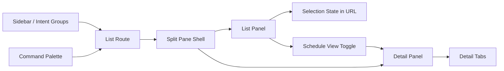
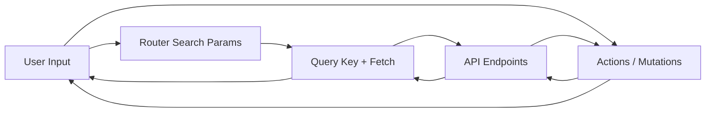
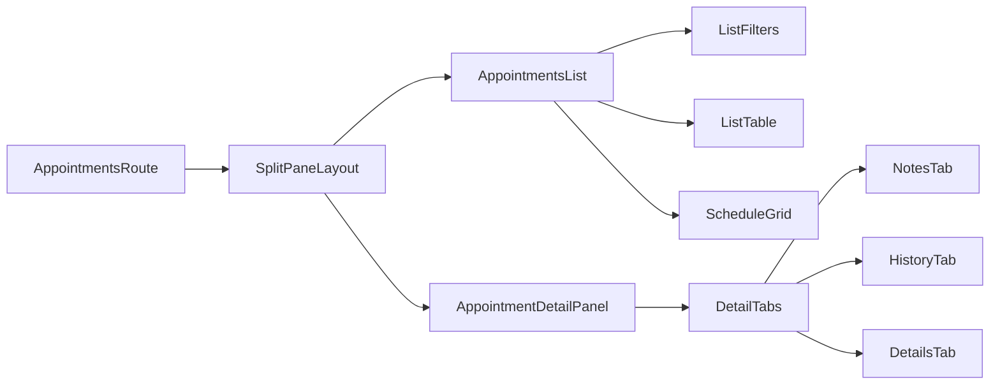

# Detailed Design: Admin UI Navigation Redesign (Split-Pane)

## Overview
This design replaces the current drawer-based detail flow with a split-pane list/detail layout across the Admin UI. Navigation is reorganized by user intent (Work, People, Setup, System) and optimized for power users with minimal clicks, minimal mouse travel, and complete keyboard access. Selection state, tab state, and view state are encoded in URL search params for shareable, predictable navigation.

Scope includes Appointments, Calendars, Appointment Types, Resources, Locations, Clients, and Settings navigation changes. Desktop-first behavior is primary, with a distinct mobile pattern as specified in the UX doc. No branding changes, no data model changes, and no API behavior changes are included in this design phase (API changes are listed as prework dependencies).

## Detailed Requirements
Consolidated from `UX-NAV-REDESIGN.md` and idea-honing responses.

### Global UX and IA
- Replace drawer model with split-pane list/detail for all list views under Work, People, Setup.
- Navigation grouped by user intent:
  - Work: Appointments (list + schedule)
  - People: Clients
  - Setup: Calendars, Appointment Types, Resources, Locations
  - System: Settings
- Local actions only: actions live next to the item they affect.
- One list, one detail: selecting a row updates the detail panel without route changes.
- Keyboard-first interaction across lists, detail panels, and schedule grid.
- Information density prioritized over click reduction without sacrificing clarity.
- State is explicit and shareable via URL query params (selection, tab, view, date).

### Priority Workflows (initial focus)
1) Schedule an Appointment (from Appointments list/schedule)
2) Reschedule an Appointment
3) Manage Availability (weekly + overrides + blocked time)

### State and Routing
- Selection and tab state stored in query params:
  - `selected=<id>`
  - `tab=<tabId>`
  - `view=list|day|week`
  - `date=YYYY-MM-DD`
- Deep routes are removed in favor of tabs:
  - Calendar availability becomes `tab=availability`
  - Appointment type calendars/resources become tabs
- Browser back returns to prior selection state.
- List scroll position preserved when selection changes.

### Appointments: List + Schedule Toggle
- List view remains primary; schedule view is a toggle within Appointments.
- Schedule supports day/week view (week default), shared filters/search with list.
- Detail panel is always on the right for both list and schedule.
- Event chip spec: start time, client name, status badge; minimal visual noise.
- Drag to reschedule; conflicts require confirm; non-conflict drops save immediately.
- Availability shading: working hours, blocked time, overrides, soft constraints.
- Conflict messaging must be explicit and confirmable; non-overridable conflicts block action.

### Selection and Focus Rules
- Arrow keys move selection in list; Enter focuses detail panel.
- Esc clears selection and returns focus to list.
- Cmd+L focuses list, Cmd+D focuses detail, Cmd+F focuses search.

### Search and Filters
- Search input always visible; triggers command palette when focused/typed.
- Filters are compact, collapsible, with active chips.
- Filter presets for Appointments/Schedule: Today, This Week, Pending, Needs Attention, Canceled, No-show.

### Command Palette
- Behavior remains as specified in doc; no new changes.
- Groups by entity + actions; selection navigates with `selected` set.

### Bulk Actions
- Works in list and schedule views with the same selection model.
- Supports Cancel, Confirm, Clear (Export low priority).
- Mixed-status selections show summary and eligibility tooltips.
- Partial failure reporting required; selection remains after actions.

### Detail Panel
- Consistent header + tabs + actions for all entities.
- Appointments: Details, Notes, History with quick actions.
- Calendars: Details, Availability, Appointments.
- Appointment Types: Details, Calendars, Resources.
- Resources/Locations/Clients with entity-specific tabs and summaries.

### Mobile Behavior
- Default schedule view is day on mobile.
- Detail panel opens as full-screen sheet.
- Drag to reschedule replaced by explicit action.

### Success Metrics
- Clicks to book appointment: 3
- Clicks to reschedule: 3
- Clicks to edit availability: 2
- Keyboard shortcut coverage: 90%
- Mouse travel per task: minimal

### Non-Goals
- Branding/visual identity changes
- Data model changes
- API behavior changes in this phase

## Architecture Overview

### High-level UI Composition


### Data Flow (Selection + Schedule)


### Component Relationships (Appointments)


## Components and Interfaces

### Shared Layout Components
- `SplitPaneLayout`
  - Props: `list`, `detail`, `emptyDetail`, `loadingDetail`.
  - Handles layout widths and empty/selected state.
- `ListPanel`
  - Header with title, search, filters, inline create.
  - Supports list or schedule view toggle when applicable.
- `DetailPanel`
  - Header with title + primary action.
  - Tabs for Details/Notes/History as needed.

### Shared Interaction Hooks
- `useSelectionSearchParams` (new)
  - Reads/writes `selected`, `tab`, `view`, `date`.
  - Clears selection with Esc.
- `useListNavigation` (existing)
  - Add usage to all list pages for j/k navigation and Enter to focus detail.

### Entity Pages
- Appointments
  - List view + Schedule view toggle.
  - Inline create in list header; booking modal for complex flow.
- Calendars
  - Detail tabs: Details, Availability, Appointments.
  - Availability tab reuses current availability editor view (embedded).
- Appointment Types
  - Detail tabs: Details, Calendars, Resources (embedded linking UI).
- Resources / Locations / Clients
  - Detail panel tabs for entity-specific details and summaries.

### Command Palette
- Remains global component; extended to open list routes with `selected` when selecting items.

### URL Search Schema (per list route)
- `selected`: string | undefined
- `tab`: string | undefined
- `view`: 'list' | 'day' | 'week' | undefined
- `date`: string (YYYY-MM-DD) | undefined

## Data Models

### UI Search Params
```ts
type ListRouteSearch = {
  selected?: string
  tab?: string
  view?: 'list' | 'day' | 'week'
  date?: string // YYYY-MM-DD
}
```

### Appointment List Row
```ts
type AppointmentListRow = {
  id: string
  status: 'scheduled' | 'confirmed' | 'cancelled' | 'no_show'
  startAt: string
  endAt: string
  durationMin: number
  timezone: string
  clientName: string
  clientEmail?: string
  clientPhone?: string
  appointmentTypeName: string
  calendarName: string
  locationName?: string
  notesPreview?: string
  hasNotes?: boolean
}
```

### Schedule Event
```ts
type ScheduleEvent = {
  id: string
  status: 'scheduled' | 'confirmed' | 'cancelled' | 'no_show'
  startAt: string
  endAt: string
  calendarId: string
  calendarColor?: string
  clientName: string
  appointmentTypeName: string
  locationName?: string
  hasNotes?: boolean
  resourceSummary?: string
}
```

### Availability Feed (Required Prework)
```ts
type AvailabilityFeedItem = {
  type: 'working_hours' | 'override_open' | 'override_closed' | 'blocked_time'
  startAt: string
  endAt: string
  calendarId: string
  label?: string
  reason?: string
  sourceId?: string
}
```

### Conflict Metadata (Required Prework)
```ts
type ConflictMetadata = {
  conflictType: 'unavailable' | 'overlap' | 'resource_unavailable' | 'capacity'
  message: string
  canOverride: boolean
  conflictingIds: string[]
}
```

## Error Handling
- List load errors show inline banner with retry; selection remains.
- Detail panel errors render in-panel with retry; do not clear selection.
- Schedule load failures show inline error state; list view remains available.
- Bulk actions return partial failures and keep selection intact.
- Conflict errors on reschedule/create display inline warning and confirm flow.

## Testing Strategy
- Unit tests
  - Selection/search-param helpers.
  - Keyboard shortcut handlers and focus management.
- Integration tests
  - List -> detail selection updates query params.
  - Appointments schedule view toggles preserve filters and selection.
  - Bulk actions eligibility and partial success messaging.
- API contract tests (prework endpoints)
  - Time-range appointments query.
  - Availability feed structure.
  - Reschedule conflict metadata.
- UI regression tests
  - Snapshot coverage for split-pane layout, detail panel tabs, and schedule grid states.

## Appendices

### Technology Choices
- TanStack Router: search-param driven selection and tab state.
- TanStack Query: data caching and mutation handling.
- cmdk: command palette UI.
- Existing design system components (Button, Table, Badge, etc.).

### Research Findings
- Current Admin UI is list + drawer for detail; selection is local state.
- Deep routes exist for calendar availability and appointment type relationships.
- API gaps align with prework list: time-range appointments, availability feed, structured conflicts, bulk status updates, client history summary.

### Alternative Approaches Considered
- Keep drawer-based detail views (rejected: higher mouse travel and context switching).
- Separate detail pages per entity (rejected: breaks inline flow and keyboard efficiency).
- Single-page dashboard with embedded sections (rejected: reduces clarity and scanability for large datasets).
