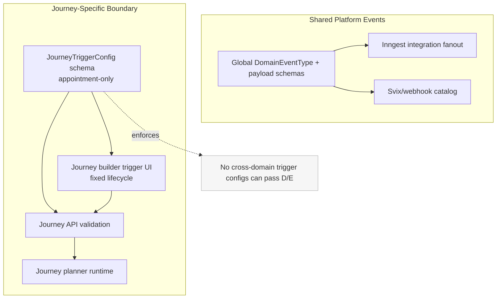
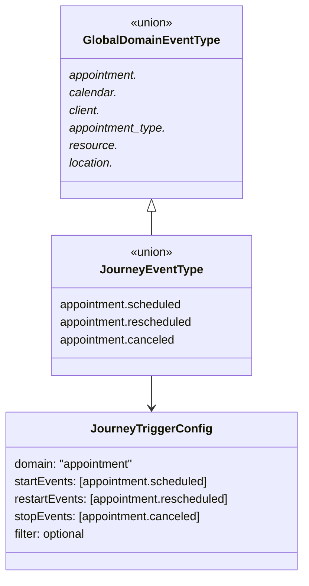

# Design: Journey Domain-Event Boundary Enforcement (Appointment-Only)

## Overview

This design closes a boundary mismatch in the current journey system:

- Journey runtime already executes from appointment lifecycle events.
- Journey authoring and contracts still allow generic cross-domain trigger configuration.

That mismatch allows invalid journey trigger configs to be authored/saved while never triggering at runtime.

The target state is:

1. Journeys are appointment-only by contract and UX.
2. Global domain event taxonomy remains unchanged for webhooks/integrations.
3. The system hard-fails invalid (non-appointment) journey trigger payloads at validation boundaries.
4. No migration/compatibility path is added (fresh-start dev environment).

## Detailed Requirements

This section consolidates all requirement decisions from `requirements.md`.

1. Scope boundary
   - Journey trigger scope is appointment lifecycle only.
   - Non-appointment domain events remain supported for webhooks/integration fanout.

2. Trigger UX and contract behavior
   - Remove journey trigger domain selector.
   - Fix lifecycle trigger sets to:
     - `start = [appointment.scheduled]`
     - `restart = [appointment.rescheduled]`
     - `stop = [appointment.canceled]`
   - Remove free-form correlation path editing.
   - Correlation identity is fixed to `appointmentId`.

3. Validation strictness
   - Reject non-appointment journey trigger payloads as hard validation failures.
   - Apply strictness at DTO and API boundaries with no fallback coercion.

4. Filters
   - Keep trigger filters.
   - Present filters as advanced optional UI (collapsed by default).
   - Trigger lifecycle remains fixed and non-editable.

5. Data/migration posture
   - No backward compatibility shims.
   - No migration path for old cross-domain journey configs.
   - Fresh-start assumption: invalid old data can be dropped/reset.

6. Acceptance threshold
   - Sufficient outcome: non-appointment journey configs are impossible to author/save.

## Architecture Overview

The design introduces a **journey-specific trigger contract** while preserving shared global domain events for non-journey flows.



## Components and Interfaces

### 1) DTO: Journey-specific trigger types

Introduce/standardize journey-only trigger types independent from broad `DomainEventType`.

Interface intent:

```ts
type JourneyEventType =
  | "appointment.scheduled"
  | "appointment.rescheduled"
  | "appointment.canceled";

type JourneyTriggerConfig = {
  triggerType: "DomainEvent";
  domain: "appointment";
  startEvents: ["appointment.scheduled"];
  restartEvents: ["appointment.rescheduled"];
  stopEvents: ["appointment.canceled"];
  correlationPath?: never;
  // keep existing filter AST shape
  filter?: JourneyTriggerFilterAst;
};
```

Design constraints:

- `domain` is literal `"appointment"` for journeys.
- Event arrays are fixed single-value tuples, not open string arrays.
- Correlation path is not user-configurable for journeys.

### 2) DTO: Journey graph validation

Journey graph validation must parse trigger node config with `JourneyTriggerConfig` (appointment-only), not broad workflow-domain schema.

Validation behavior:

- If trigger node includes non-appointment domain/event values, parse fails.
- If trigger config omits fixed lifecycle sets, parse fails.
- If trigger config includes editable correlation path, parse fails.

### 3) API service and routes

Journey create/update/publish paths rely on journey graph parse result. If graph parse fails for trigger boundary reasons, return validation error and do not persist.

Error contract:

- Structured validation error with field path targeting trigger config.
- No auto-normalization from invalid to valid trigger config.

### 4) Admin UI trigger config panel

Replace generic domain-event trigger editor with appointment-journey trigger presentation.

UI behavior:

- Display lifecycle mapping as fixed (read-only) values.
- Hide/remove domain selector.
- Hide/remove event multiselect controls for start/restart/stop.
- Hide/remove correlation path field.
- Keep filters as an advanced section, collapsed by default.

### 5) Runtime and integrations

No architectural change to runtime appointment event ingestion or global fanout.

- Journey runtime continues using appointment lifecycle events.
- Integration/webhook fanout continues supporting broad domain taxonomy.

## Data Models

No new database tables are required for boundary enforcement.

Model-level changes are contract/schema-level:

1. Journey trigger config snapshot shape narrows to appointment-only literals.
2. Existing journey records with incompatible config are considered invalid under fresh-start policy and can be reset.

Conceptual model split:



## Error Handling

### Validation failure scenarios

1. Non-appointment domain in journey trigger config.
2. Non-canonical lifecycle event names in journey trigger sets.
3. Missing required fixed lifecycle mappings.
4. Presence of disallowed configurable correlation path.

### Response behavior

- Return deterministic client-facing validation errors.
- Reject create/update/publish mutation for invalid payloads.
- Do not persist partial graph changes.

### UX behavior

- Since invalid authoring controls are removed, normal users should rarely hit these errors.
- If stale payload is encountered (for example from old local editor state), show inline error on save and require re-save using current UI.

## Acceptance Criteria

Given-When-Then criteria for machine-verifiable behavior.

1. Journey scope enforcement
   - Given a journey payload with trigger `domain = "client"`
   - When create/update is submitted
   - Then validation fails and journey is not saved.

2. Fixed lifecycle enforcement
   - Given a journey payload with `startEvents = ["appointment.rescheduled"]`
   - When create/update is submitted
   - Then validation fails because trigger lifecycle mapping is not canonical.

3. Correlation lock
   - Given a journey payload with a custom `domainEventCorrelationPath`
   - When create/update is submitted
   - Then validation fails.

4. UI authoring guard
   - Given a user opens journey trigger configuration
   - When viewing trigger controls
   - Then domain selector and editable lifecycle event pickers are absent, and advanced filters are available collapsed by default.

5. Integration/webhook continuity
   - Given non-appointment domain events are emitted by platform services
   - When integration/webhook fanout processes events
   - Then fanout behavior remains unchanged.

6. Runtime continuity for journeys
   - Given appointment lifecycle events are emitted
   - When journey runtime ingests events
   - Then journeys continue to start/restart/stop by canonical appointment lifecycle mapping.

## Testing Strategy

The implementation should prioritize validation and behavior checks at boundaries.

1. DTO contract tests
   - Parse success for canonical appointment-only journey trigger config.
   - Parse failure for non-appointment domain/event values.
   - Parse failure when correlation path is provided.

2. API route/service tests
   - Journey create rejects cross-domain trigger payload.
   - Journey update rejects cross-domain trigger payload.
   - Error shape includes actionable validation details.

3. Admin UI tests
   - Trigger panel no longer renders domain selector.
   - Trigger panel no longer renders editable start/restart/stop selectors.
   - Advanced filters render and are collapsed by default.

4. Runtime/integration regression checks
   - Journey runtime appointment-lifecycle processing remains green.
   - Integration fanout for non-appointment events remains green.

## Appendices

### Appendix A: Technology Choices

1. Keep existing event architecture split
   - Reuse current global event emission/fanout for integrations.
   - Narrow only journey contract layer.

2. Use schema-first enforcement
   - Apply strictness in shared DTO so UI/API/runtime consume one enforced contract.

3. Favor deletion over compatibility code
   - Remove outdated journey trigger configuration affordances rather than adding migration shims.

### Appendix B: Research Findings Summary

From the research set in `research/`:

1. Runtime is already appointment-only for journey ingestion.
2. Shared schema/UI/API trigger configuration still permits multi-domain values.
3. This creates a silent failure mode: config can be saved but never triggered.
4. Existing docs/tests over-index on cutover/legacy removal and under-assert journey boundary enforcement.

Research artifacts:

- `specs/domain-event-boundaries-v2/research/01-plan-vs-last-cycle.md`
- `specs/domain-event-boundaries-v2/research/02-code-audit-domain-event-boundaries.md`
- `specs/domain-event-boundaries-v2/research/03-gap-matrix.md`
- `specs/domain-event-boundaries-v2/research/04-remediation-checklist.md`

### Appendix C: Alternative Approaches Considered

1. Platform-wide domain event reduction (remove non-appointment events)
   - Rejected: conflicts with requirement to keep webhooks/integrations broad.

2. Runtime-only guardrails
   - Rejected: does not prevent invalid configs from being authored/saved; poor UX.

3. Soft coercion of invalid configs to appointment defaults
   - Rejected: requirement is hard validation failures and no fallback coercion.

4. Backward-compat migration path
   - Rejected: project is fresh-start dev with no production data.
