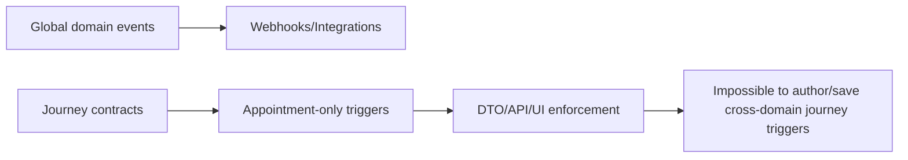

# Iteration Checkpoint

## Requirements Status

Requirements clarification is complete.

Locked decisions:

- Journeys are appointment-only.
- Global non-appointment domain events remain for webhooks/integrations.
- Hard reset approach (fresh start; no migration/compat path).
- Journey trigger domain selector removed.
- Journey lifecycle trigger sets are fixed and non-editable.
- Correlation is fixed to appointment identity (`appointmentId`).
- Filters remain, but as advanced optional UX.
- Minimum acceptance: non-appointment journey configs are impossible to author/save.

## Research Status

Research indicates a mixed state:

- Runtime ingestion is appointment-only.
- DTO/API/UI authoring contracts still allow cross-domain trigger configurations.
- This mismatch likely explains incomplete implementation relative to `PLAN.md`.

## Decision Context

