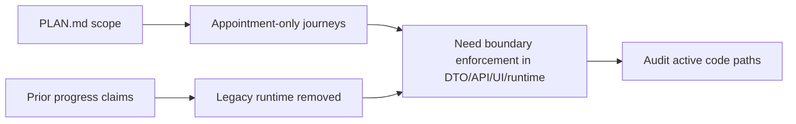

# Plan vs Last Cycle Findings

## Scope Baseline from `PLAN.md`

- The plan explicitly scopes journey automations to appointment lifecycle events only.
- Out of scope includes triggers on other domains (clients, calendars, availability, etc.).

## What the Last Cycle Claims

- Prior cycle summary claims the rebuild is appointment-only and complete as a planning + implementation package.
- Progress log claims Task 12 removed legacy runtime and completed full quality gates.

## What This Means for Current Investigation

- Passing quality gates and legacy cleanup do not necessarily prove domain-boundary enforcement.
- We must verify both runtime behavior and authoring constraints, not just legacy removal.

## Component Relationship (Claimed vs Required)

## Initial Gap Hypothesis

The last cycle appears to have strongly addressed runtime replacement and cleanup, but may not have fully closed the cross-domain trigger boundary in shared schemas and UI authoring surfaces.

## Sources

- `PLAN.md`
- `specs/workflow-engine-rebuild-appointment-journeys/plan.md`
- `specs/workflow-engine-rebuild-appointment-journeys/progress.md`
- `specs/workflow-engine-rebuild-appointment-journeys/summary.md`
