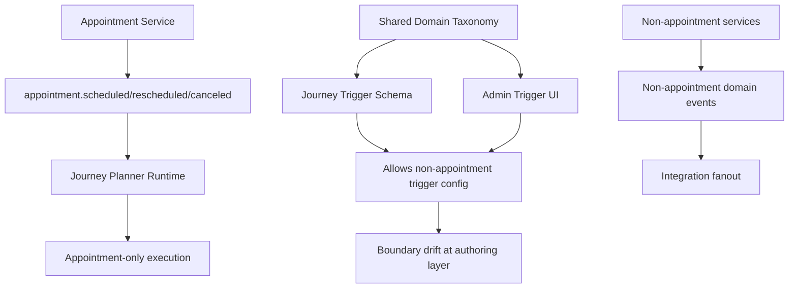

# Code Audit: Domain Event Boundaries

## Key Finding

Implementation is mixed-state:

- Journey runtime ingestion is appointment-only.
- Authoring/contracts/UI taxonomy still allow multi-domain selection.
- Non-appointment domain events are still emitted and consumed elsewhere in active code.

This explains why implementation can look complete by cleanup gates while still violating boundary intent.

## Evidence Summary

### A) Appointment-only behavior exists in runtime planner path

- Inngest journey domain trigger subscribes to appointment lifecycle events only.
- Journey planner event typing is appointment lifecycle only.
- Appointment service lifecycle emission uses scheduled/rescheduled/canceled classifier.

### B) Multi-domain behavior still exists in active authoring/taxonomy surfaces

- Shared webhook/domain-event taxonomy still includes non-appointment domains.
- Journey trigger schema accepts generic domain/event combinations via shared trigger config.
- Journey create/update validation does not constrain trigger domain to appointment-only.
- Admin UI trigger config still presents generic domain selector and event list.

### C) Multi-domain event flow still active in integration surfaces

- Integration fanout remains subscribed to broad domain events.
- Non-appointment services still emit domain events (for example clients/calendars).

## Data Flow (Current Mixed State)

## Likely Root Causes

1. Journey scope is not isolated from shared domain-event taxonomy.
2. Linear graph validation enforces topology but not domain boundary.
3. Generic trigger schema is reused by journey APIs without appointment-only narrowing.
4. UI cutover retained generic domain/event trigger controls.
5. Completion checks focused on legacy removal, not boundary guard assertions.

## Gaps to Validate Next

1. Whether API tests explicitly reject non-appointment trigger payloads for journeys.
2. Whether DTO contracts should split `JourneyEventType` from global `DomainEventType`.
3. Whether UI should remove domain picker entirely for journeys.
4. Whether integration fanout should remain broad while journeys stay narrow (boundary of responsibility).

## Sources

- `apps/api/src/inngest/functions/journey-domain-triggers.ts`
- `apps/api/src/services/journey-planner.ts`
- `apps/api/src/services/appointments.ts`
- `apps/api/src/services/journeys.ts`
- `apps/api/src/inngest/functions/integration-fanout.ts`
- `apps/api/src/services/clients.ts`
- `apps/api/src/services/calendars.ts`
- `packages/dto/src/schemas/webhook.ts`
- `packages/dto/src/schemas/domain-event.ts`
- `packages/dto/src/schemas/workflow-graph.ts`
- `packages/dto/src/schemas/journey.ts`
- `apps/admin-ui/src/features/workflows/workflow-trigger-config.tsx`
