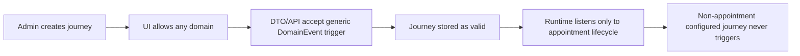

# Deep Gap Matrix: Domain-Event Boundaries

## Executive Takeaway

The last cycle implemented appointment-only **runtime ingestion**, but did not fully enforce appointment-only boundaries at **authoring and contract layers**. That mismatch allows creation of journeys that look valid yet never run.

## Gap Matrix

| Area | Expected (from `PLAN.md`) | Current state | Gap level |
|---|---|---|---|
| Journey runtime trigger ingestion | Appointment lifecycle only | `journey-domain-triggers` subscribes only to appointment lifecycle events | Aligned |
| Journey trigger contract (DTO) | Appointment-only trigger config | `workflowDomainEventTriggerConfigSchema` allows all domains/events | High |
| Journey create/update API boundary | Reject non-appointment trigger payloads | No explicit appointment-only guard in journey schemas/services | High |
| Admin trigger builder UX | Appointment journey trigger model | UI still exposes generic domain selector + cross-domain events | High |
| Test coverage for boundary | Non-appointment journey trigger should fail | No targeted tests enforcing this rejection path | High |
| Global domain-event emission | Non-appointment events may exist outside journeys | Non-appointment events still emitted for integrations/webhooks | Expected, but boundary unclear |

## Evidence by Layer

### Runtime layer (mostly aligned)

- Appointment-only ingress exists in `apps/api/src/inngest/functions/journey-domain-triggers.ts:9`.
- Planner event type is narrowed to appointment lifecycle in `apps/api/src/services/journey-planner.ts:39`.
- Appointment service emits lifecycle taxonomy in `apps/api/src/services/appointments.ts:149`.

### Contract layer (not fully aligned)

- Shared domain taxonomy still includes calendar/client/location/resource/etc in `packages/dto/src/schemas/domain-event.ts:28`.
- Domain events are aliased directly from webhook events in `packages/dto/src/schemas/domain-event.ts:14`.
- Journey trigger config still uses generic domain + event sets in `packages/dto/src/schemas/workflow-graph.ts:201`.
- Journey graph validation checks topology, not appointment-only trigger scope in `packages/dto/src/schemas/journey.ts:75`.

### API/service layer (not fully aligned)

- Journey service parses trigger config with generic schema in `apps/api/src/services/journeys.ts:174`.
- Manual test run forces appointment payload/event type in `apps/api/src/services/journeys.ts:1049`, but this does not prevent invalid non-appointment configs from being saved.

### UI layer (not fully aligned)

- Trigger UI imports full domain lists in `apps/admin-ui/src/features/workflows/workflow-trigger-config.tsx:3`.
- Domain picker renders all domains in `apps/admin-ui/src/features/workflows/workflow-trigger-config.tsx:366`.
- Editor sidebar also treats trigger events as global domain events in `apps/admin-ui/src/features/workflows/workflow-editor-sidebar.tsx:4`.

### Coverage/docs layer (not fully aligned)

- Cutover tests validate removal of legacy routes/exports, not appointment-only trigger rejection (`apps/api/src/routes/index.test.ts:5`, `packages/dto/src/schemas/journey-cutover.test.ts:5`).
- UI test currently asserts cross-domain filtering behavior (`client.created`) in `apps/admin-ui/src/features/workflows/workflow-trigger-config.test.tsx:92`.
- Legacy docs still describe removed workflow runtime surfaces in `docs/guides/workflow-engine-domain-events.md:9` and `docs/guides/workflow-execution-lifecycle.md:9`.

## Failure Mode Diagram

## Interpretation

This is not purely an implementation bug in runtime execution. It is a **boundary-contract bug**: shared domain taxonomy is reused where a journey-specific taxonomy is required.

## Sources

- `PLAN.md`
- `apps/api/src/inngest/functions/journey-domain-triggers.ts`
- `apps/api/src/services/journey-planner.ts`
- `apps/api/src/services/appointments.ts`
- `apps/api/src/services/journeys.ts`
- `packages/dto/src/schemas/domain-event.ts`
- `packages/dto/src/schemas/workflow-graph.ts`
- `packages/dto/src/schemas/journey.ts`
- `apps/admin-ui/src/features/workflows/workflow-trigger-config.tsx`
- `apps/admin-ui/src/features/workflows/workflow-editor-sidebar.tsx`
- `apps/admin-ui/src/features/workflows/workflow-trigger-config.test.tsx`
- `apps/api/src/routes/index.test.ts`
- `packages/dto/src/schemas/journey-cutover.test.ts`
- `docs/guides/workflow-engine-domain-events.md`
- `docs/guides/workflow-execution-lifecycle.md`
