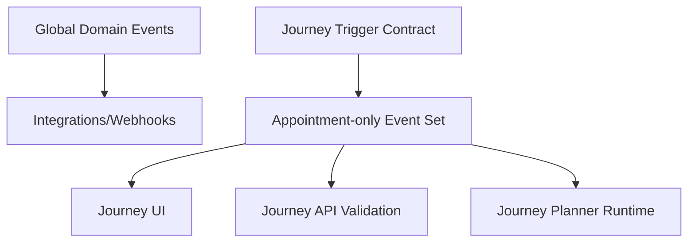

# Remediation Checklist (Boundary Enforcement)

## Objective

Close the mismatch between appointment-only journey scope and cross-domain authoring/contracts.

## Recommended Direction

Keep global domain events for integrations/webhooks, but create a **journey-specific trigger contract** that is appointment-only.

This preserves existing integration functionality while enforcing journey boundaries.

## Proposed End State

## Concrete Checklist

1. Create journey-specific event taxonomy in DTO
   - Add a `JourneyEventType` union limited to:
     - `appointment.scheduled`
     - `appointment.rescheduled`
     - `appointment.canceled`
   - Do not reuse broad `DomainEventType` where journey contracts are defined.

2. Narrow journey trigger config schema
   - Add a dedicated schema for journey trigger config (appointment-only domain/event values).
   - Keep existing generic schema for non-journey use cases if needed.

3. Enforce API boundary validation
   - Ensure `createJourneySchema` and `updateJourneySchema` reject non-appointment trigger configs.
   - Add explicit error messaging for invalid trigger domain/event combinations.

4. Simplify admin trigger UI to appointment journey model
   - Remove generic domain selector from journey builder.
   - Restrict start/restart/stop selections to appointment lifecycle events.
   - Preserve existing filter AST support for appointment/client fields.

5. Add missing tests as hard guardrails
   - DTO tests: non-appointment journey trigger rejected.
   - API tests: journey create/update with `domain=client` rejected with validation error.
   - UI tests: domain selector absent and only appointment lifecycle options shown.
   - Regression test: a non-appointment trigger payload cannot be persisted through journey endpoints.

6. Update stale docs to match current architecture
   - Replace legacy workflow-engine guides with journey-runtime docs.
   - Document explicit split:
     - broad domain events for integrations/webhooks
     - appointment-only events for journeys.

## Priority Order (fastest risk reduction first)

1. DTO + API validation hard guard (prevents new invalid configs)
2. UI constraint changes (prevents user confusion)
3. Test coverage additions (locks behavior)
4. Documentation updates (removes operational drift)

## Acceptance Signals

- Attempting to create a journey with `domain: "client"` fails validation.
- Journey builder cannot author non-appointment trigger domains.
- All journey runtime tests continue passing with appointment-only inputs.
- Integration fanout continues to process global domain events unchanged.

## Open Clarification to Capture in Requirements

Do we want to:

- **A)** enforce appointment-only for journeys while keeping global domain events for other systems (recommended), or
- **B)** remove/stop non-appointment domain events platform-wide?

Current `PLAN.md` language implies A, but your latest note may indicate B. This should be explicitly locked before design.

## Sources

- `PLAN.md`
- `specs/domain-event-boundaries-v2/research/03-gap-matrix.md`
- `apps/api/src/inngest/functions/integration-fanout.ts`
- `apps/api/src/services/jobs/emitter.ts`
- `packages/dto/src/schemas/domain-event.ts`
- `packages/dto/src/schemas/workflow-graph.ts`
- `apps/admin-ui/src/features/workflows/workflow-trigger-config.tsx`
