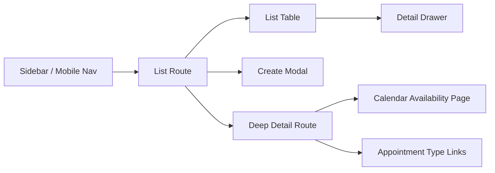

# Existing Admin UI (Current State)

## Overview
The current Admin UI uses a sidebar + page layout with entity list routes and drawer-based detail views. Detail editing is handled in right-side drawers, and some workflows use separate deep routes (e.g., calendar availability, appointment type relationships).

Key locations:
- Root layout + sidebar: `apps/admin-ui/src/routes/__root.tsx`
- Global command palette: `apps/admin-ui/src/components/command-palette.tsx`
- Keyboard shortcuts: `apps/admin-ui/src/hooks/use-keyboard-shortcuts.ts`
- Drawer shell: `apps/admin-ui/src/components/drawer.tsx`
- Entity list routes: `apps/admin-ui/src/routes/_authenticated/*`
- Drawer detail components: `apps/admin-ui/src/components/*-drawer.tsx`

## Navigation Shell
- Sidebar nav is static and flat (Dashboard, Appointments, Calendars, Appointment Types, Locations, Resources, Clients, Settings).
- Mobile uses a Sheet with the same nav items.

## Command Palette & Shortcuts
- Command palette is toggled by Cmd/Ctrl+K and currently provides only quick actions + static nav entries.
- Keyboard navigation includes `g` sequences (e.g., g a, g c) and `meta+n` for new appointment on the appointments list page.
- List navigation shortcuts exist in `useListNavigation` but are not used by current list routes.

## List + Drawer Pattern
- Appointments, Calendars, Appointment Types, Resources, Locations, Clients are list pages that open a drawer for detail view/edit.
- Selection state is in component state (not URL), so selection is not shareable via query params.
- Context menus are used for row actions, with drawers as the detail target.

## Deep Routes in Use Today
- Calendar availability is a dedicated route: `_authenticated/calendars/$calendarId.availability.tsx`.
- Appointment Type calendars/resources are dedicated routes: `_authenticated/appointment-types/$typeId.calendars.tsx` and `_authenticated/appointment-types/$typeId.resources.tsx`.

## Notes That Affect Redesign
- Appointment “Confirm” is noted as requiring a dedicated API endpoint in `AppointmentDrawer`.
- There is no schedule grid view today; appointments are list/table only.

## Current Interaction Architecture (Diagram)

