# Rough Idea

Source: apps/admin-ui/UX-NAV-REDESIGN.md

# Admin UI Navigation Redesign (Split-Pane)

Status: Draft
Date: 2026-01-25
Scope: Admin UI only (no code changes yet)
Owner: Product + Design + Engineering

Summary:
- Replace the drawer model with a split-pane list/detail layout.
- Reorganize navigation by user intent (Work, People, Setup, System).
- Map every core journey with minimal clicks and minimal mouse travel.

This doc complements `apps/admin-ui/UI-UX-DIRECTIVES.md` and supersedes the drawer-based interaction model.

---

## Problem Statement

The current drawer workflow forces repeated cross-screen mouse movement and interrupts focus. Users have to jump between list and drawer panels, often across large distances. Deep routes (availability, appointment type linking) also break flow and increase clicks.

We need a navigation model that is:
- Fast for power users
- Predictable for frequent tasks
- Low-click and low-mouse-travel
- Fully keyboard-accessible

---

## Goals

1. Minimize clicks and mouse travel for all core workflows.
2. Keep users in context while editing or navigating related data.
3. Make keyboard navigation complete and fast.
4. Surface key information inline to reduce drill-down.
5. Use patterns proven by Linear and Superhuman.

## Non-Goals

1. Implement code changes in this phase.
2. Redesign branding or visual identity.
3. Change data models or API behavior.

---

## Design Pillars

1. Local actions only. Actions live next to the thing they affect.
2. One list, one detail. Selection changes detail without changing page.
3. Keyboard first. Every action is reachable without a mouse.
4. Density over clicks. Show key data inline and in the row.
5. Predictable state. Selection and tab state are in the URL.

---

## UI/UX Philosophy (Linear + Superhuman)

This product should feel like a command center. It is optimized for speed, clarity, and low effort. The user should never feel lost or slowed down by navigation.

Principles inspired by Linear and Superhuman:

1. Single focus at a time. List on the left, detail on the right. No competing panels.
2. Triage over navigation. Most work happens by selecting and acting, not routing.
3. Keyboard is the default. Mouse is optional, not required.
4. Actions are immediate and local. Avoid global actions that require context switches.
5. Information density is a feature, not a compromise.
6. Latency is a UX bug. Prefer quick feedback and optimistic updates.
7. State is explicit and shareable (query params), never hidden.

Behavioral expectations:
- One-click to reveal details, zero extra navigation.
- Actions are visible at the point of use.
- Consistent interaction model across all objects.
- Speed of use scales with expertise (power users get faster, not blocked).

---

## Navigation and Information Architecture

Navigation is grouped by user intent, not by raw object type.

ASCII map:

```
WORK
- Appointments
- Schedule (list + calendar toggle)

PEOPLE
- Clients

SETUP
- Calendars
- Appointment Types
- Resources
- Locations

SYSTEM
- Settings
```

Notes:
- Nav is short and stable. Users can jump anywhere via `g` shortcuts or the command palette.
- Every list view under WORK/PEOPLE/SETUP uses the split-pane layout.

---

## Interaction Model: Split-Pane List/Detail

### Desktop Layout (List View)

```
| Sidebar | List / Table (selectable rows) | Detail Panel |
|  200px  |            60-70%              |    30-40%    |
```

### Detail Panel States

1. Empty state: panel hidden or shows "Select an item" hint.
2. Selected state: panel shows details for the focused row.
3. Editing state: inline fields and editable controls.
4. Loading state: skeletons, no layout shift.

### Selection and Focus Rules

1. Arrow keys change selection in the list.
2. Selection updates detail immediately without navigation.
3. Enter moves focus into the detail panel.
4. Esc clears selection and returns focus to the list.

### Actions

1. Row actions appear in-row when selected.
2. Primary action lives in the detail header near the title.
3. Secondary actions are in a compact action menu.
4. Destructive actions are grouped and de-emphasized.

### Inline vs Modal

1. Inline create forms live in the list header.
2. Editing happens in the detail panel, never in a separate route.
3. Complex flows (booking) use a modal, then return to selection.

### Context Menu

Right-click (or Shift+F10) shows all actions for the row.

### Calendar View (Schedule)

Calendar view is a toggle inside Appointments. It shows a day or week grid while keeping the detail panel on the right. The list view remains the primary view for density and bulk actions.

Layout (desktop):

```
| Sidebar | Calendar Grid (day/week) | Detail Panel |
|  200px  |         60-70%           |    30-40%    |
```

Calendar view rules:
1. Selecting an event opens the detail panel, same as list.
2. Creating an event can be done by drag selection or a "New" action, but must end in the same booking modal.
3. The list view and calendar view share filters and search state.
4. Switching views preserves selection when possible.

Schedule view specifics:
- Default mode: Week (Day toggle available).
- Time scale: 15-minute increments, hour labels, working hours emphasized.
- Availability shading: outside hours muted; blocked time striped; overrides tinted.
- Event rendering: status color, time, client.
- Overlaps: stacked with a compact overflow indicator when dense.
- Interaction: click event to open detail; click empty slot to prefill booking modal; drag-select in day view sets start time; drag event to reschedule; no resize by default.
- Conflict handling: show a warning outline and inline message when an event is placed into an unavailable slot; require confirm to finalize.
- Color system: calendar color tint for quick scanning, status badge for state (confirmed, pending, canceled, no-show).
- Density rules: minimum event height equals 15 minutes; if smaller, render a compact chip with time only.

Availability visualization rules:
- Working hours are the default visible range; outside hours are muted but still scrollable.
- Hard blocked time (availability rules, overrides, blocked time) is rendered with a hatched background and cannot be selected for creation.
- Soft constraints (preferred windows, buffers) are tinted and show a tooltip explaining the constraint.
- Now line is always visible and includes timezone label.

Conflict rules:
- Conflicts include: unavailable time, overlaps beyond allowed capacity, or mismatched resources.
- On drag or creation into conflict, the event shows a warning state with a summary of the conflict.
- Default policy: conflicts require explicit confirm to finalize; non-conflict drops save immediately.
- If a conflict cannot be overridden, the drop is rejected and the event snaps back with an inline message.

Drag-and-drop rules:
- Dragging an event previews the new time range with a ghost chip.
- Snaps to 15-minute increments.
- Confirmation is required only when the new slot conflicts; non-conflict drops save immediately.
- Dragging across calendars is not supported in the first iteration.

Conflict messaging (tone and copy):
- Warning banner: "This time conflicts with availability. Review before saving."
- Inline detail: "Blocked time" / "Outside working hours" / "Resource unavailable" / "Over capacity"
- Confirm button: "Reschedule anyway"
- Cancel button: "Keep original"
- Now line + timezone label always visible.

Keyboard behavior (calendar):
- Arrow keys move time focus (day/week grid).
- Enter opens the selected event in the detail panel.
- Cmd+N opens the booking modal (same as list view).
- t jumps to today.
- [ and ] move to previous/next day or week (based on view).

---

## State and Routing Model

State is represented with query params for deep linking without route changes.

Examples:
- List only: `/appointments`
- Selected item: `/appointments?selected=apt_123`
- Detail tab: `/appointments?selected=apt_123&tab=notes`
- Schedule week: `/appointments?view=week&date=2026-01-25`
- Schedule day + selection: `/appointments?view=day&date=2026-01-25&selected=apt_123`

Rules:
1. Browser back returns to the prior selection state.
2. Deep routes like `/calendars/$id/availability` are replaced by `tab=availability`.
3. List scroll position is preserved when selection changes.
4. `view` controls list/day/week; `date` anchors schedule view; default view is list, schedule defaults to week.

---

## Keyboard Model

Minimum shortcuts (must work everywhere):

```
Cmd+K     Command palette
Cmd+N     Create new (context-aware)
g a       Appointments
g c       Calendars
g t       Appointment Types
g r       Resources
g l       Locations
g p       Clients
j / k     Move list selection down/up
Enter     Focus detail panel
Esc       Clear selection / close modals
x         Toggle selection (bulk)
```

Split-pane additions:

```
Cmd+L     Focus list
Cmd+D     Focus detail
Cmd+F     Focus search
?         Show keyboard cheat sheet
```

Schedule view additions (when focus is in the grid):

```
t         Jump to today
[ / ]     Previous/next day or week (based on view)
```

---

## Search and Filters

1. Search input is always visible above the list and triggers the command palette when focused or typed into.
2. Filters are compact and collapsible; active filters show as dismissible chips.
3. `Cmd+F` focuses search; search never pushes the list down.
4. Filters and search persist across list and schedule views.

Filter presets (Appointments and Schedule):
- Today
- This Week
- Pending
- Needs Attention (unconfirmed + in past)
- Canceled
- No-show

## Command Palette Behavior

The command palette is the single global search experience.

Behavior rules:
1. The top search bar opens the command palette; it is not a separate search page.
2. Results are grouped by type: Appointments, Clients, Calendars, Types, Resources, Locations, Actions.
3. Selecting a result opens the corresponding list view with `selected` set.
4. Action items include Create Appointment, Create Client, and context-aware New.
5. Palette is keyboard-first: arrow keys navigate, Enter confirms, Esc closes.
6. Search scopes respect current org and user permissions.

Ranking and search rules:
1. Prefix matches rank higher than contains matches.
2. Recent items (last 30 days) get a boost.
3. Open items (pending appointments, active clients) get a boost.
4. Exact ID matches surface at the top of their group.
5. Actions are pinned at the top when the query starts with a verb (new, create, book).
6. If the query is empty, show Recents and Create actions only.

Keyboard shortcuts in palette:
- Up/Down: move selection
- Enter: open selected item
- Esc: close

---

## Bulk Actions

Bulk mode and multi-select apply to both list and schedule views.

Selection model:
1. Click selects a single item; Cmd/Ctrl+Click toggles selection.
2. Shift+Click selects a contiguous range in list view.
3. `x` toggles selection on the focused row (keyboard).
4. Escape clears selection and returns to single-select.
5. Selection persists when switching between list and schedule view if items are visible in both.

Bulk toolbar:
1. Appears inline above the list or schedule grid when selection count > 0.
2. Shows selected count and primary actions.
3. Actions include Cancel, Confirm, and Clear. Export is low priority and can be deferred.
4. Destructive actions require confirm.
5. Actions are enabled only when they apply to at least one selected item; disabled actions show a tooltip with the reason.
6. Mixed-status selections show a summary (e.g., "3 confirmed, 2 pending, 1 canceled").
7. After bulk actions, selection remains and updates status inline.

Schedule view bulk behavior:
1. Lasso selection is not supported in first iteration; selection is click-based.
2. Range select is not available in schedule grid; use Cmd/Ctrl+Click.
3. Bulk actions apply to selected events across visible days.

Bulk action eligibility:
- Confirm: enabled when selection includes any pending appointments.
- Cancel: enabled when selection includes any confirmed or pending appointments.
- Export: enabled for any selection (low priority; defer until later phase).
- Clear: always enabled.

Bulk results messaging:
- Success: "Updated 5 appointments" with status summary.
- Partial success: "Updated 4 of 6" with inline list of failures.
- Failure: show error toast and keep selection intact.

Bulk confirm:
- Confirm dialog copy follows: "Update [n] appointments?" with a list of status changes.
- Confirm button is action-specific (Confirm, Cancel).

Export rules (CSV, low priority):
- Export respects current filters and selection; selection wins if present.
- File name pattern: `appointments_YYYY-MM-DD.csv`.
- Columns (default): appointment_id, status, start_time, end_time, duration_min, timezone, client_name, client_email, client_phone, appointment_type, calendar, location, notes.
- Date/time format: ISO 8601 with timezone offset.

Inline action availability (list rows and schedule chips):
- Pending: Confirm, Reschedule, Cancel.
- Confirmed (future): Reschedule, Cancel.
- Confirmed (past): No-show.
- Canceled: No actions except View and Rebook.
- No-show: View and Rebook.

Rebook flow (from canceled or no-show):
- Entry points: inline action on row/chip, context menu, detail panel action.
- Rebook opens booking modal with appointment type, calendar, client, and notes pre-filled.
- Original appointment is referenced in the booking payload for audit/history.
- After confirm, new appointment is selected; original remains unchanged.

---

## Object Model (Mental Map)

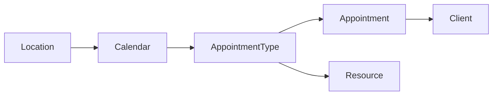

---

## Journey Maps

Each journey is mapped as an ideal flow with minimal clicks and minimal movement.

### 1) Create a Calendar (with Availability)

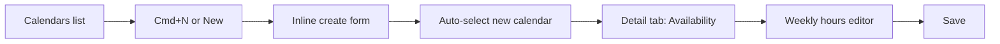

ASCII flow:

```
Calendars list -> New -> Inline form -> Availability tab -> Weekly hours -> Save
```

### 2) Create Appointment Type (link Calendars + Resources)

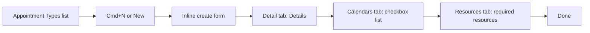

ASCII flow:

```
Types list -> New -> Details -> Calendars tab -> Resources tab -> Done
```

### 3) Create a Resource

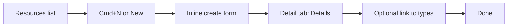

ASCII flow:

```
Resources list -> New -> Details -> Link types -> Done
```

### 4) Create a Location

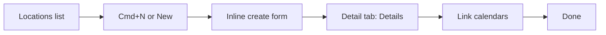

ASCII flow:

```
Locations list -> New -> Details -> Link calendars -> Done
```

### 5) Create a Client

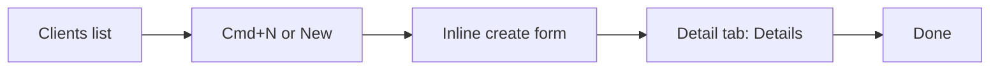

ASCII flow:

```
Clients list -> New -> Details -> Done
```

### 6) Schedule an Appointment (from Appointments)

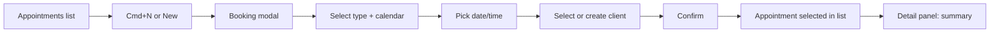

ASCII flow:

```
Appointments -> New -> Booking modal -> Confirm -> Detail panel stays open
```

### 7) Reschedule an Appointment

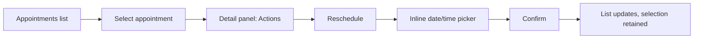

ASCII flow:

```
Select -> Reschedule -> Pick time -> Confirm -> Stay in list
```

### 8) Confirm, Cancel, or No-show

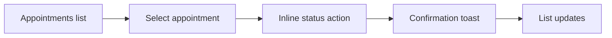

ASCII flow:

```
Select -> Status action -> Confirm -> List updates
```

### 9) Book from a Client

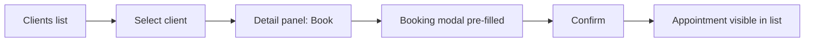

ASCII flow:

```
Client -> Book -> Confirm -> Appointment created
```

### 10) Manage Availability (weekly + overrides + blocked)

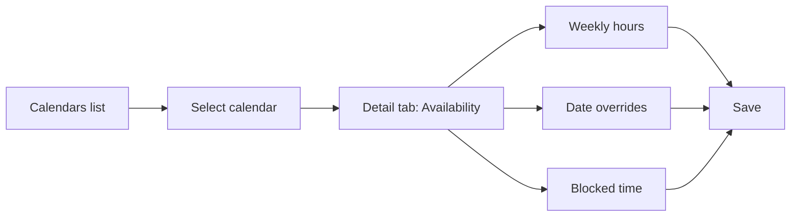

ASCII flow:

```
Calendar -> Availability tab -> Edit -> Save
```

### 11) View Calendar Appointments

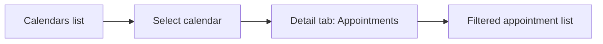

ASCII flow:

```
Calendar -> Appointments tab -> Filtered list
```

### 12) View Appointments in Calendar (Schedule)

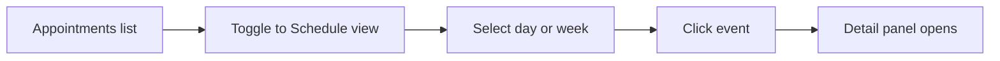

ASCII flow:

```
Appointments -> Toggle schedule -> Click event -> Detail panel
```

### 13) Create from Schedule

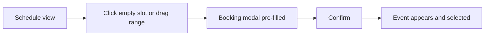

ASCII flow:

```
Schedule -> Click or drag -> Booking modal -> Confirm -> Selected
```

### 14) Reschedule from Schedule

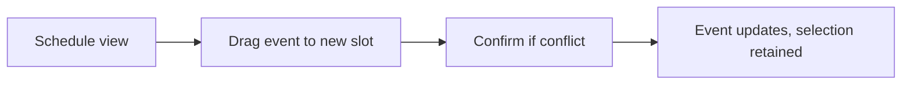

ASCII flow:

```
Schedule -> Drag event -> Confirm if conflict -> Update
```

### 15) Bulk Cancel or Export

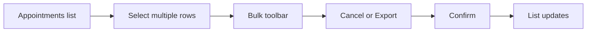

ASCII flow:

```
Select many -> Bulk action -> Confirm -> List updates
```

### 16) Find and Open by Keyboard

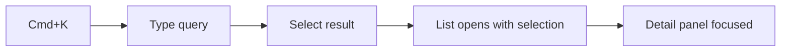

ASCII flow:

```
Cmd+K -> Search -> Enter -> Detail focused
```

---

## Page Blueprints

### Appointments

List columns:
- Time (show start + duration)
- Status badge
- Client name + contact
- Appointment type
- Calendar
- Notes preview (truncated)

Schedule view:
- Day and week grid toggle
- Week default, Day toggle, Today control
- Compact all-day strip for blocks/overrides
- Event chips show time, client, status
- Overlap handling with compact overflow indicator
- Click event to open detail panel; click empty slot to prefill booking
- Drag event to reschedule with confirm and conflict warning

Multi-calendar overlays (schedule view):
- Default shows a single calendar per schedule view for clarity.
- Optional multi-calendar mode uses color tints and a compact legend.
- Filters control which calendars and locations are visible; avoid more than 4 overlays at once.
- Legend shows calendar names and colors for quick scanning.

Event chip spec (schedule view):
- Required fields: start time, client name, status badge.
- Details live in the detail panel; chip stays minimal.
- Truncation: one line for client name; ellipsis when space is tight.
- Colors: light calendar tint background with a left status stripe.
- Icons: only when status is canceled/no-show; avoid icon noise otherwise.

Detail panel sections:
- Header: status + time + quick actions
- Tabs: Details, Notes, History
- Actions: Confirm, Reschedule, Cancel, No-show

Inline actions:
- Status toggles in row
- Actions appear on the right edge for the selected row

List density rules:
- Row height: 44px default; compact mode 36px.
- Primary text in one line; secondary text muted and truncated.
- Badges are compact and aligned to the right edge of the cell.
- Notes preview is truncated inline; no hover required.
- Entire row is a click target; padding ensures a minimum 40px hit area.
- Row actions appear on the right edge to reduce mouse travel.

Status badge labels and colors:
- Pending: "Pending" (neutral/secondary)
- Confirmed: "Confirmed" (success)
- Canceled: "Canceled" (destructive)
- No-show: "No-show" (destructive)

Accessibility notes:
- Selected rows use `aria-selected=true` and are announced in screen readers.
- Bulk toolbar uses `aria-live=polite` for selection count changes.
- Keyboard focus ring is always visible on the list row and schedule grid cell.
- Context menu supports Shift+F10 and keyboard navigation.

### Calendars

List columns:
- Name
- Availability status indicator
- Appointment count badge
- Next appointment preview

Detail panel tabs:
- Details
- Availability (weekly, overrides, blocked)
- Appointments (filtered list)

### Appointment Types

List columns:
- Name
- Linked calendars count
- Required resources count
- Total bookings badge

Detail panel tabs:
- Details
- Calendars (checkbox list)
- Resources (checkbox list)

### Resources

List columns:
- Name
- Utilization today
- Availability indicator

Detail panel:
- Details
- Utilization summary

### Locations

List columns:
- Name
- Calendars count
- Resources count

Detail panel:
- Details
- Calendars
- Resources

### Clients

List columns:
- Name
- Email / phone
- Appointment count
- Last visit

Detail panel tabs:
- Details
- Appointment history
- Notes

### Dashboard

Dashboard stays as summary, but all items open list pages with pre-filtered states.

---

## Detail Panel Layout Spec

The detail panel is consistent across all objects: header, tabs, primary fields, and actions.

Shared header layout:
- Title (object name) + status badge
- Primary action button (context-aware)
- Secondary actions in kebab menu

Shared tab layout:
- Details (default)
- History (appointments and clients)
- Notes (appointments and clients)

Appointments (detail panel):
- Header: status + time + quick actions (Confirm, Reschedule, Cancel)
- Details: date/time, type, calendar, client, location, resources
- Notes: inline editable
- History: status changes and reschedules

Calendars (detail panel):
- Details: name, timezone, default availability summary
- Availability: weekly hours, overrides, blocked time
- Appointments: filtered list view

Appointment Types (detail panel):
- Details: name, duration, price, buffer rules
- Calendars: checkbox list with counts
- Resources: required resources list with toggles

Resources (detail panel):
- Details: name, capacity, availability status
- Utilization: today's load, next appointment

Locations (detail panel):
- Details: name, address, timezone
- Calendars: linked calendars
- Resources: linked resources

Clients (detail panel):
- Details: name, email, phone, notes
- Appointment history: list of past and upcoming
- Notes: inline editable

---

## Schedule View Accessibility

- Grid cells have accessible labels with date and time.
- Focus follows the time grid; arrow keys move in 15-minute increments.
- Events are reachable via Tab when the grid is focused.
- Screen reader announcements include status and time range.
- The now line includes an aria-label with the current time and timezone.

---

## Error and Empty State Copy

Global empty states:
- No results: "No matches. Try a different filter."
- No data: "Nothing here yet. Create your first item."

Appointments:
- Empty list: "No appointments scheduled."
- Schedule view: "No events in this range."

Calendars:
- Empty list: "No calendars yet. Create one to start scheduling."
- Availability empty: "Set working hours to enable bookings."

Clients:
- Empty list: "No clients yet."
- Search empty: "No clients match that search."

---

## QA Checklist (UI/UX)

Global:
- [ ] Split-pane layout is used across all list views with selection driving the detail panel.
- [ ] Query params persist selection and tab state; browser back restores prior selection.
- [ ] Search bar opens the command palette and works across all entities.
- [ ] Keyboard shortcuts work as defined; focus zones are visible.

Appointments list:
- [ ] Rows are fully clickable with inline actions and status badges.
- [ ] Notes preview is visible inline without hover.
- [ ] Bulk actions appear with accurate eligibility and mixed-status summary.

Appointments schedule:
- [ ] Day/Week toggle and Today control present.
- [ ] Event chips render time, client, status.
- [ ] Drag-reschedule saves immediately; conflicts require confirm.
- [ ] Availability shading is visible; blocked time cannot be selected.

Calendars:
- [ ] Availability editing is fully in detail panel tabs (no deep routes).
- [ ] Next appointment preview and appointment count appear in list.

Appointment Types:
- [ ] Calendars and Resources linking happen in detail tabs with checkbox lists.
- [ ] Linked counts are visible in list rows.

Resources and Locations:
- [ ] Relationship counts are visible in list rows.
- [ ] Detail panel includes linked entities.

Clients:
- [ ] Appointment history is accessible in detail panel.
- [ ] Book appointment action pre-fills client in booking modal.

Command palette:
- [ ] Results grouped by entity; actions pinned for verb queries.
- [ ] Selection opens list view with `selected` set.

Performance (UI-level):
- [ ] Schedule view renders within a day/week scope and does not block first paint.

---

## Success Metrics (Targets)

| Metric | Target |
| --- | --- |
| Clicks to book appointment | 3 |
| Clicks to reschedule | 3 |
| Clicks to edit availability | 2 |
| Keyboard shortcut coverage | 90% |
| Mouse travel per task | Minimal (single region) |

---

## Implementation Risks and Dependencies

Dependencies to verify (or add if missing):
- Time-range appointments query for schedule view (start/end, status, client, type, calendar, location, resources).
- Availability rules + overrides + blocked time feed for schedule shading.
- Appointment reschedule mutation that supports conflict validation and override.
- Appointment type relations endpoints (calendars/resources) for detail tabs.
- Client search and appointment history for detail panel.
- Bulk status updates with partial failure reporting.

Risks:
- Large data volume in schedule view without pagination or virtualization.
- Timezone and DST edge cases causing misaligned grid rendering.
- Conflict rules diverging from server validation (client shows "allowed" but server rejects).
- Keyboard focus conflicts between list, detail, and calendar grid.

Mitigations:
- Use time-range queries with server-side limits and prefetching.
- Normalize times to timezone-aware ISO and render with explicit offsets.
- Surface server-side conflict messages in the confirm dialog.
- Define explicit focus zones (list, detail, grid) with clear shortcuts.

---

## Gap Analysis and Prework Tasks

Current support (API):
- Appointments list supports date filters (`startDate`, `endDate`) and basic filters (status, calendarId, typeId, clientId).
- Availability rules/overrides/blocked time lists exist as separate endpoints.
- Reschedule endpoint exists but conflicts are returned as an error message string only.
- Appointment type relation endpoints (calendars/resources) exist.
- Client search exists; history is possible by filtering appointments by `clientId`.

Gaps:
- Schedule view needs time-range queries (start/end timestamps) for day/week grids; current filters are date-only.
- No consolidated availability feed for schedule shading across rules/overrides/blocked time.
- Reschedule needs structured conflict metadata and an override path.
- No bulk appointment status update endpoint with partial failure reporting.
- Client history lacks a dedicated summary endpoint.

Prework tasks (must address before UI build):
- Add appointments time-range endpoint (timestamp start/end) with compact fields for schedule view.
- Add availability feed endpoint that merges rules, overrides, and blocked time into a single range response.
- Extend reschedule response to return structured conflict details and an override flag.
- Add bulk appointment status update endpoint with per-item results and partial success handling.
- Add client history summary endpoint.

---

## Prework Task List

1. Appointments time-range query (start/end timestamps, day/week scope)
2. Availability feed API (merged rules + overrides + blocked time)
3. Reschedule conflict metadata (structured conflict type + override allowed)
4. Bulk appointment status update (per-item results + partial success)
5. Client history summary endpoint

---

## Relative Priority (Backend-First)

1. Appointments time-range query (schedule view requires this)
2. Availability feed API (schedule shading depends on this)
3. Reschedule conflict metadata + override path (drag-reschedule UX)
4. Bulk appointment status update (list/schedule bulk actions)
5. Client history summary endpoint (detail panel)

---

## Data Contracts (UI Requirements)

Appointments list (row fields):
- id, status, startAt, endAt, durationMin, timezone
- clientName, clientEmail, clientPhone
- appointmentTypeName, calendarName, locationName
- notesPreview (truncated), hasNotes

Appointments detail (panel fields):
- All list fields plus: notes, history events, resources, createdAt, updatedAt

Schedule grid (event fields):
- id, status, startAt, endAt, calendarId, calendarColor
- clientName, appointmentTypeName, locationName
- hasNotes, resourceSummary

Availability feed (schedule shading):
- items: { type: working_hours | override_open | override_closed | blocked_time, startAt, endAt, calendarId }
- label, reason, sourceId (sourceId nullable)

Conflict metadata (reschedule/create):
- conflictType: unavailable | overlap | resource_unavailable | capacity
- message: user-friendly summary
- canOverride: boolean
- conflictingIds: array (empty when not applicable)

---

## Performance Guidance (UI-First)

- Keep schedule view scoped to day/week ranges only.
- Use compact payloads for list and schedule views.
- Defer virtualization and aggressive prefetching until after UX is validated.
- Avoid blocking UI on prefetch; prioritize fast first paint.

---

## Timezone Policy

- Org timezone is the default for scheduling and grid alignment.
- User timezone is shown as secondary context (label in grid and detail panel).
- All stored times are UTC; UI renders with explicit timezone labels.
- DST transitions must be handled with clear labels (e.g., "1:30 AM (DST)").

---

## Permissions and Action Gating

- Actions are hidden when the user lacks permission; avoid disabled controls and tooltips.
- Conflict overrides require elevated permission; show "Override required" when not allowed.
- Bulk actions follow the same gating as single actions.

---

## Conflict and Capacity Policy

- Capacity rules define the max overlap for a given calendar or resource.
- Overbooked slots show warnings; non-overridable conflicts are blocked.
- Override actions require explicit confirmation and are logged in history.

---

## Event Density and Overflow

- Max visible chips per slot: 3; additional events collapse into a "+n" indicator.
- Clicking overflow opens a compact list popover with the hidden events.
- Day view uses full width chips; week view uses compact chips by default.

---

## Reschedule Confirmation UX

- Confirmation appears only for conflicts or override-required changes.
- Panel shows before/after time, calendar, and client.
- Conflict list appears inline with severity indicators.
- Confirm button label changes for overrides ("Reschedule anyway").
- Non-conflict reschedules show a success toast.

---

## Error and Retry Handling

- Inline error banners for list and schedule loads with a "Retry" action.
- Detail panel errors do not clear selection; show retry inside the panel.
- Partial failures in bulk actions show inline per-item errors.

---

## History and Audit

- Appointment history includes: created, confirmed, rescheduled, canceled, no-show, client changes, notes edits.
- Each history item shows timestamp, actor, and summary.

---

## Mobile Schedule Behavior

- Default to day view; week view available via explicit toggle.
- Detail panel opens as full-screen sheet.
- Drag to reschedule is replaced with "Reschedule" action on mobile.

---

## Settings Scope and Defaults

- Org settings: timezone, business hours defaults, notification defaults.
- Calendar settings: hours, overrides, blocked time, capacity.
- Appointment type settings: duration, buffers, required resources.

---

## Notifications

- Single actions show immediate toasts (success or error).
- Client notifications are opt-in per action and visible before confirm.
- Undo is deferred to a later phase.

---

## Route Deprecations

These routes should be removed after split-pane adoption:

- `_authenticated/calendars/$calendarId/availability.tsx`
- `_authenticated/appointment-types/$typeId/calendars.tsx`
- `_authenticated/appointment-types/$typeId/resources.tsx`

---

## Migration Strategy (Design-Only)

Phase 0: Approve IA + split-pane model
Phase 1: Convert Appointments to split-pane
Phase 2: Convert Calendars, Types, Resources, Locations, Clients
Phase 3: Deprecate deep routes
Phase 4: Optimize keyboard + command palette

---

## Open Questions

None.
