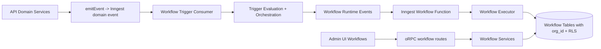
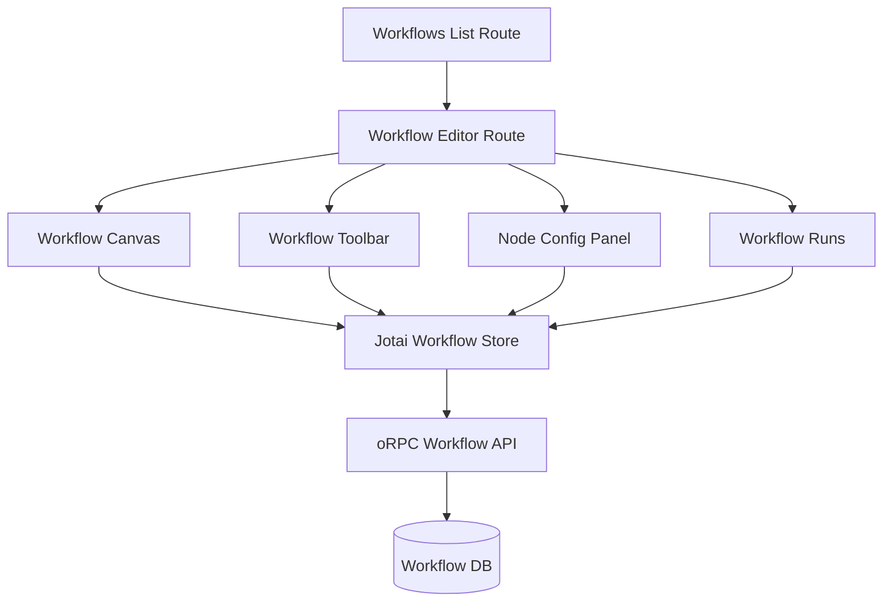
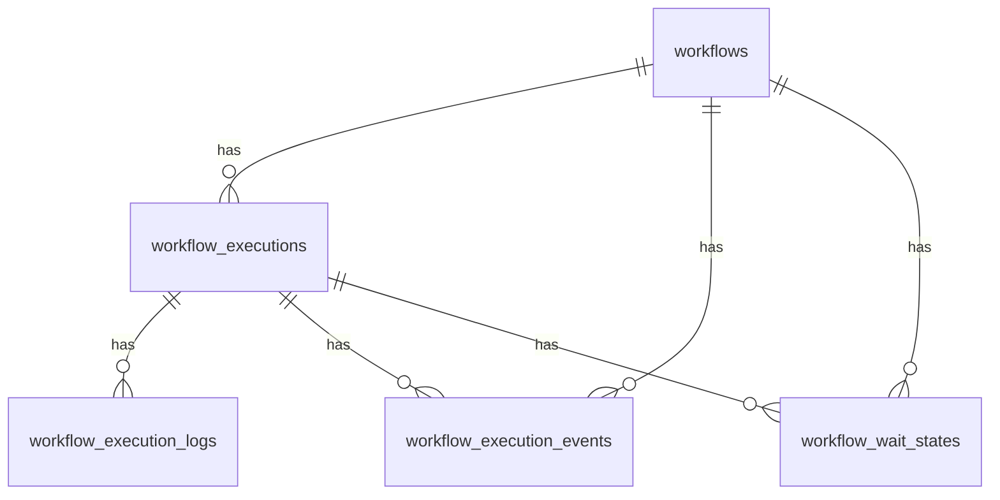

# Workflow Engine + UI Port with Domain Event Triggers

## Overview
This design ports the workflow engine and workflow editor UI from `../notifications-workflow` (branch `main`) into this repository, preserving behavior and surface area while adapting to:
- domain-event trigger ingress (instead of webhook-trigger ingress)
- oRPC API shape and handler style
- org-scoped RLS and multi-tenant table conventions

This is a planning/design artifact only and does not implement code.

## Detailed Requirements
1. Support all canonical domain event types and fields from `packages/dto/src/schemas/domain-event.ts`.
2. Keep trigger routing behavior equivalent to reference workflow logic (`start`, `restart`, `stop`, `ignore`).
3. Copy all workflow engine and UI capabilities at launch, except technical adaptations for oRPC and org RLS.
4. Add `org_id` to all workflow tables and enforce per-org RLS isolation.
5. Consume the same domain-event stream currently used by webhook delivery (single producer, multiple consumers).
6. Keep schema evaluation on the current/latest event schema (schema evolution assumed backward compatible).
7. Target exactly-once behavior via Inngest deduplication and run-id idempotency constraints.
8. Keep webhook delivery feature separate; workflows are not webhook-model specific.
9. Follow active-dev DB policy: update initial schema/migration directly (no incremental migration).
10. Authorization model:
- Admin-only for create/edit/enable/disable/delete/execute/cancel operations.
- Read-only visibility of workflows and run history for authenticated org members.
11. Copy runtime defaults (retry, timeout, concurrency, failure behavior) from reference unless technically incompatible.
12. Use `../notifications-workflow` `main` as parity source.
13. Start workflow tables with no seed/demo workflow data.

## Architecture Overview
The solution has four layers:
1. Domain Event Ingress Layer
- Existing domain events emitted by API services to Inngest are consumed by a new workflow-trigger consumer.
2. Workflow Management API Layer (oRPC)
- CRUD, execute, run history, logs, events, wait-resume, and cancellation are exposed via oRPC routes.
3. Workflow Runtime Layer
- Trigger evaluation + orchestration produces workflow run requests and cancellation/resume actions.
- Inngest workflow execution functions run the workflow graph.
4. Persistence Layer
- Org-scoped workflow tables with RLS store definitions, executions, logs, events, and wait states.

## Components and Interfaces

### 1) DTO Layer (`packages/dto`)
Add workflow DTO modules equivalent to reference shared contracts:
- workflow graph/types/schemas
- trigger config schemas
- execution response contracts (`running`, `cancelled`, `ignored`, `resumed`)
- workflow CRUD IO schemas
- execution log/event/status schemas

Domain trigger config includes:
- trigger type (`DomainEvent`)
- event routing sets:
  - `startEvents`
  - `restartEvents`
  - `stopEvents`
- optional correlation override policy (default is inferred mapping by domain event type)

### 2) DB Layer (`packages/db`)
Add org-scoped workflow tables:
- `workflows`
- `workflow_executions`
- `workflow_execution_logs`
- `workflow_execution_events`
- `workflow_wait_states`

Required table characteristics:
- `id uuid default uuidv7()`
- `org_id uuid not null`
- RLS policy using `current_org_id()` for all operations
- index strategy preserving reference query paths with `org_id` prefixing

### 3) API Layer (`apps/api`)
Add workflow route namespace to oRPC router:
- read procedures (`authed`): list/get/workflow runs/logs/events/status
- write procedures (`adminOnly`): create/update/delete/duplicate/execute/cancel/clear/save current

Replace reference webhook trigger ingress with Inngest consumer functions that:
- subscribe to canonical domain event types
- evaluate workflow trigger config
- call orchestrator with same routing semantics

### 4) Runtime Layer (`apps/api`)
Port and adapt:
- trigger registry and trigger evaluation
- trigger orchestrator
- workflow executor and runtime steps
- Inngest function registration and cache invalidation

Preserve reference behaviors:
- start/restart/stop/ignore routing
- wait-state resume/cancel handling
- execution auditing/logging patterns

### 5) UI Layer (`apps/admin-ui`)
Replace workflow stub with full editor surface:
- list page
- workflow editor route (`/_authenticated/workflows/$workflowId`)
- canvas, nodes, config panel, toolbar, runs panel, overlays
- state store and autosave behavior

Role-aware UI behavior:
- members: read-only editor and run history views
- admins: full edit/execute management controls

## Data Models

### Entity Overview
- `workflows`: workflow definition and graph
- `workflow_executions`: per-run lifecycle record
- `workflow_execution_logs`: per-node execution log rows
- `workflow_execution_events`: high-level audit events for run/workflow timeline
- `workflow_wait_states`: active and resolved waits for resume/cancel logic

### Key Field Decisions
- `org_id` present on all workflow tables.
- `workflow_run_id` dedupe/index retained for idempotent run tracking.
- `trigger_type` values include `manual` and `domain_event` (adapted from `webhook`).
- `trigger_event_type` stores canonical domain event type string.
- `correlation_key` stores domain entity key used for restart/stop/resume matching.

### Correlation Mapping Default
By event prefix:
- `appointment.*` -> `appointmentId`
- `calendar.*` -> `calendarId`
- `appointment_type.*` -> `appointmentTypeId`
- `resource.*` -> `resourceId`
- `location.*` -> `locationId`
- `client.*` -> `clientId`

## Error Handling
1. Validation errors
- Invalid workflow graph/config -> `BAD_REQUEST`
- Unknown/invalid domain event types in trigger config -> `BAD_REQUEST`

2. Authorization errors
- Non-admin mutation attempts -> `FORBIDDEN`
- Unauthenticated access -> `UNAUTHORIZED`

3. Not found / isolation-safe misses
- Missing workflow/execution in current org -> `NOT_FOUND`

4. Conflict/idempotency
- Duplicate workflow name within org -> `CONFLICT`
- Duplicate run-id collisions -> `CONFLICT` or ignore-idempotent behavior (service-defined)

5. Runtime failures
- Enqueue failures and step failures recorded on execution rows with terminal status and error payload.

6. Ignore outcomes (non-error)
- Missing event type / event not configured / no waiting runs return explicit `ignored` response contracts.

## Acceptance Criteria
1. Given an authenticated member in org A, when listing workflows, then only org A workflows are returned and no write actions are permitted.
2. Given an authenticated admin in org A, when creating/updating/deleting a workflow, then the operation succeeds only within org A.
3. Given a user in org B, when querying org A workflow IDs, then the API responds `NOT_FOUND`/no visibility due to org isolation.
4. Given workflow tables with RLS enabled, when queries run outside `withOrg`, then tenant-scoped rows are not exposed.
5. Given a domain event `X` in canonical DTO list, when emitted, then workflow trigger evaluation can read event type and payload fields without transformation.
6. Given a domain event routed as `start`, when processed, then a new execution is created and a workflow run is enqueued.
7. Given a domain event routed as `restart`, when matching wait states exist, then waiting runs are cancelled and a replacement run is started.
8. Given a domain event routed as `stop`, when matching wait states exist, then waiting runs are cancelled and no replacement run is started.
9. Given a domain event with unconfigured routing, when processed, then the outcome is `ignored` with explicit reason.
10. Given duplicate delivery of the same dedupe identity, when processed, then exactly-once effect is preserved via dedupe/idempotency.
11. Given an admin opens workflow editor, when modifying graph/config, then autosave and explicit save behaviors persist updates.
12. Given a member opens workflow editor, when attempting edits, then UI remains read-only and API mutation attempts are forbidden.
13. Given execution history exists, when opening runs/logs/events panels, then data matches persisted execution state.
14. Given schema changes that are backward compatible, when old workflows evaluate triggers, then they use latest schema successfully.
15. Given no workflow seed data, when bootstrapping dev DB, then workflow tables initialize empty.

## Testing Strategy
1. DTO/schema tests
- trigger config parsing and domain event type validation
- execution response contract unions

2. DB tests
- RLS policy coverage for all workflow tables
- org isolation regression tests
- uniqueness/index behavior tests (`workflow_run_id`, per-org name uniqueness)

3. API unit/integration tests
- route authz matrix (`authed` read vs `adminOnly` write)
- CRUD and execution endpoints
- ignored/cancelled/resumed/running outcomes

4. Runtime/orchestration tests
- trigger routing table tests for start/restart/stop/ignore
- correlation-key mapping tests per domain prefix
- wait-state cancellation/resume behavior tests
- dedupe/idempotency path tests

5. UI tests
- list + editor render and navigation
- read-only behavior for member role
- admin mutation interactions
- run history/logs/events rendering

6. End-to-end smoke
- create workflow as admin
- emit domain event
- verify execution row and run artifacts
- verify member read-only access

## Appendices

### A) Technology Choices
- API transport: oRPC (existing repo standard)
- Runtime: Inngest (existing repo standard)
- DB: Drizzle + Postgres 18 + uuidv7 + RLS (existing repo standard)
- UI state/editor stack: TanStack Router + React Query + Jotai + React Flow

### B) Research Findings Incorporated
- Reference parity source: `../notifications-workflow` `main`
- Canonical domain events already present and emitted in target repo
- Workflow subsystem is currently absent in target (except UI placeholder)
- Highest risk area is correlation derivation correctness across event domains

### C) Alternative Approaches Considered
1. Keep webhook endpoint for workflow ingress and adapt payloads
- Rejected: violates requirement to use domain-event triggers directly.

2. Skip `visibility/isOwner` and simplify to role-only workflow model
- Deferred: for parity, keep model unless implementation complexity forces removal.

3. Skip `current workflow` autosave concept
- Deferred: kept for parity in this design; can be simplified later if unnecessary.
