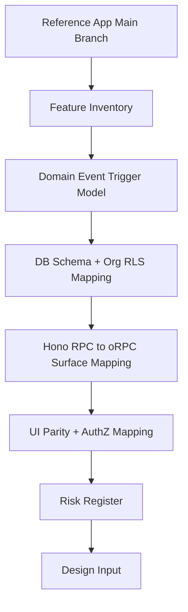

# Research Plan

## Goal
Produce implementation-ready research for copying workflow engine + UI from `../notifications-workflow` into this repo with:
- identical behavior/surfaces where possible
- domain-event triggers (not webhook-specific trigger model)
- oRPC adaptation
- org-scoped RLS adaptation

## Proposed Topics

1. `01-reference-inventory.md`
- Inventory workflow engine + UI modules in `../notifications-workflow` (DB, API, runtime, UI).
- Identify exact parity targets on `main`.

2. `02-event-trigger-model.md`
- Map current domain event schemas in this repo.
- Define trigger-binding model to domain event types/payloads with no transformation layer.
- Confirm exactly-once + dedupe assumptions with Inngest integration points.

3. `03-db-schema-rls-mapping.md`
- Compare reference workflow schema to this repo’s DB conventions.
- Produce table-by-table mapping for `org_id`, RLS, indexes, constraints, and tenancy boundaries.

4. `04-api-surface-mapping.md`
- Compare Hono RPC surfaces in reference app to required oRPC surfaces here.
- Capture route/procedure parity and adapter differences.

5. `05-ui-parity-and-authz.md`
- Compare workflow UI components/screens to current admin-ui structure.
- Define parity plan plus access model: admin write, read-only for others.

6. `06-risks-and-compatibility.md`
- List known incompatibilities and decisions required before design finalization.

## Execution Order
1. Reference inventory
2. Event trigger model
3. DB + RLS mapping
4. API mapping
5. UI + authz mapping
6. Risks summary

## Diagram

