# Reference Inventory (`../notifications-workflow`)

## Snapshot
- Reference source branch: `main`
- Reference commit sampled: `1c5107d5f0476526008aac783fc36057363011e7`
- Scope requested: copy workflow engine + UI behavior and surfaces, adapting trigger source to domain events and adapting DB/API to this repo conventions.

## High-Signal Findings
- The reference app is a single-app repo (not monorepo) with workflow concerns split across `src/backend`, `src/shared/workflow`, `src/client`, and `src/components/workflow`.
- Trigger logic is plugin-style (`trigger-registry`) with built-ins for `Webhook` and `Schedule`; orchestration behavior is centralized and reusable.
- Workflow runtime is Inngest-backed with per-workflow dynamic function registration and cache invalidation.
- Workflow persistence uses 5 core workflow tables (`workflows`, `workflow_executions`, `workflow_execution_logs`, `workflow_execution_events`, `workflow_wait_states`).
- This repo (`scheduling-app`) currently has only a workflows UI stub and no workflow DB/API/runtime implementation yet.

## Reference Module Inventory

### 1. DB + Persistence
- Schema and table definitions:
  - `../notifications-workflow/src/backend/lib/db/schema.ts`
  - `../notifications-workflow/drizzle/0000_baseline.sql`
- Tables relevant to workflows:
  - `workflows`
  - `workflow_executions`
  - `workflow_execution_logs`
  - `workflow_execution_events`
  - `workflow_wait_states`

### 2. Triggering + Orchestration
- Trigger registry and definitions:
  - `../notifications-workflow/src/shared/workflow/trigger-registry.ts`
  - `../notifications-workflow/src/shared/workflow/triggers/webhook-trigger.ts`
  - `../notifications-workflow/src/shared/workflow/triggers/schedule-trigger.ts`
  - `../notifications-workflow/src/shared/workflow/webhook-routing.ts`
- Orchestration:
  - `../notifications-workflow/src/backend/services/workflows/trigger-orchestrator.workflows.ts`
- Trigger bootstrap:
  - `../notifications-workflow/src/backend/lib/workflow-trigger-bootstrap.ts`
  - `../notifications-workflow/src/backend/workflow-triggers/index.ts`

### 3. Runtime + Inngest
- Dynamic function registry:
  - `../notifications-workflow/src/backend/lib/inngest/functions.ts`
- Runtime event senders:
  - `../notifications-workflow/src/backend/lib/inngest/runtime-events.ts`
- Function factory:
  - `../notifications-workflow/src/backend/lib/inngest/workflow-function.ts`
- Executor core:
  - `../notifications-workflow/src/backend/lib/workflow-executor.workflow.ts`

### 4. API Surface (Reference)
- Route registration and endpoints:
  - `../notifications-workflow/src/backend/app.ts`
  - `../notifications-workflow/src/backend/server/routes/workflows.route.ts`
  - `../notifications-workflow/src/backend/server/routes/workflow.route.ts`
- Services:
  - `../notifications-workflow/src/backend/services/workflows/*.workflows.ts`
  - `../notifications-workflow/src/backend/services/workflow/workflow-execute.workflow.ts`

### 5. Shared Contracts + Types
- Trigger and graph schemas/types:
  - `../notifications-workflow/src/shared/workflow/schemas.ts`
  - `../notifications-workflow/src/shared/workflow/types.ts`
  - `../notifications-workflow/src/shared/workflow/graph.ts`
- Execution contracts:
  - `../notifications-workflow/src/shared/workflow/execution-contracts.ts`

### 6. UI + State
- Router/pages:
  - `../notifications-workflow/src/client/router.tsx`
  - `../notifications-workflow/src/frontend/app/workflows/page.tsx`
  - `../notifications-workflow/src/frontend/app/workflows/[workflowId]/page.tsx`
- Jotai workflow store:
  - `../notifications-workflow/src/client/lib/workflow-store.ts`
- API client glue:
  - `../notifications-workflow/src/client/lib/rpc-client.ts`
- Workflow editor components:
  - `../notifications-workflow/src/components/workflow/*`
  - `../notifications-workflow/src/components/workflow/config/*`
  - `../notifications-workflow/src/components/workflow/nodes/*`

## Target Repo Baseline (`scheduling-app`)
- Domain-event schemas already exist and are canonical:
  - `packages/dto/src/schemas/domain-event.ts`
  - `packages/dto/src/schemas/webhook.ts`
- Domain events are already emitted and sent to Inngest:
  - `apps/api/src/services/jobs/emitter.ts`
- Existing Inngest fanout currently targets integrations (one function per domain event type):
  - `apps/api/src/inngest/functions/integration-fanout.ts`
- oRPC route composition and auth helpers exist:
  - `apps/api/src/routes/index.ts`
  - `apps/api/src/routes/base.ts`
  - `apps/api/src/lib/orpc.ts`
- DB is org-scoped with RLS helper and `withOrg` transaction context:
  - `packages/db/src/schema/index.ts`
  - `packages/db/src/migrations/20260208064434_init/migration.sql`
  - `apps/api/src/lib/db.ts`
- Workflows UI is currently placeholder only:
  - `apps/admin-ui/src/features/workflows/workflow-list-page.tsx`
  - `apps/admin-ui/src/routes/_authenticated/workflows/index.tsx`

## Copy vs Adapt Matrix
- Copy mostly as-is:
  - Workflow engine internals, orchestration behavior, run lifecycle semantics.
  - Workflow editor UI component structure and interactions.
- Must adapt:
  - Trigger source: webhook request payload -> domain event stream.
  - Transport: Hono route handlers + `hc` client -> oRPC routes + typed TanStack query utils.
  - Data tenancy: single-tenant workflow tables -> org-scoped tables with RLS and `org_id`.
  - Authz model: reference ownership/private visibility semantics -> admin-write/read-only policy by org role.

## Architecture Diagram

```mermaid
flowchart LR
  A[Domain Entity Changes in API Services] --> B[emitEvent -> Inngest domain event]
  B --> C[Workflow Trigger Consumer]
  C --> D[Trigger Evaluation + Orchestration]
  D --> E[Workflow Run Requested Event]
  E --> F[Inngest Workflow Function]
  F --> G[Workflow Executor]
  G --> H[(workflow_executions/logs/events/wait_states)]
  H --> I[Admin UI Workflow Editor + Runs]
```

## Sources
- `../notifications-workflow/src/backend/lib/db/schema.ts`
- `../notifications-workflow/drizzle/0000_baseline.sql`
- `../notifications-workflow/src/shared/workflow/trigger-registry.ts`
- `../notifications-workflow/src/shared/workflow/triggers/webhook-trigger.ts`
- `../notifications-workflow/src/shared/workflow/webhook-routing.ts`
- `../notifications-workflow/src/backend/services/workflows/trigger-orchestrator.workflows.ts`
- `../notifications-workflow/src/backend/lib/inngest/functions.ts`
- `../notifications-workflow/src/backend/lib/inngest/runtime-events.ts`
- `../notifications-workflow/src/backend/lib/workflow-executor.workflow.ts`
- `../notifications-workflow/src/backend/app.ts`
- `../notifications-workflow/src/client/router.tsx`
- `../notifications-workflow/src/client/lib/workflow-store.ts`
- `../notifications-workflow/src/client/lib/rpc-client.ts`
- `../notifications-workflow/src/components/workflow/workflow-canvas.tsx`
- `packages/dto/src/schemas/domain-event.ts`
- `packages/dto/src/schemas/webhook.ts`
- `apps/api/src/services/jobs/emitter.ts`
- `apps/api/src/inngest/functions/integration-fanout.ts`
- `apps/api/src/routes/index.ts`
- `apps/api/src/routes/base.ts`
- `apps/api/src/lib/orpc.ts`
- `packages/db/src/schema/index.ts`
- `packages/db/src/migrations/20260208064434_init/migration.sql`
- `apps/api/src/lib/db.ts`
- `apps/admin-ui/src/features/workflows/workflow-list-page.tsx`
