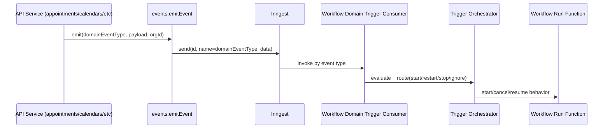

# Event Trigger Model Research

## Goal
Define how to preserve reference trigger/orchestration behavior while replacing webhook-triggered ingress with domain-event-triggered ingress from this repo.

## Current Reference Behavior (What Must Stay)
- Trigger evaluation outputs:
  - `triggerType`
  - `executionType`
  - `eventType`
  - `correlationKey`
  - routing decision: `start | restart | stop | ignore`
- Orchestrator behavior:
  - `start`: start new run
  - `restart`: cancel matching waiting runs, then start
  - `stop`: cancel matching waiting runs
  - `ignore`: no run started
- Resume behavior (for wait hooks) is available for webhook-triggered paths.

Reference files:
- `../notifications-workflow/src/shared/workflow/trigger-registry.ts`
- `../notifications-workflow/src/shared/workflow/triggers/webhook-trigger.ts`
- `../notifications-workflow/src/shared/workflow/webhook-routing.ts`
- `../notifications-workflow/src/backend/services/workflows/trigger-orchestrator.workflows.ts`

## Target Repo Event Reality
- Canonical domain events already exist and are type-safe:
  - `packages/dto/src/schemas/domain-event.ts`
  - `packages/dto/src/schemas/webhook.ts`
- API services already emit those events to Inngest:
  - `apps/api/src/services/jobs/emitter.ts`
- Existing fanout functions already subscribe by domain event type:
  - `apps/api/src/inngest/functions/integration-fanout.ts`

## Recommended Domain Trigger Shape

### Trigger Type
- Add a first-class trigger definition for domain events (for example `DomainEvent`).
- Keep orchestration output contract identical to reference.

### Event Type Extraction
- Use event name directly from Inngest event (`event.name`) / envelope `type`.
- No payload-path configuration needed for event type extraction in this repo.

### Correlation Key Derivation (Critical)
To preserve restart/stop/wait semantics, correlation must represent entity identity (not event id).

Recommended default map by domain event type prefix:
- `appointment.*` -> `appointmentId`
- `calendar.*` -> `calendarId`
- `appointment_type.*` -> `appointmentTypeId`
- `resource.*` -> `resourceId`
- `location.*` -> `locationId`
- `client.*` -> `clientId`

Without this derivation, `restart`/`stop` will not target the correct waiting runs.

### Routing Sets (create/update/delete)
Keep same routing model as reference (start/restart/stop sets), but values are domain event names.

Example configuration:
- `startEvents`: `calendar.created,client.created,...`
- `restartEvents`: `calendar.updated,client.updated,appointment.rescheduled,...`
- `stopEvents`: `calendar.deleted,client.deleted,appointment.cancelled,...`

This preserves exact orchestrator behavior while changing only ingress source.

### Exactly-Once Handling
- Use event IDs from emitter (`emitEvent` sets deterministic event id per send payload) for dedupe keys where applicable.
- Keep unique execution run id tracking (`workflow_run_id`) and enforce uniqueness strategy in DB design.
- Treat as exactly-once best effort via dedupe (as requested), with Inngest idempotency constraints.

## Event Flow Diagram

## Delta From Reference
- Replaced ingress surface:
  - Reference: HTTP webhook endpoint (`/workflows/:workflowId/webhook`)
  - Target: internal domain-event stream consumer per event type
- Preserved behavior:
  - routing decisions
  - execution lifecycle
  - wait-state resume/cancel semantics

## Notable Constraint Mismatch Observed
- Example provided in rough idea used `appointment.deleted`, but canonical DTO on this repo uses `appointment.cancelled`/`appointment.rescheduled`/`appointment.no_show` (not `appointment.deleted`).
- Trigger config/options should be generated from canonical `domainEventTypes`, not assumed suffixes.

## Sources
- `../notifications-workflow/src/shared/workflow/trigger-registry.ts`
- `../notifications-workflow/src/shared/workflow/triggers/webhook-trigger.ts`
- `../notifications-workflow/src/shared/workflow/webhook-routing.ts`
- `../notifications-workflow/src/backend/services/workflows/trigger-orchestrator.workflows.ts`
- `../notifications-workflow/src/backend/services/workflows/workflow-webhook.workflows.ts`
- `packages/dto/src/schemas/domain-event.ts`
- `packages/dto/src/schemas/webhook.ts`
- `apps/api/src/services/jobs/emitter.ts`
- `apps/api/src/inngest/functions/integration-fanout.ts`
- `apps/api/src/inngest/client.ts`
