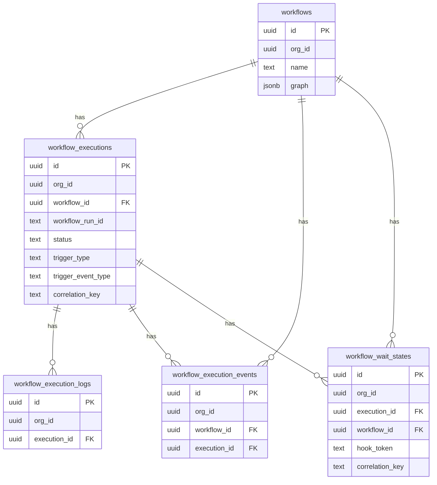

# DB Schema + Org RLS Mapping

## Goal
Map reference workflow schema into this repo’s DB conventions:
- add `org_id` to all workflow-related tables
- enforce org-scoped RLS
- preserve workflow behavior and query/index performance

## Target DB Conventions to Follow
- IDs default to `uuidv7()` in this repo.
- Multi-tenant tables use `pgTable.withRLS(...)` + `org_isolation_*` policies.
- Runtime queries use `withOrg(orgId, ...)` to set `app.current_org_id` transaction context.

Sources:
- `packages/db/src/schema/index.ts`
- `packages/db/src/migrations/20260208064434_init/migration.sql`
- `apps/api/src/lib/db.ts`

## Table-by-Table Mapping

| Reference table | Keep from reference | Required adaptation in this repo |
| --- | --- | --- |
| `workflows` | `name`, `description`, `graph`, `visibility`, timestamps, case-insensitive name uniqueness | Add `org_id uuid not null references orgs(id)` and RLS policy. Change PK from `text` to `uuidv7`. Unique index becomes `(org_id, lower(name))` to avoid cross-org conflicts. |
| `workflow_executions` | status fields, trigger fields, run id, correlation key, input/output/error, lifecycle timestamps | Add `org_id`. Add FK to workflow with org consistency. Use uuid IDs. Keep run-id uniqueness, but scope unique index as `(org_id, workflow_run_id)` where not null. Add `org_id`-leading indexes for list/filter by org + workflow. |
| `workflow_execution_logs` | per-node log model and indexes | Add `org_id` for strict tenancy and direct RLS policy. Keep FK to execution; include org-consistency checks at app/query level. Add index on `(org_id, execution_id, timestamp)`. |
| `workflow_execution_events` | audit/event feed fields and execution/workflow refs | Add `org_id` and RLS. Keep created-at feed indexes, prefixed by org where appropriate. |
| `workflow_wait_states` | wait token, wait status, run/correlation fields, timestamps | Add `org_id` and RLS. Keep unique `hook_token` and correlation/run indexes; add org-leading indexes for tenant-local scans. |

## Proposed Workflow Table Set (Target)
- `workflows`
- `workflow_executions`
- `workflow_execution_logs`
- `workflow_execution_events`
- `workflow_wait_states`

All five should include:
- `id uuid primary key default uuidv7()`
- `org_id uuid not null references orgs(id)`
- RLS enabled + policy `org_id = current_org_id()` for `USING` and `WITH CHECK`

## Index Strategy (Adapted)

### `workflows`
- unique: `workflow_org_name_ci_uidx` on `(org_id, lower(name))`
- list: index on `(org_id, updated_at desc)`

### `workflow_executions`
- unique: `(org_id, workflow_run_id)` where `workflow_run_id is not null`
- list by workflow: `(org_id, workflow_id, started_at desc)`
- wait/cancel routing: `(org_id, workflow_id, correlation_key)`

### `workflow_execution_logs`
- `(org_id, execution_id)`
- `(org_id, execution_id, timestamp)`

### `workflow_execution_events`
- `(org_id, workflow_id, created_at)`
- `(org_id, execution_id, created_at)`

### `workflow_wait_states`
- unique `hook_token`
- `(org_id, execution_id, status)`
- `(org_id, workflow_id, correlation_key, status)`
- `(org_id, run_id)`

## RLS Pattern
Use existing repo pattern verbatim:
- `ALTER TABLE ... ENABLE ROW LEVEL SECURITY`
- `CREATE POLICY org_isolation_<table> ... USING (org_id = current_org_id()) WITH CHECK (org_id = current_org_id())`

## Consistency Rules
To prevent cross-org reference bugs:
- app/service layer should always write `org_id` from context.
- queries should always run inside `withOrg(orgId, ...)`.
- FK chains should be accompanied by org-filtered lookups before writes where needed.

## ER Diagram (Adapted)

## Migration Strategy Note (per repo rules)
- Do not add incremental migration for this feature in active development.
- Update initial migration/schema directly and push/reset dev DB.

## Sources
- `../notifications-workflow/drizzle/0000_baseline.sql`
- `../notifications-workflow/src/backend/lib/db/schema.ts`
- `packages/db/src/schema/index.ts`
- `packages/db/src/migrations/20260208064434_init/migration.sql`
- `apps/api/src/lib/db.ts`
