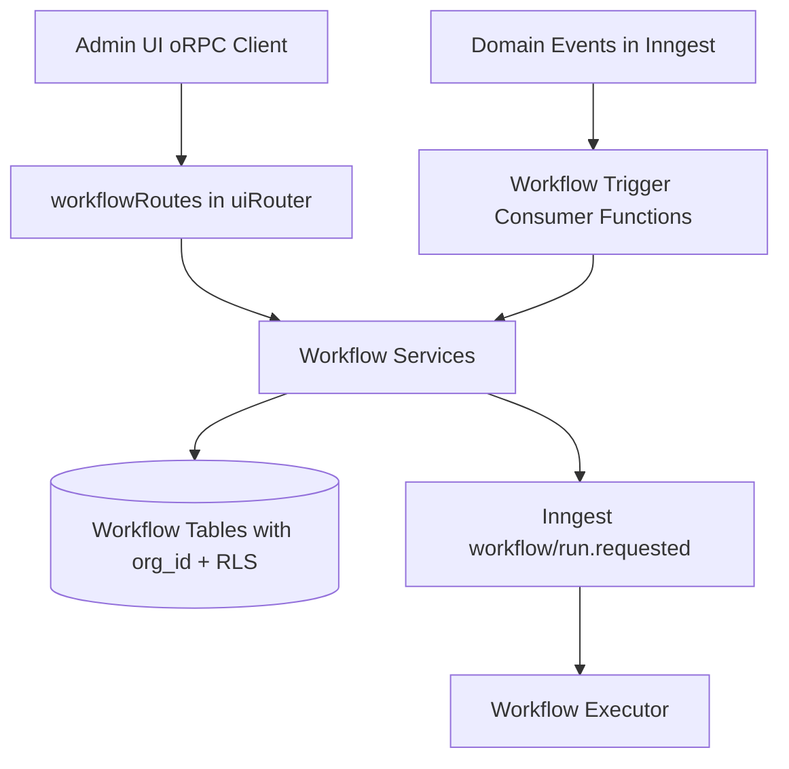

# API Surface Mapping (Hono RPC -> oRPC)

## Goal
Preserve reference workflow API surface/behavior while implementing in this repo’s oRPC architecture.

## Target API Constraints
- oRPC route style is the standard in this repo (`apps/api/src/routes/*.ts`).
- Auth helpers available:
  - `authed` for authenticated org members
  - `adminOnly` for org admin/owner-only mutations
- DB access should run through `withOrg(orgId, ...)` for RLS context.

Sources:
- `apps/api/src/routes/index.ts`
- `apps/api/src/routes/base.ts`
- `apps/api/src/lib/orpc.ts`
- `apps/api/src/lib/db.ts`

## Reference Endpoints to Preserve
Reference registrations are in `../notifications-workflow/src/backend/app.ts`.

### Reference endpoint set (workflow-related)
- `POST /workflow/:workflowId/execute`
- `GET /workflows`
- `POST /workflows/create`
- `GET /workflows/current`
- `POST /workflows/current`
- `GET /workflows/:workflowId`
- `PATCH /workflows/:workflowId`
- `DELETE /workflows/:workflowId`
- `POST /workflows/:workflowId/duplicate`
- `GET /workflows/:workflowId/executions`
- `DELETE /workflows/:workflowId/executions`
- `POST /workflows/:workflowId/webhook` (to be replaced as ingress path)
- `GET /workflows/executions/:executionId/status`
- `GET /workflows/executions/:executionId/logs`
- `GET /workflows/executions/:executionId/events`
- `POST /workflows/executions/:executionId/cancel`
- `POST /workflows/hooks/:token/resume`

## Proposed oRPC Route Object
Add `workflowRoutes` to `uiRouter` in `apps/api/src/routes/index.ts`.

Proposed procedure grouping:
- `workflows.list` (`GET /workflows`) - `authed` (read-only)
- `workflows.get` (`GET /workflows/{id}`) - `authed`
- `workflows.create` (`POST /workflows`) - `adminOnly`
- `workflows.update` (`PATCH /workflows/{id}`) - `adminOnly`
- `workflows.remove` (`DELETE /workflows/{id}`) - `adminOnly`
- `workflows.duplicate` (`POST /workflows/{id}/duplicate`) - `adminOnly`
- `workflows.current.get` (`GET /workflows/current`) - `authed`
- `workflows.current.save` (`POST /workflows/current`) - `adminOnly`
- `workflows.execute` (`POST /workflows/{id}/execute`) - `adminOnly`
- `workflows.executions.list` (`GET /workflows/{id}/executions`) - `authed`
- `workflows.executions.clear` (`DELETE /workflows/{id}/executions`) - `adminOnly`
- `workflows.executions.status` (`GET /workflows/executions/{executionId}/status`) - `authed`
- `workflows.executions.logs` (`GET /workflows/executions/{executionId}/logs`) - `authed`
- `workflows.executions.events` (`GET /workflows/executions/{executionId}/events`) - `authed`
- `workflows.executions.cancel` (`POST /workflows/executions/{executionId}/cancel`) - `adminOnly`
- `workflows.wait.resume` (`POST /workflows/hooks/{token}/resume`) - likely `authed`/token-guarded depending reference behavior

## Trigger Ingress Replacement
Reference ingress path to remove/replace:
- `POST /workflows/{id}/webhook`

Target ingress path:
- Inngest domain event consumers (internal) that:
  - receive canonical domain event types
  - evaluate workflow trigger config
  - run same orchestrator semantics

This keeps UI/API surface equivalent for workflow management while removing webhook-driven trigger ingress.

## Surface Mapping Diagram

## DTO/Contract Implications
This repo currently lacks workflow DTO schemas. Add DTO modules mirroring reference contracts:
- workflow graph and trigger config schemas
- workflow CRUD input/output schemas
- execution response schemas (`running/cancelled/ignored/resumed` union)
- execution log/event status shapes

Source for reference shapes:
- `../notifications-workflow/src/shared/workflow/schemas.ts`
- `../notifications-workflow/src/shared/workflow/types.ts`
- `../notifications-workflow/src/shared/workflow/execution-contracts.ts`

## Compatibility Notes
- Client transport changes from `hono/client` (`hc`) to oRPC TanStack Query utils.
- Path names can remain equivalent via `route({ method, path })` so external behavior stays familiar.
- Role enforcement can be stricter than reference via `adminOnly` for mutations and `authed` for read.

## Sources
- `../notifications-workflow/src/backend/app.ts`
- `../notifications-workflow/src/backend/server/routes/workflows.route.ts`
- `../notifications-workflow/src/backend/server/routes/workflow.route.ts`
- `../notifications-workflow/src/backend/services/workflows/workflows.workflows.ts`
- `../notifications-workflow/src/backend/services/workflows/workflow.workflows.ts`
- `../notifications-workflow/src/backend/services/workflows/workflow-executions.workflows.ts`
- `../notifications-workflow/src/backend/services/workflows/workflow-webhook.workflows.ts`
- `../notifications-workflow/src/shared/workflow/execution-contracts.ts`
- `apps/api/src/routes/index.ts`
- `apps/api/src/routes/base.ts`
- `apps/api/src/lib/orpc.ts`
- `apps/api/src/lib/db.ts`
- `apps/api/src/inngest/functions/integration-fanout.ts`
