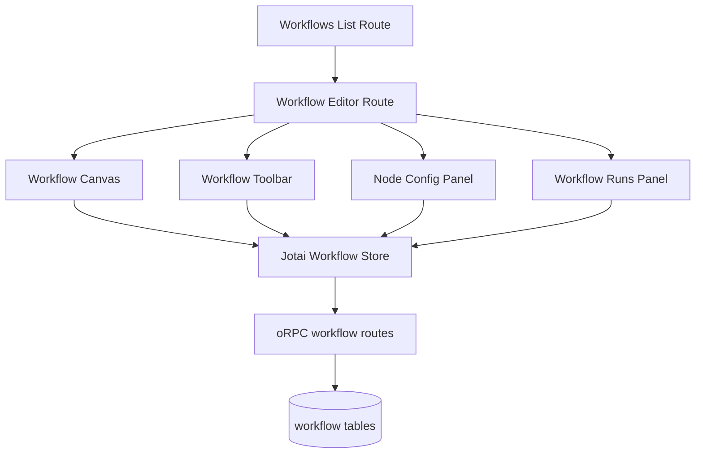

# UI Parity + AuthZ Mapping

## Goal
Copy reference workflow UI/editor behavior and structure into `apps/admin-ui`, while enforcing:
- admin-only write operations
- read-only visibility for all authenticated org members

## Current Target State
- Existing workflows page is a static stub:
  - `apps/admin-ui/src/features/workflows/workflow-list-page.tsx`
  - `apps/admin-ui/src/routes/_authenticated/workflows/index.tsx`
- No workflow editor route exists yet (`/_authenticated/workflows/$workflowId` missing).

## Reference UI Surfaces to Port
- Routing and editor shell:
  - `../notifications-workflow/src/client/router.tsx`
  - `../notifications-workflow/src/frontend/app/workflows/page.tsx`
  - `../notifications-workflow/src/frontend/app/workflows/[workflowId]/page.tsx`
- Workflow state and autosave behavior:
  - `../notifications-workflow/src/client/lib/workflow-store.ts`
  - `../notifications-workflow/src/client/lib/rpc-client.ts`
- Core editor components:
  - `../notifications-workflow/src/components/workflow/workflow-canvas.tsx`
  - `../notifications-workflow/src/components/workflow/workflow-toolbar.tsx`
  - `../notifications-workflow/src/components/workflow/node-config-panel.tsx`
  - `../notifications-workflow/src/components/workflow/workflow-runs.tsx`
  - `../notifications-workflow/src/components/workflow/config/trigger-config.tsx`
  - `../notifications-workflow/src/components/workflow/nodes/*`

## Route Mapping (Target)
- Keep list route:
  - `/_authenticated/workflows/`
- Add detail/editor route:
  - `/_authenticated/workflows/$workflowId`
- Keep sidebar/nav entry already present in root route:
  - `apps/admin-ui/src/routes/__root.tsx`

## AuthZ Mapping

### API-level (authoritative)
- `authed` for read:
  - list workflows
  - get workflow
  - execution history/logs/events/status
- `adminOnly` for write:
  - create/update/delete/duplicate workflows
  - execute/cancel/clear executions
  - save current/autosave mutation

### UI-level (experience)
- Members should still load editor and run history in read-only mode.
- Disable/hide write actions for non-admin:
  - `New workflow`
  - save/update controls
  - execute/cancel controls
  - delete/duplicate actions
  - mutable node config forms
- Use current role resolution pattern from root/settings routes:
  - `orpc.auth.me` + membership fallback in `apps/admin-ui/src/routes/__root.tsx`

## Component Relationship Diagram

## Porting Compatibility Notes
- `@xyflow/react` and `jotai` already exist in target `apps/admin-ui/package.json`.
- Some reference UI dependencies/components differ (`lucide-react`, custom overlay stack, specific UI primitives) and will need adaptation to current admin-ui component set.
- `apps/admin-ui/src/components/flow-elements` exists but is currently empty; reference flow components can be copied into this area.

## Read-Only Behavior Model
Recommended single model for consistency:
- compute `canEditWorkflows = role in {owner, admin}`
- pass `disabled={!canEditWorkflows}` through editor mutating controls
- guard all write mutations with API authorization regardless of UI state

## Sources
- `../notifications-workflow/src/client/router.tsx`
- `../notifications-workflow/src/frontend/app/workflows/page.tsx`
- `../notifications-workflow/src/frontend/app/workflows/[workflowId]/page.tsx`
- `../notifications-workflow/src/client/lib/workflow-store.ts`
- `../notifications-workflow/src/client/lib/rpc-client.ts`
- `../notifications-workflow/src/components/workflow/workflow-canvas.tsx`
- `../notifications-workflow/src/components/workflow/workflow-toolbar.tsx`
- `../notifications-workflow/src/components/workflow/node-config-panel.tsx`
- `../notifications-workflow/src/components/workflow/workflow-runs.tsx`
- `../notifications-workflow/src/components/workflow/config/trigger-config.tsx`
- `apps/admin-ui/src/features/workflows/workflow-list-page.tsx`
- `apps/admin-ui/src/routes/_authenticated/workflows/index.tsx`
- `apps/admin-ui/src/routes/__root.tsx`
- `apps/admin-ui/src/lib/query.ts`
- `apps/admin-ui/src/lib/api.ts`
