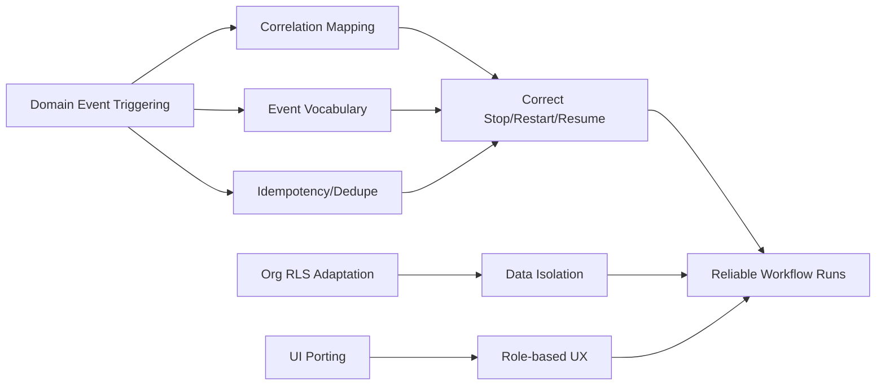

# Risks and Compatibility Register

## Goal
Identify implementation risks before design finalization for copying workflow engine + UI into this repo with domain-event triggers.

## Key Risks

### 1) Correlation Key Derivation Risk (High)
- Why: reference webhook model assumes configurable `data.id`; domain events here use different id fields per event domain.
- Impact: restart/stop/wait-resume semantics break if correlation key is wrong.
- Mitigation: implement explicit domain->entity key map (`appointmentId`, `calendarId`, etc.) and validate at trigger-evaluation time.

### 2) Event Vocabulary Drift (High)
- Why: expected examples may use `appointment.deleted`, but canonical DTO currently uses `appointment.cancelled`/`appointment.rescheduled`/`appointment.no_show`.
- Impact: silent misconfiguration of trigger routing lists.
- Mitigation: build trigger options from `domainEventTypes` only; reject unknown strings.

### 3) Exactly-Once Expectation vs Runtime Reality (Medium)
- Why: Inngest dedupe/idempotency is strong, but distributed systems are generally at-least-once with dedupe best effort.
- Impact: rare duplicate effects if dedupe keys are inconsistent.
- Mitigation: standardize event id usage and keep DB uniqueness on run identifiers.

### 4) RLS + Org Consistency Across Child Tables (High)
- Why: requirement is `org_id` on all workflow tables; child tables also reference parent IDs.
- Impact: potential cross-org FK misuse if app writes inconsistent org values.
- Mitigation: always write from org context, query with `withOrg`, and include org-constrained joins/checks in services.

### 5) UI Copy Friction Due to Framework/Component Differences (Medium)
- Why: reference UI stack and component organization differ from current admin-ui structure.
- Impact: longer adaptation time and possible subtle UX divergence.
- Mitigation: preserve workflow feature structure while adapting imports/primitives to existing app shell.

### 6) Ownership/Visibility Model Mismatch (Medium)
- Why: reference includes `visibility` + `isOwner`; target requirement is org-scoped admin write/read-only visibility.
- Impact: extra complexity if both models are kept without purpose.
- Mitigation: simplify to org-role permissions; keep visibility only if strictly needed for parity or future requirements.

### 7) Autosave "Current Workflow" Semantics (Low-Medium)
- Why: reference has special `__current__` workflow pattern.
- Impact: unnecessary complexity if editor in target can rely on explicit workflow IDs.
- Mitigation: decide during design whether to keep or remove this concept; if kept, admin-only writes still apply.

### 8) Inngest Function Fanout Scale (Medium)
- Why: adding workflow-trigger consumers per domain event increases function count alongside integration fanout.
- Impact: operational complexity and concurrency tuning pressure.
- Mitigation: reuse existing per-org concurrency/throttle patterns and monitor function load.

## Dependency/Compatibility Notes
- Target already includes `@xyflow/react` and `jotai`.
- Target does not currently expose workflow DTO schemas; these need to be introduced.
- Target currently has no workflow DB tables/routes/services; full feature import is net-new in this repo.

## Risk Topology

## Pre-Design Decision Checklist
- Confirm canonical correlation key derivation per domain (or configurable override policy).
- Confirm whether `visibility/isOwner` survives or is simplified under org-role model.
- Confirm whether `current workflow` autosave concept is retained.
- Confirm run-id uniqueness strategy (`org_id`-scoped or global).
- Confirm role split exactly as requested:
  - admin: create/edit/execute/delete
  - member: read-only list + details + run history

## Sources
- `packages/dto/src/schemas/domain-event.ts`
- `packages/dto/src/schemas/webhook.ts`
- `apps/api/src/services/jobs/emitter.ts`
- `apps/api/src/inngest/functions/integration-fanout.ts`
- `apps/api/src/inngest/client.ts`
- `apps/api/src/lib/db.ts`
- `packages/db/src/schema/index.ts`
- `packages/db/src/migrations/20260208064434_init/migration.sql`
- `../notifications-workflow/src/shared/workflow/webhook-routing.ts`
- `../notifications-workflow/src/shared/workflow/trigger-registry.ts`
- `../notifications-workflow/src/backend/services/workflows/trigger-orchestrator.workflows.ts`
- `../notifications-workflow/src/backend/services/workflows/workflow-webhook.workflows.ts`
- `../notifications-workflow/src/backend/lib/db/schema.ts`
- `../notifications-workflow/drizzle/0000_baseline.sql`
- `../notifications-workflow/src/client/lib/workflow-store.ts`
- `apps/admin-ui/src/features/workflows/workflow-list-page.tsx`
