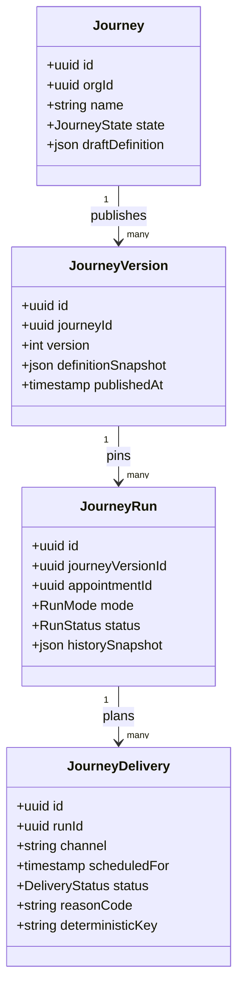

# Appointment Journey Engine Rebuild Design

## 1. Overview

This design replaces the current generic workflow graph runtime with an appointment-only, linear journey system.

The rebuilt system prioritizes lower configuration complexity and higher runtime correctness by:

- constraining the event taxonomy to three appointment lifecycle events
- constraining journey structure to a linear step chain
- separating planning from delivery execution
- keeping run history durable even when journey definitions are removed

The design is a big-bang replacement. Legacy graph behavior is removed rather than bridged.

## 2. Detailed Requirements

The following requirements are consolidated from the finalized requirements set.

R1. Appointment lifecycle taxonomy is exactly:

- `appointment.scheduled`
- `appointment.rescheduled`
- `appointment.canceled`

R2. Journey steps are exactly: Trigger, Wait, Send Message, Logger.

R3. Non-linear journey payloads are invalid and rejected on create/update.

R4. Trigger filters are stored as structured AST with one-level nesting.

R5. Trigger filter caps are enforced: max 12 conditions total and max 4 groups.

R6. Trigger filtering supports AND/OR/NOT and required operator set, across appointment and client attributes.

R7. Backend filter evaluation uses constrained `cel-js`; no raw expression authoring in UI.

R8. Runtime uses planner + delivery worker with deterministic run and delivery identities.

R9. Pause cancels/suppresses pending unsent deliveries.

R10. Resume immediately re-plans active runs from current appointment state/time.

R11. Runs are version-pinned to the journey version active at start.

R12. Journey delete hard-deletes definitions, auto-cancels active runs, and preserves historical run visibility with snapshot context.

R13. Test mode supports explicit `test|live` run separation in storage and UI.

R14. Test execution supports both paths:

- `test_only` auto-trigger from real appointment lifecycle events
- manual start from UI with explicit appointment selection

R15. Both test paths create `mode=test` runs only.

R16. Email override is required before test run start; missing override rejects run start and prevents send execution.

R17. Slack override is optional in v1.

R18. Overlap detection is publish-time, best-effort, warning-only, and does not block publish.

R19. Message limits are explicitly out of scope for this rebuild.

R20. Webhooks remain functional and aligned to the new appointment taxonomy.

## 3. Architecture Overview

```mermaid
graph TB
  APPT[Appointment service] --> CLASSIFY[Lifecycle classifier]
  CLASSIFY --> EVT[(appointment.scheduled|rescheduled|canceled)]

  EVT --> PLAN[Journey planner function]
  PLAN --> DBV[(journey_versions)]
  PLAN --> DBR[(journey_runs)]
  PLAN --> DBD[(journey_deliveries)]

  PLAN --> SCHED[journey.delivery.scheduled]
  PLAN --> CANCEL[journey.delivery.canceled]

  SCHED --> WORKER[Delivery worker function]
  CANCEL -. cancel by delivery identity .-> WORKER

  WORKER --> EMAIL[Email adapter]
  WORKER --> SLACK[Slack adapter]
  EMAIL --> DBD
  SLACK --> DBD

  ADMIN[Admin UI] --> API[Journey API]
  API --> PLAN
  API --> DBV
  API --> DBR
  API --> DBD
```

### Runtime semantics

- Planner computes desired future delivery set from current appointment + journey state.
- Worker executes only when delivery remains eligible at send time.
- Planner and worker are idempotent by deterministic identity keys.
- Inngest platform pause is operational control only; product pause/resume behavior is modeled in application state and planner logic.

## 4. Components and Interfaces

### 4.1 Journey Definition API

Responsibilities:

- CRUD for journey drafts
- publish/pause/resume/delete lifecycle actions
- manual test run start
- bulk cancel active runs for one journey

Interface expectations:

- create/update reject non-linear definitions
- publish returns overlap warnings (non-blocking)
- delete performs active-run cancellation + hard definition delete

### 4.2 Filter Validation and Evaluation Service

Responsibilities:

- validate AST shape, nesting, and caps
- validate operator and field compatibility
- evaluate filters against appointment + client context using constrained `cel-js`

Interface expectations:

- deterministic boolean result
- structured validation errors for invalid payloads

### 4.3 Lifecycle Classifier

Responsibilities:

- map appointment mutations into canonical taxonomy only
- emit no legacy aliases

Interface expectations:

- create => scheduled
- time/timezone change => rescheduled
- cancel transition => canceled

### 4.4 Planner Runtime

Responsibilities:

- resolve matching journeys for lifecycle event
- create/update version-pinned runs
- plan/cancel pending unsent deliveries
- respond to pause/resume/delete control events

Interface expectations:

- emit `journey.delivery.scheduled`
- emit `journey.delivery.canceled`
- persist `skipped/past_due` when computed send time is in past

### 4.5 Delivery Worker Runtime

Responsibilities:

- wait until due time
- revalidate eligibility before send
- execute via channel adapter
- persist final delivery status

Interface expectations:

- statuses limited to `sent|failed|canceled|skipped`
- retries use fixed provider defaults
- Resend path uses idempotency keys

### 4.6 Admin UI Surfaces

Responsibilities:

- linear journey builder (no branch controls)
- trigger filter builder (one-level grouped logic)
- run timelines and mode/state filters
- clear badges for `test_only` journeys and `mode=test` runs

## 5. Data Models

### Core entities

- `journeys`: mutable definition shell and high-level state (`draft|published|paused|test_only`)
- `journey_versions`: immutable published snapshots
- `journey_runs`: version-pinned execution record with `mode=test|live`
- `journey_deliveries`: planned/attempted send artifacts

### Identity and idempotency model

- run identity: deterministic composite over org, journey version, appointment, and mode
- delivery identity: deterministic composite over run, step identity, and schedule context
- duplicate planner inputs converge to same run/delivery identities

### Snapshot and delete model

- `journey_runs` store snapshot context needed for post-delete history
- deleting `journeys`/`journey_versions` never erases historical run visibility

### Data model diagram



## 6. Error Handling

### Validation failures

- non-linear step structures: reject with field-level validation issues
- invalid filter AST shape/caps/operators: reject with field-level validation issues
- duplicate journey name in org: reject with uniqueness error

### Test mode safety failures

- missing required Email override for test run start: reject start and create no send attempts
- Slack override missing: allow run start in v1

### Runtime guardrails

- stale or canceled delivery at send time: mark `canceled` and no-op send
- computed delivery time already past during planning: mark `skipped` with `past_due`
- provider errors: record `failed` and apply provider retry defaults

### Race and idempotency handling

- planner upserts by deterministic identity to collapse duplicate lifecycle events
- worker revalidates state after wake to prevent stale sends
- cancel events are idempotent by delivery identity

## 7. Testing Strategy

### Unit tests

- lifecycle classifier mapping
- filter AST schema and cap enforcement
- AST-to-evaluator translation correctness
- wait schedule computation with timezone and reschedule changes
- overlap heuristic behavior

### Integration tests

- journey lifecycle operations (create/update/publish/pause/resume/delete)
- run version pinning and post-delete history visibility
- planner reactions for schedule/reschedule/cancel/delete
- pause/resume cancellation and immediate re-plan behavior

### Runtime tests (Inngest)

- planner idempotency under duplicate events
- worker sleep/cancel race handling
- channel success/failure persistence and retries

### API and UI contract tests

- admin-only mutating access controls
- linear-builder payload validation and non-linear rejection
- test/live mode filters and badges in runs views
- publish overlap warnings appear without publish block

### Acceptance test matrix

- validate all 15 acceptance criteria in `requirements.md`

### Quality gates

- `pnpm format`
- `pnpm lint`
- `pnpm typecheck`
- `pnpm test`

## 8. Appendices

### A. Technology choices (pros/cons)

1) Structured AST + constrained `cel-js`

- pros: expressive filters, backend type-aware evaluation, overlap analysis-friendly persisted form
- cons: AST-to-evaluator translation layer adds implementation complexity

2) Planner/worker split on Inngest

- pros: clean separation of planning vs sending, durable waiting, clear retry boundaries
- cons: requires careful idempotency and cancellation race handling

3) Version snapshots for run history retention

- pros: supports hard delete with historical visibility, stable audit context
- cons: increased storage footprint over time

### B. Alternative approaches considered

- raw CEL expression authoring in UI: rejected (higher admin complexity and support risk)
- custom expression parser: rejected (maintenance and correctness risk)
- blocking publish on overlap: rejected (conflicts with warning-only requirement)
- legacy compatibility shims during cutover: rejected (big-bang replacement requirement)

### C. Key constraints and limitations

- no incremental migration strategy for this phase; update baseline schema artifacts directly
- no message-limit subsystem in this rebuild
- no SMS sending in this rebuild
- no backfill tool in this rebuild
- overlap detection is best-effort heuristic, not strict logical satisfiability

### D. Source attribution

- `specs/workflow-engine-rebuild-appointment-journeys/requirements.md`
- `specs/workflow-engine-rebuild-appointment-journeys/plan.md`
- `specs/workflow-engine-rebuild-appointment-journeys/research/recommendations.md`
- `specs/workflow-engine-rebuild-appointment-journeys/research/filter-engine-cel-vs-custom.md`
- `specs/workflow-engine-rebuild-appointment-journeys/research/inngest-runtime-and-pause.md`
