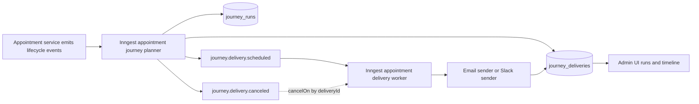
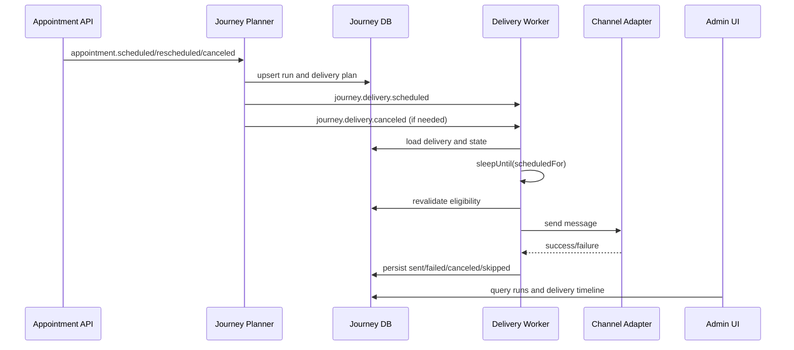
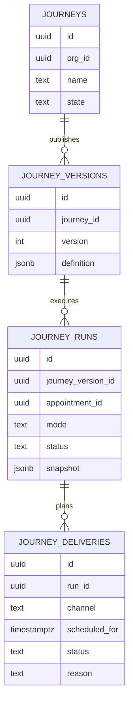

# Appointment Journey Engine Rebuild Design

## Overview

This design replaces the current generic workflow graph engine with an appointment-only journey system.

Primary objective:

- reduce configuration complexity while improving runtime correctness, observability, and testability.

Core product model:

- lifecycle events: `appointment.scheduled`, `appointment.rescheduled`, `appointment.canceled`
- linear journey steps only: Trigger, Wait, Send Message, Logger
- Inngest-first runtime with planner and delivery worker
- version-pinned journey runs
- support for test-only journeys and explicit test run labeling

Out of scope for this rebuild:

- message/notification limits (backend and UI)
- SMS sending integration
- non-linear branching nodes and generic graph orchestration
- backfill of existing appointments

## Detailed Requirements

### 1) Scope and access

- Journey product is appointment-only.
- Only org admins can create, edit, publish, pause, resume, cancel, and delete journeys.
- Journey names are unique per workspace (org).

### 2) Trigger model and filter semantics

- Canonical appointment trigger events are only:
  - `appointment.scheduled`
  - `appointment.rescheduled`
  - `appointment.canceled`
- Journey trigger filters support:
  - AND, OR, NOT
  - one nesting level maximum
  - max 12 conditions and max 4 groups
  - operators: `=`, `!=`, `in`, `not in`, `contains`, `startsWith`, date/time comparisons, null checks (`is set`, `is not set`)
  - all appointment and client attributes as filter fields
- Filter evaluation occurs on both scheduled and rescheduled events.

Reschedule rules:

- previously matched -> now not matched: cancel all pending unsent deliveries
- previously not matched -> now matched: plan new deliveries from updated appointment timing
- still matched: recompute future deliveries and replace obsolete pending ones
- recomputed send time in the past: do not send immediately; mark as `skipped` with reason `past_due`

### 3) Step model and execution semantics

- Allowed v1 steps are exactly:
  - Trigger
  - Wait
  - Send Message
  - Logger
- Non-linear structures are invalid and must be rejected by API validation.
- Wait supports:
  - anchor: appointment start and appointment end
  - direction: before and after
  - parseable duration expressions (for example `1d`, `1w`, `1s`)
- Wait calculations always use current appointment datetime plus timezone at re-evaluation time.

### 4) Journey lifecycle and run management

- Journey states in v1:
  - `draft`
  - `published`
  - `paused`
  - `test_only`
- Pause behavior:
  - suppress/cancel all future unsent deliveries for active runs
- Resume behavior:
  - immediately re-plan eligible future deliveries from current appointment state and time
- Appointment canceled or deleted:
  - terminal for that appointment run
  - pending unsent deliveries are canceled
- Multiple journeys may run for the same appointment.

### 5) Versioning, delete, and history

- Runs are pinned to the journey version they started on.
- Republishing creates a new version; existing runs do not migrate.
- Bulk cancel scope in v1:
  - cancel all active runs for a selected journey (across versions)
  - keep individual run cancel
- Delete journey behavior:
  - auto-cancel active runs
  - hard-delete journey definition
  - keep run history queryable with version snapshot context

### 6) Send behavior and channels

- v1 delivery channels:
  - Email (Resend)
  - Slack
- SMS delivery is out of scope.
- Message templating:
  - dynamic variables from appointment and client data
  - reuse existing template placeholder syntax
- Retry behavior:
  - failure logging required
  - retries enabled
  - provider-specific retry defaults
  - use Resend idempotency keys
  - no retry UI controls in v1

### 7) Test mode behavior

- Full test runs execute real actions with real data.
- Test and live runs are separated in storage and UI (`mode = test | live`).
- Test-only journey state is supported and can auto-trigger from real lifecycle events.
- Manual test start selects an existing appointment.
- Destination override requirements:
  - required for Email
  - required for SMS when SMS exists in future
  - not required for Slack in v1
- Wait behavior in test mode uses normal wait timing (no acceleration mode).
- Test-only state has prominent UI labeling and warnings.

### 8) Overlap warnings

- Detect likely overlapping trigger coverage between journeys at publish time.
- Warnings are best-effort, warning-only, and do not block publish.
- No cross-journey send deduplication in v1.

### 9) Webhooks and event catalog

- Webhooks remain independent from journey pause and test state.
- Appointment webhook taxonomy exposes only:
  - `appointment.scheduled`
  - `appointment.rescheduled`
  - `appointment.canceled`
- Legacy appointment aliases are removed.

### 10) Observability and retention

- Delivery status set in v1:
  - `sent`, `failed`, `canceled`, `skipped`
- Logger step outputs:
  - visible in journey run timeline
  - also emitted to real logger/console
- Run and delivery history retention is indefinite for now.

## Architecture Overview

### High-level architecture

### Runtime behavior model

- Planner is authoritative for computing desired future deliveries.
- Delivery worker is authoritative for actual send attempt execution at or after scheduled time.
- App-level pause/resume logic controls journey semantics; Inngest function pause is operational only.

### Filter architecture

- Canonical persisted trigger filter is structured AST.
- Backend translates constrained AST to CEL evaluation context and executes with `cel-js`.
- Raw CEL expressions are not exposed to admins.

## Components and Interfaces

### API and service components

1. Journey definition service
- CRUD and validation for linear journey definitions.
- Publish, pause, resume, delete, duplicate, and run cancellation operations.

2. Planner service
- Handles lifecycle events and journey control events.
- Computes desired run and delivery artifacts from current appointment state.
- Emits internal schedule and cancel events.

3. Delivery service
- Receives scheduled delivery events.
- Waits until due time via `step.sleepUntil`.
- Revalidates appointment and journey state before send.
- Sends through channel adapters and persists outcomes.

4. Filter evaluation service
- Validates filter AST shape and limits.
- Evaluates criteria using backend CEL runtime with constrained context.

### Internal event interfaces

- `journey.delivery.scheduled`
  - payload includes `orgId`, `deliveryId`, `runId`, `journeyVersionId`, `channel`, `scheduledFor`, `mode`
- `journey.delivery.canceled`
  - payload includes `orgId`, `deliveryId`, `runId`, `reason`

### Admin UI components

- Journey Builder
  - linear step authoring only
  - trigger filter builder with one-level grouping
- Journey Runs
  - separate filtering by state and mode
  - run and delivery timeline with clear test badges
- Publish warnings
  - overlap warning panel at publish time

### Component interaction diagram

## Data Models

## 1) Journey definition entities

- `journeys`
  - identity, org scope, unique name, editable draft state, current state (`draft|published|paused|test_only`)
- `journey_versions`
  - immutable published snapshot of trigger and linear steps
  - monotonically increasing version number per journey

## 2) Runtime entities

- `journey_runs`
  - references journey version
  - tracks appointment correlation
  - stores mode (`live|test`)
  - stores status and historical snapshot fields required for post-delete history
- `journey_deliveries`
  - one row per planned send artifact
  - includes channel, scheduled time, status, reason code, and delivery identity

## 3) Suggested status and reason model

- Delivery status: `sent | failed | canceled | skipped`
- Reason code examples:
  - `appointment_canceled`
  - `appointment_deleted`
  - `journey_paused`
  - `reschedule_replaced`
  - `past_due`
  - `filter_no_match`
  - `manual_cancel`

## 4) Idempotency and uniqueness

- Deterministic run identity by org, journey version, appointment, and mode.
- Deterministic delivery identity by run, step, and computed schedule context.
- Unique constraints prevent duplicate active delivery planning from duplicate events.

## 5) Data model relationship diagram

## Error Handling

### Validation errors

- Reject non-linear definitions with `BAD_REQUEST` and detailed field issues.
- Reject filters that exceed cap limits or unsupported operators.
- Reject publish when required trigger or step configuration is incomplete.

### Runtime guard errors

- If delivery due time is already past at planning time, persist `skipped` with `past_due`.
- If required Email test override is missing in test mode, fail run start with clear validation error.
- If channel config is missing or invalid at send time, mark `failed` and store error detail.

### Retry and idempotency failures

- Provider retries use fixed provider defaults.
- Send attempts use idempotency keys (Resend).
- Duplicate schedule events should no-op via unique delivery identity checks.

### Cancellation races

- Cancel events are best-effort and idempotent by `deliveryId`.
- Worker revalidates state after wake and before send to prevent stale sends.

## Acceptance Criteria

All acceptance criteria are written for machine-verifiable tests.

1. Given a valid linear journey definition, when create API is called, then journey is stored and returned with `draft` state.
2. Given a non-linear journey payload, when create or update API is called, then API returns validation error and does not persist changes.
3. Given appointment create event, when lifecycle classifier runs, then emitted event type is `appointment.scheduled`.
4. Given appointment time or timezone change without cancel status, when lifecycle classifier runs, then emitted event type is `appointment.rescheduled`.
5. Given appointment status changes to canceled, when lifecycle classifier runs, then emitted event type is `appointment.canceled`.
6. Given published journey and matching scheduled appointment, when planner processes event, then run and deliveries are created.
7. Given reschedule causes filter mismatch, when planner processes rescheduled event, then pending unsent deliveries are canceled.
8. Given reschedule causes new filter match, when planner processes rescheduled event, then new future deliveries are planned.
9. Given recomputed delivery time is in the past, when planner computes schedule, then delivery is persisted as `skipped` with reason `past_due` and no send is attempted.
10. Given paused journey with active pending deliveries, when pause action is applied, then pending unsent deliveries are canceled.
11. Given paused journey is resumed, when resume action is applied, then active runs are immediately re-planned from current appointment state and timezone.
12. Given appointment is canceled or deleted, when planner handles event, then run is terminal and pending unsent deliveries are canceled.
13. Given journey is republished, when existing run continues, then existing run remains pinned to original version and new runs use latest version.
14. Given journey delete is requested with active runs, when delete executes, then active runs are canceled and journey definition is hard-deleted.
15. Given deleted journey with historical runs, when runs API is queried, then historical runs remain queryable with version snapshot data.
16. Given test-only journey and matching lifecycle event, when planner runs, then resulting run is marked `mode=test`.
17. Given test run includes Email step and override is missing, when run starts, then start is rejected with explicit override-required error.
18. Given test run includes Slack step and no Slack override, when run starts, then run proceeds.
19. Given overlapping trigger coverage at publish, when publish action runs, then warning is shown and publish is not blocked.
20. Given webhook catalog sync after taxonomy cutover, when sync completes, then appointment catalog includes only scheduled/rescheduled/canceled names.

## Testing Strategy

### 1) Unit tests

- filter AST validation and cap enforcement
- AST to CEL translation and evaluator correctness
- lifecycle event classification rules
- wait time computation with timezone and reschedule changes
- overlap warning heuristic classification

### 2) Service and repository integration tests

- journey create/update/publish/pause/resume/delete flows
- version pinning and snapshot persistence
- run and delivery idempotency constraints
- cancellation behavior on pause, reschedule mismatch, and appointment cancel/delete

### 3) Inngest function tests

- planner function end-to-end event handling
- delivery worker sleep and cancellation behavior
- provider retry and idempotency behavior

### 4) API contract tests

- input and output schema validation for journey routes
- explicit validation error payload checks
- permissions tests (admin-only mutating actions)

### 5) Admin UI tests

- linear builder step constraints
- trigger filter builder with one-level nesting and cap limits
- test mode labels and filters in runs views
- publish-time overlap warning rendering

### 6) End-to-end acceptance tests

- scheduled -> send success path
- rescheduled -> recompute and replace pending deliveries
- canceled/deleted -> terminal cancellation path
- test-only journey path with override behavior
- hard-delete journey while preserving history visibility

### 7) Quality gates

- `pnpm format`
- `pnpm lint`
- `pnpm typecheck`
- `pnpm test`

## Appendices

### Appendix A: Technology choices

1. Inngest planner plus delivery-worker architecture
- chosen for durable waits, cancellation hooks, and event-driven orchestration.

2. Hybrid filter model (structured AST plus backend CEL)
- chosen to keep UI simple while avoiding custom parser maintenance.

3. Structured run and delivery model
- chosen to satisfy version pinning, post-delete history retention, and observability.

### Appendix B: Research findings summary

Key research outputs:

- repo baseline and gaps: `research/repo-baseline-and-gaps.md`
- filter engine options: `research/filter-engine-cel-vs-custom.md`
- Inngest pause fit: `research/inngest-runtime-and-pause.md`
- data model and retention: `research/data-model-and-retention.md`
- test mode safety: `research/test-mode-and-safety.md`
- overlap warnings: `research/overlap-warning-strategy.md`
- cutover sequencing: `research/cutover-and-migration-inputs.md`
- consolidated recommendations: `research/recommendations.md`

External references used in research:

- cel-js: https://github.com/marcbachmann/cel-js
- Inngest pause guide: https://www.inngest.com/docs/guides/pause-functions
- Inngest sleepUntil: https://www.inngest.com/docs/reference/functions/step-sleep-until

### Appendix C: Alternative approaches considered

1. Raw CEL expression authoring in UI
- rejected for v1 due to higher configuration complexity and support burden.

2. Custom text expression parser
- rejected due to maintenance and correctness risk.

3. Platform-level Inngest pause as journey pause feature
- rejected because it is function-wide and does not match per-journey product semantics.

4. Publish blocking for overlap detection
- rejected because requirement is warning-only and best-effort in v1.

### Appendix D: Explicit superseding decisions

- Message limits are out of scope for this rebuild, superseding earlier rough-plan assumptions.
- SMS delivery remains out of scope; only Email and Slack are implemented channels in v1.
