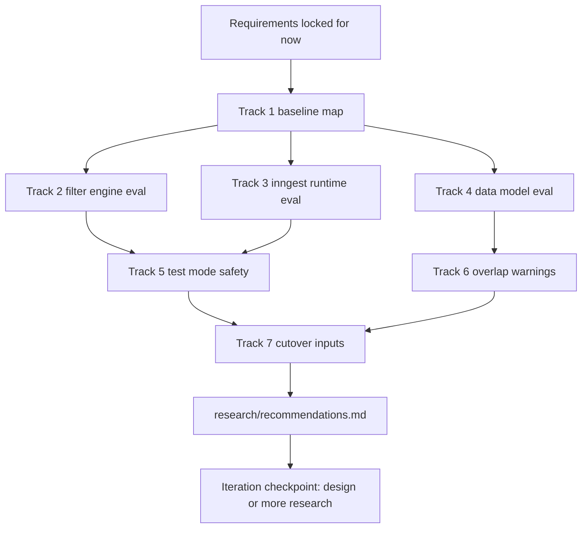

# Research Plan

## Why this is broader

This plan now covers not only external library checks, but also:
- current codebase impact mapping
- data model and runtime tradeoffs
- UI and testing mode implications
- migration and cutover risks
- operational and observability risks

## Goals

1. Validate high risk implementation decisions before design lock.
2. Reduce rework by confirming runtime and data model choices.
3. Produce concrete recommendations with clear v1 boundaries.

## Research Tracks

### Track 1: Repo Baseline and Gap Map

- Map current workflow engine touchpoints in API, DB, DTO, Inngest, and Admin UI.
- Identify all code paths that must be replaced or retired in big-bang cutover.
- Capture integration points that must remain stable (webhooks, run visibility, logger behavior).

Deliverable:
- `research/repo-baseline-and-gaps.md`

### Track 2: Filter Engine and Expression Model

- Compare `cel-js` versus custom parser/evaluator for trigger filters.
- Validate support for required semantics:
  - AND/OR/NOT
  - one-level grouping
  - operators and null checks
  - all appointment and client attributes
- Evaluate security and performance risks of evaluating admin-authored expressions.
- Define recommended persisted filter representation and validation strategy.

Deliverable:
- `research/filter-engine-cel-vs-custom.md`

### Track 3: Inngest Runtime and Pause Semantics

- Evaluate Inngest native capabilities for pause/resume and where app-level state is still required.
- Validate planner and delivery worker architecture against requirements:
  - cancel terminal behavior
  - reschedule re-planning
  - pause suppresses unsent deliveries
  - resume immediate re-planning
- Define idempotency key strategy and deterministic cancellation identity.

Deliverable:
- `research/inngest-runtime-and-pause.md`

### Track 4: Data Model and Retention Strategy

- Evaluate journey definitions, versioning, run history snapshot needs, and delete semantics.
- Validate run history preservation after journey hard delete.
- Define status model (`sent`, `failed`, `canceled`, `skipped`) and reason taxonomy.
- Evaluate query/index considerations for run timelines and test/live separation.

Deliverable:
- `research/data-model-and-retention.md`

### Track 5: Test Mode and Safety Controls

- Define how test-only state and test/live run separation should work end-to-end.
- Evaluate override requirements:
  - required for Email (and future SMS)
  - not required for Slack
- Validate auto-trigger behavior for test-only journeys and UI labeling strategy.

Deliverable:
- `research/test-mode-and-safety.md`

### Track 6: Overlap Detection and Publish-Time Warnings

- Define practical heuristic overlap detection at publish time only.
- Clarify expected false positives/false negatives and user messaging.
- Recommend minimal implementation that does not block publish.

Deliverable:
- `research/overlap-warning-strategy.md`

### Track 7: Migration and Cutover Plan Inputs

- Identify safest sequence for big-bang replacement with minimal broken windows.
- Confirm cleanup scope for legacy runtime modules.
- Capture rollout verification checklist needed before design and implementation plan.

Deliverable:
- `research/cutover-and-migration-inputs.md`

## Source Plan

External references to review and cite in research docs:
- `cel-js` repo: https://github.com/marcbachmann/cel-js
- Inngest pause docs: https://www.inngest.com/docs/guides/pause-functions
- Inngest function patterns/docs pages as needed during investigation

Internal references to cite:
- `PLAN.md`
- `specs/workflow-engine-rebuild-appointment-journeys/requirements.md`
- relevant source files discovered during baseline mapping

## Output Files

- `research/00-plan.md` (this file)
- `research/repo-baseline-and-gaps.md`
- `research/filter-engine-cel-vs-custom.md`
- `research/inngest-runtime-and-pause.md`
- `research/data-model-and-retention.md`
- `research/test-mode-and-safety.md`
- `research/overlap-warning-strategy.md`
- `research/cutover-and-migration-inputs.md`
- `research/recommendations.md`

## Check-in Plan

I will check in after:
1. Track 1 + Track 2 draft findings
2. Track 3 + Track 4 draft findings
3. Track 5 + Track 6 + Track 7 and final recommendations

## Research Flow Diagram

