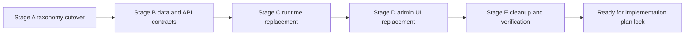

# Cutover and Migration Inputs

## Objective

Provide sequencing and verification inputs for a big-bang replacement from legacy workflow engine to appointment journeys.

## Constraints

- Big-bang replacement (no legacy compatibility requirement).
- No incremental DB migrations in this repo phase; update initial migration artifacts.
- Preserve webhook user-facing functionality with updated appointment taxonomy.

## Key Cutover Risks

1. Dual runtime paths accidentally active at once.
2. Event taxonomy partially updated (breaks fanout/webhooks).
3. UI payload contract mismatch during backend switch.
4. Data model mismatch for hard delete + keep history.

## Recommended Cutover Sequence

### Stage A: Taxonomy and event-source stabilization

1. Update appointment lifecycle taxonomy to scheduled/rescheduled/canceled.
2. Update appointment emit classification rules in service layer.
3. Update Inngest typing and fanout subscriptions.
4. Update Svix catalog sync to new canonical names and prune legacy names.

Exit checks:

- webhook catalog contains only new appointment lifecycle names
- fanout still works for non-appointment events

### Stage B: Data and contract replacement

1. Introduce journey DTO contracts (definition/version/run/delivery).
2. Replace DB schema artifacts for runtime model and history behavior.
3. Replace repository and service contracts.
4. Update API routes to journey contracts.

Exit checks:

- create/read/update/delete journey APIs work with new schema
- hard delete with history retention behavior is validated

### Stage C: Runtime replacement

1. Add planner function and internal schedule/cancel events.
2. Add delivery worker with sleepUntil and cancellation handling.
3. Add channel dispatch path for Email and Slack.
4. Remove legacy workflow runtime functions and services.

Exit checks:

- no active reference to `workflow/run.requested` runtime path
- reschedule and cancel semantics validated end-to-end

### Stage D: Admin UI replacement

1. Replace trigger config with journey trigger/filter UX.
2. Remove non-v1 node types and branch interactions.
3. Adapt runs panel to new run/delivery contract.
4. Add test/live and journey state filtering/labeling.

Exit checks:

- editor persists linear journey definitions only
- runs panel correctly reflects run and delivery statuses

### Stage E: Cleanup and hardening

1. Remove legacy workflow docs, tests, and unused modules.
2. Align docs and operational runbooks.
3. Run full quality gates and fix all failures.

Exit checks:

- format/lint/typecheck/test all green
- no legacy workflow runtime code path active

## Cutover Flow

## Verification Checklist Inputs

1. Event classification matrix:
   - create -> scheduled
   - reschedule -> rescheduled
   - cancel/delete -> terminal cancellation behavior

2. Runtime idempotency:
   - duplicate events do not duplicate active deliveries

3. Journey pause/resume:
   - pause cancels unsent deliveries
   - resume re-plans immediately

4. Test mode safety:
   - test/live separation visible
   - Email override required in test mode

5. Webhook continuity:
   - new appointment taxonomy present
   - non-appointment events unaffected

## Affected Wiring to Remove or Replace

- `apps/api/src/inngest/functions/workflow-domain-triggers.ts`
- `apps/api/src/inngest/functions/workflow-run-requested.ts`
- `apps/api/src/inngest/runtime-events.ts` (`workflow/run.*` events)
- `apps/api/src/services/workflow-domain-triggers.ts`
- `apps/api/src/services/workflow-run-requested.ts`
- `apps/api/src/services/workflow-trigger-registry.ts`
- `apps/api/src/services/workflow-trigger-orchestrator.ts`
- `apps/api/src/services/workflow-runtime/*`
- `apps/api/src/repositories/workflows.ts` (legacy execution shape)
- `packages/db/src/schema/index.ts` workflow runtime tables
- `apps/admin-ui/src/features/workflows/*` graph-only assumptions

## Sources

Internal:

- `PLAN.md`
- `specs/workflow-engine-rebuild-appointment-journeys/requirements.md`
- `specs/workflow-engine-rebuild-appointment-journeys/research/repo-baseline-and-gaps.md`
- `apps/api/src/inngest/functions/index.ts`
- `apps/api/src/routes/index.ts`
- `apps/api/src/inngest/runtime-events.ts`
- `apps/api/src/services/workflow-domain-triggers.ts`
- `apps/api/src/services/workflow-run-requested.ts`
- `apps/api/src/repositories/workflows.ts`
- `packages/db/src/schema/index.ts`

External:

- None required; this is internal cutover sequencing based on current architecture and requirements.
