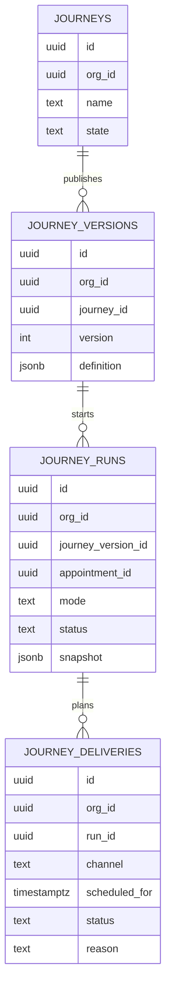

# Data Model and Retention Evaluation

## Objective

Define data model direction for journey definitions, runs, deliveries, and history retention based on locked requirements.

## Requirement Highlights Affecting Data Model

- Linear journeys only.
- Version-pinned runs.
- Hard delete journey definition.
- Auto-cancel active runs on delete.
- Keep run history queryable after journey delete.
- Separate test and live runs.
- No message limits in scope for this rebuild.

## Current Baseline Constraints

- Current model stores workflow graph in `workflows.graph` JSON.
- Executions and wait states reference workflow id with cascade behavior.
- Current delete cascade would remove execution-linked records.

This conflicts with new requirement to hard-delete definition while preserving history.

## Recommended Entity Model

1. `journeys`
   - current editable definition metadata
   - state: draft, published, paused, test_only

2. `journey_versions`
   - immutable published snapshots
   - each run references one version

3. `journey_runs`
   - one run per journey+appointment correlation instance
   - includes `mode` (`live` or `test`)
   - stores execution snapshot fields for historical display

4. `journey_deliveries`
   - each planned message send artifact
   - deterministic identity for idempotent planner behavior
   - status lifecycle and reason codes

5. `journey_run_events` (or folded into runs)
   - optional timeline events for observability

## Relationship Strategy for Delete + History

To satisfy "hard delete journey but keep history":

- Do not require strict cascading FK from historical runs to active journey row.
- Store historical snapshot fields on run records:
  - journey name at run start
  - version number/id
  - trigger filter summary
  - step summary used by run
- On journey delete:
  - cancel active pending deliveries
  - hard-delete `journeys` and unpublished draft artifacts
  - preserve `journey_runs` and `journey_deliveries` history rows

## Status Model Recommendation

External delivery statuses (as requested):

- `sent`
- `failed`
- `canceled`
- `skipped`

Recommended reason taxonomy (non-exhaustive):

- `appointment_canceled`
- `appointment_deleted`
- `journey_paused`
- `reschedule_replaced`
- `past_due`
- `filter_no_match`
- `manual_cancel`

## Test/Live Separation

Use explicit mode field on run and delivery rows:

- `mode = live | test`

Benefits:

- clear UI labeling
- separate filtering and reporting
- safe handling of override behavior

## Idempotency and Uniqueness

Recommended uniqueness keys:

1. Run identity:
   - unique on `(org_id, journey_version_id, appointment_id, mode)` with replay-safe semantics

2. Delivery identity:
   - unique deterministic key derived from run, step, and computed schedule context

3. Cancellation identity:
   - cancellation event matches deterministic `delivery_id`

## Query and Index Considerations

Minimum indexes:

- runs by `(org_id, journey_id, started_at desc)`
- runs by `(org_id, mode, started_at desc)`
- deliveries by `(org_id, run_id, status, scheduled_for)`
- deliveries by `(org_id, status, scheduled_for)` for pending processing visibility

## Retention Policy

- Current decision: keep run and delivery history indefinitely.
- Record as future TODO to add configurable retention later.

## Out of Scope Note

Message limits and counters are explicitly out of scope for this rebuild, so no limit tables are required in v1 schema.

## Model Diagram

## Sources

Internal:

- `packages/db/src/schema/index.ts`
- `packages/db/src/relations.ts`
- `apps/api/src/repositories/workflows.ts`
- `apps/api/src/services/workflows.ts`
- `apps/api/src/services/workflow-execution-events.ts`
- `specs/workflow-engine-rebuild-appointment-journeys/requirements.md`

External:

- PostgreSQL schema/index and lifecycle behaviors are informed by current repo patterns, no external standard required for this specific recommendation.
