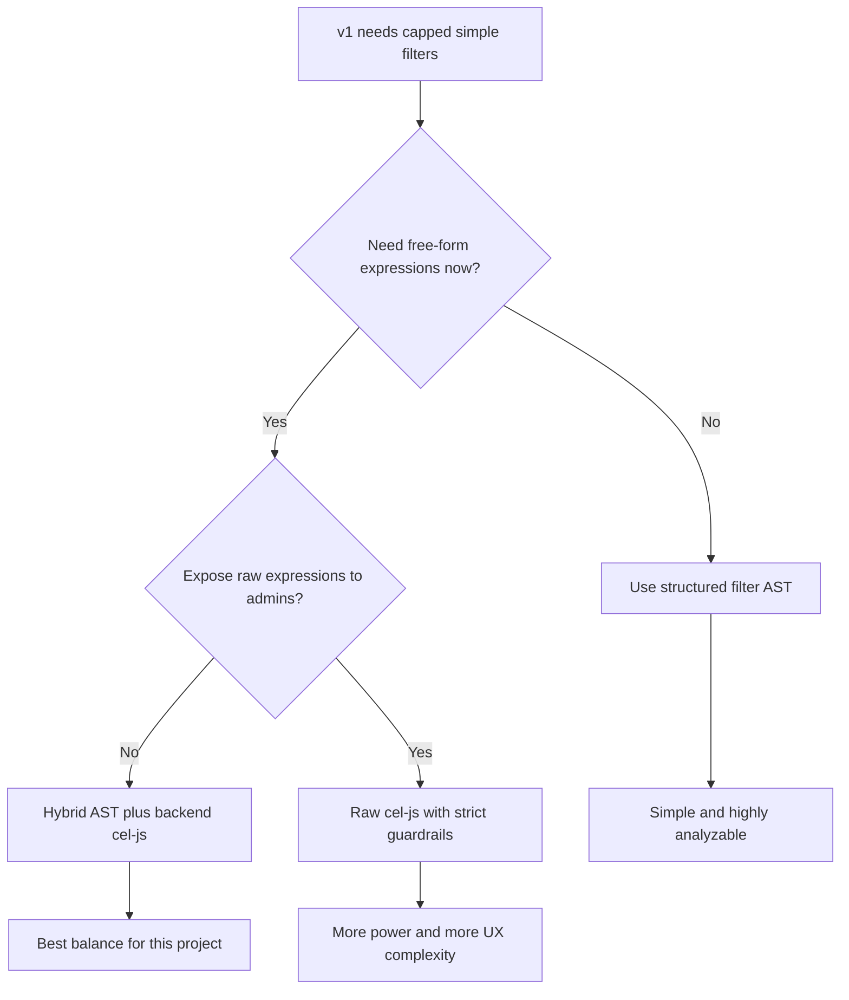

# Filter Engine Evaluation: cel-js vs Custom

## Objective

Evaluate whether v1 journey trigger filters should use `@marcbachmann/cel-js` or a custom implementation.

## v1 Requirement Fit Targets

From requirements collected so far:

- Support AND/OR/NOT logic with one nesting level.
- Support all appointment and client attributes.
- Support comparison operators and null checks.
- Enforce caps (12 conditions, 4 groups).
- Re-evaluate filters on reschedule.
- Keep configuration complexity low.
- Support publish-time overlap warnings (warning only).

## Current Repo Baseline

- Trigger config is event-routing based, not expression-filter based.
- Existing expression handling is action-level and uses a custom limited parser in runtime.
- Existing trigger UI has no expression authoring model for predicate logic.

This means any filter engine choice requires a new trigger filter contract and validation path.

## Option A: cel-js

What it gives:

- Mature CEL expression parser/evaluator in JS.
- Type-aware environment model (`Environment`) with parse/check/evaluate flow.
- Parse-time structural limits and reusable compiled expressions.
- Rich operator and function surface.

Strengths for this project:

- Avoids maintaining a custom parser grammar.
- Strong long-term flexibility if expression needs grow.
- Can centralize filter validation and runtime evaluation.

Risks for this v1:

- Free-form expressions are more power than required for capped one-level filters.
- Needs strict environment hardening to avoid exposing unsafe or confusing semantics.
- Harder overlap warning analysis from arbitrary text expressions.
- Additional UX complexity if admins must author CEL directly.

## Option B: Custom Parser (text expression)

What it gives:

- Full control over language and semantics.
- Potentially narrow grammar tailored to product needs.

Strengths:

- Can enforce strict simplicity in syntax and semantics.

Risks:

- High maintenance cost over time.
- High correctness risk (tokenization, precedence, null semantics, dates, types).
- Existing custom parser already shows limited grammar and mismatch risk.
- Slower to stabilize than using a proven engine.

## Option C: Structured Filter AST (No Text Parser)

This is a practical custom approach distinct from writing a parser.

- Persist structured rule JSON from the UI (groups + conditions + operator enums).
- Evaluate via deterministic server-side evaluator (no free-form text parsing).
- Keep CEL optional for future advanced mode.

Strengths:

- Best fit for one-level nesting and hard caps.
- Easiest overlap warning analysis at publish time.
- Strongest control over admin UX simplicity.
- Lower ambiguity in validation and error messaging.

Risks:

- Less flexible for advanced logic until expanded.

## Option D: Hybrid (Structured AST authoring + cel-js backend evaluation)

This aligns with the user preference to avoid exposing raw expressions in UI while still leveraging `cel-js` in backend execution.

- UI stores a structured filter AST.
- Backend compiles AST to constrained CEL expression (or directly to evaluator input) and evaluates with `cel-js`.
- Admins never author CEL text directly.

Strengths:

- Preserves simple UX and analyzable structure.
- Reduces custom evaluator logic burden.
- Keeps CEL power internal for future expansion.

Risks:

- Adds translation layer (AST -> CEL) that must be deterministic and tested.
- Requires strict backend guardrails to keep CEL runtime safe and bounded.

## Comparison Summary

| Criteria | cel-js raw | Custom text parser | Structured AST | Hybrid AST + cel-js |
|---|---|---|---|---|
| Time to stable v1 | Medium | High | Low-Medium | Medium |
| Maintains low config complexity | Medium-Low | Medium | High | High |
| Long-term flexibility | High | Medium | Medium | High |
| Runtime safety control | Medium-High | Medium | High | High |
| Overlap warning analyzability | Low-Medium | Medium | High | High |
| Maintenance burden | Medium | High | Low-Medium | Medium |

## Recommendation

Recommended for v1: **Hybrid AST + cel-js backend evaluation**.

Reason:

- It keeps admin UX simple by avoiding raw expression authoring.
- It uses `cel-js` where it helps most: backend validation/evaluation and future expansion.
- It preserves structured filters for overlap warnings, caps, and deterministic behavior.

Secondary recommendation:

- If delivery timeline pressure is high, start with pure structured AST evaluator and add CEL backend translation in a follow-up.

## If CEL Is Chosen Anyway (Guardrails)

If the team wants CEL in v1 despite the recommendation above, require:

1. Locked variable namespace for appointment/client fields only.
2. Disabled or tightly controlled custom functions/macros.
3. Parse/check at publish time, not only at runtime.
4. Compile cache keyed by journey version.
5. Structural limits (`maxAstNodes`, `maxDepth`, etc.) enforced.
6. Clear error mapping from CEL errors to friendly admin messages.

## Decision Flow

## Sources

External:

- cel-js README: https://github.com/marcbachmann/cel-js
- cel-js raw README content: https://raw.githubusercontent.com/marcbachmann/cel-js/main/README.md
- CEL spec reference linked by cel-js: https://github.com/google/cel-spec

Internal:

- `packages/dto/src/schemas/workflow-graph.ts`
- `apps/api/src/services/workflow-trigger-registry.ts`
- `apps/api/src/services/workflow-run-requested.ts`
- `apps/api/src/services/workflow-runtime/action-executors.ts`
- `apps/admin-ui/src/features/workflows/workflow-trigger-config.tsx`
- `apps/admin-ui/src/features/workflows/config/expression-input.tsx`
- `apps/admin-ui/src/features/workflows/config/action-config-renderer.tsx`
- `apps/admin-ui/src/features/workflows/config/event-attribute-suggestions.ts`
