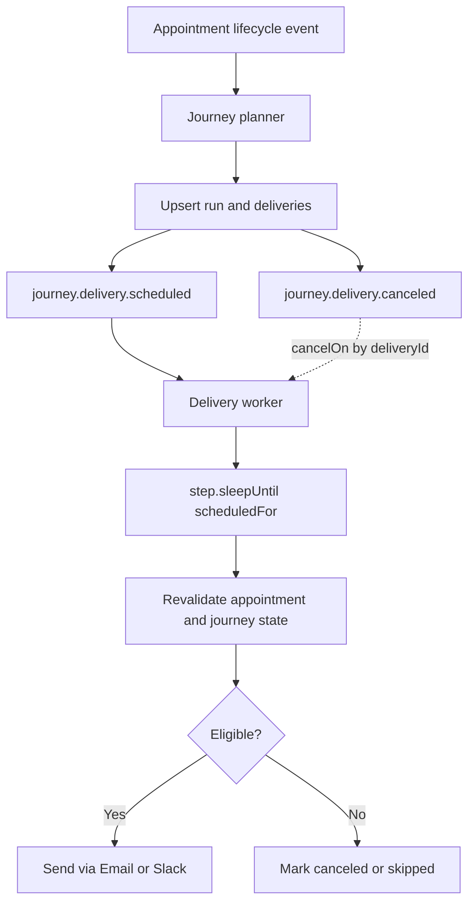

# Inngest Runtime and Pause Evaluation

## Objective

Evaluate Inngest capabilities against v1 journey runtime requirements, especially pause/resume behavior.

## Requirements to Satisfy

- Planner + delivery worker architecture.
- Delivery waits until scheduled time.
- Delivery cancellation on appointment cancel/delete and journey pause.
- Journey pause suppresses/cancels unsent deliveries.
- Journey resume immediately re-plans eligible future deliveries.
- Version-pinned runs.

## Relevant Inngest Capabilities

1. Function-level cancellation rules (`cancel` / `cancelOn`) can stop runs based on matching events.
2. `step.sleep` and `step.sleepUntil` support durable waits for delayed execution.
3. Platform function pausing exists in Inngest Cloud dashboard.
4. Paused-function events are skipped and not replayed automatically after resume.

## Fit Analysis

### Good fit

- Delivery worker can use `step.sleepUntil` for exact send times.
- Delivery worker can use cancellation matching on internal cancel events by delivery identity.
- Planner and worker model matches event-driven durable execution style.

### Partial or poor fit

- Inngest platform pause is function-wide, not entity-scoped (not per journey id).
- Paused events are not reprocessed automatically; replay is a separate operation.
- Journey-level pause/resume semantics require app-level state transitions and selective re-planning.

Conclusion:

- Use Inngest platform pause as an operational emergency control only.
- Do not use platform pause as product-level journey pause/resume implementation.

## Recommended v1 Runtime Semantics

1. Planner triggers:
   - appointment lifecycle events (`scheduled`, `rescheduled`, `canceled`)
   - journey control events (pause, resume, publish, delete)

2. Delivery scheduling:
   - planner emits `journey.delivery.scheduled` with deterministic `deliveryId`.
   - worker sleeps until `scheduledFor`.

3. Cancellation:
   - planner emits `journey.delivery.canceled` for obsolete deliveries.
   - worker cancellation matches by `deliveryId`.

4. Pause behavior:
   - pause action emits cancel events for all pending unsent deliveries for that journey.
   - canceled delivery reason: `journey_paused`.

5. Resume behavior:
   - resume emits a planner request for immediate re-planning of active runs.
   - re-planning uses current appointment state/time/timezone and trigger filters.

6. Terminal behavior:
   - appointment cancel/delete terminates run delivery progression.
   - pending unsent deliveries are canceled.

## Runtime Flow

## Design Implications

- Planner must be idempotent per run and per step schedule.
- Delivery identity must be deterministic across reschedule churn.
- Journey pause/resume requires explicit journey state in app DB.
- Inngest pause UI can be documented as break-glass operational control.

## Sources

External:

- Inngest pause functions guide: https://www.inngest.com/docs/guides/pause-functions
- Inngest step sleep docs: https://www.inngest.com/docs/features/inngest-functions/steps-workflows/sleeps
- Inngest step sleepUntil reference: https://www.inngest.com/docs/reference/functions/step-sleep-until
- Inngest cancellation docs/examples: https://context7.com/inngest/inngest/llms.txt

Internal:

- `apps/api/src/inngest/functions/workflow-run-requested.ts`
- `apps/api/src/inngest/functions/workflow-domain-triggers.ts`
- `apps/api/src/inngest/runtime-events.ts`
- `apps/api/src/services/workflow-domain-triggers.ts`
- `apps/api/src/services/workflow-run-requested.ts`
- `specs/workflow-engine-rebuild-appointment-journeys/requirements.md`
