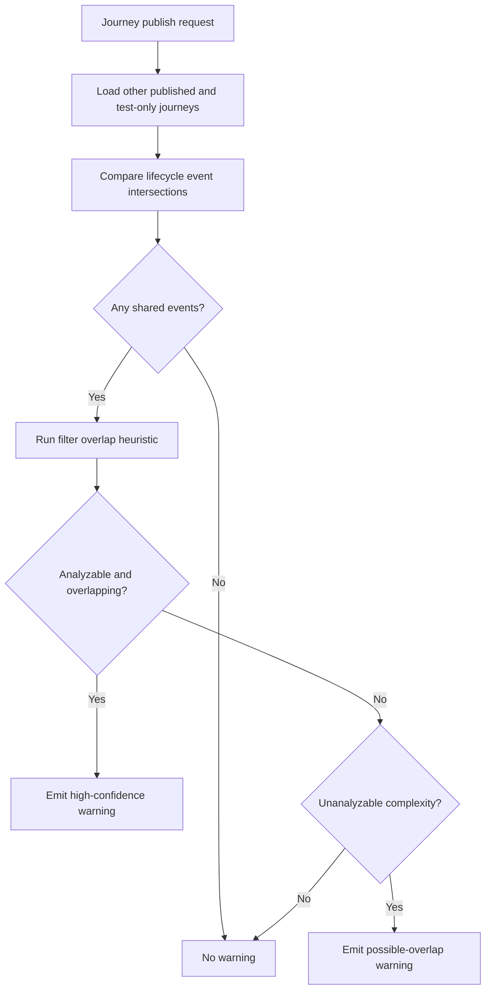

# Overlap Warning Strategy (Publish-Time, Warning-Only)

## Objective

Define a practical v1 approach for warning admins about overlapping journey triggers, without blocking publish.

## Requirement Constraints

- Warning-only (no publish block).
- Evaluate at publish time.
- Best-effort heuristic is acceptable.
- Filters support AND/OR/NOT with one nesting level.

## Current Baseline

Current UI only warns about overlap inside a single trigger config for shared start/restart/stop event selections. There is no cross-workflow overlap detection.

## What Overlap Means in v1

For this rebuild, overlap warning should focus on trigger overlap, not message content equality.

A warning candidate exists when:

1. Two published/test-only journeys both listen to the same lifecycle event class, and
2. Their trigger filters can match at least some common appointment population.

## Recommended Heuristic Model

### Step 1: Fast event overlap check

- Compare event sets (`scheduled`, `rescheduled`, `canceled`).
- If no event intersection, no warning.

### Step 2: Filter analyzability classification

Classify each filter expression into:

- analyzable subset (field/operator/value combinations in supported dimensions)
- complex/unknown subset (advanced conditions that exceed heuristic analyzer)

### Step 3: Subset intersection test

For analyzable filters, estimate overlap on high-signal dimensions:

- `calendarId`
- `appointmentTypeId`
- `locationId`
- `providerId` (if present)

Rule of thumb:

- if either side is wildcard for a dimension, treat as overlap-possible for that dimension
- if both sides have explicit disjoint sets for any mandatory dimension, treat as non-overlap
- otherwise treat as overlap-possible

### Step 4: Unknown complexity warning

If either filter is not analyzable in heuristic subset, emit a softer warning:

- "Potential overlap could not be fully analyzed due to advanced filter conditions."

## Why structured AST matters

This strategy depends on structural filter data, not raw expression text. If backend uses CEL, keep AST as canonical source for warning analysis and compile AST to CEL only for evaluation.

## Warning Output Recommendation

At publish-time, show grouped warnings with:

- overlapping journey names
- overlapping event types
- overlap confidence (`high`, `possible`, `unknown`)
- short reason (for example: "shared appointmentTypeId set")

No hard block is applied.

## Detection Flow

## Known Limitations

- False positives are expected and acceptable in v1.
- Some true overlaps will be missed for advanced condition combinations.
- This does not dedupe execution or delivery behavior; it only informs admins.

## Sources

Internal:

- `apps/admin-ui/src/features/workflows/workflow-trigger-config.tsx`
- `specs/workflow-engine-rebuild-appointment-journeys/requirements.md`
- `specs/workflow-engine-rebuild-appointment-journeys/research/filter-engine-cel-vs-custom.md`

External:

- None required for this topic; strategy is product-policy and system-design driven.
