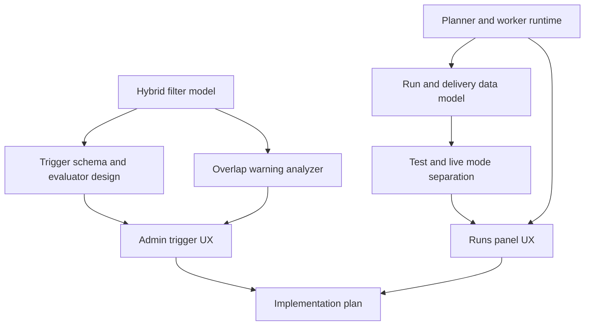

# Research Recommendations

## Executive Summary

The rebuild should proceed as a full replacement with:

- appointment lifecycle taxonomy cutover first
- journey-first planner/worker runtime
- hybrid filter approach (structured UI filters, backend `cel-js` evaluation)
- explicit test/live mode separation
- publish-time warning-only overlap detection

This best matches the requirement priority of reduced configuration complexity while still allowing strong backend evaluation capabilities.

## Final Recommendations by Topic

## 1) Filter engine direction

Recommendation:

- Use **hybrid AST + `cel-js` backend evaluation**.

Why:

- Keeps UI simple and structured (no raw expressions exposed).
- Allows backend type-aware validation and evaluation.
- Keeps overlap-warning analysis feasible using AST.

Implementation note:

- Keep AST as canonical persisted representation.
- Compile AST to constrained CEL only in backend evaluation layer.

## 2) Inngest runtime and pause semantics

Recommendation:

- Use Inngest for planner and delivery worker runtime.
- Implement journey pause/resume in app-level state and planner logic.
- Treat Inngest platform pause as operational control, not product behavior.

Why:

- Platform pause is function-level and not per-journey.
- Paused events are skipped and require replay, which does not match product resume semantics.

## 3) Data model and history behavior

Recommendation:

- Introduce journey definitions, immutable journey versions, runs, and deliveries.
- Preserve run history after hard deleting journey definition by storing run snapshots.

Why:

- Satisfies version-pinned run requirement and delete-plus-history requirement.

## 4) Test mode and safety

Recommendation:

- Introduce explicit `mode = test|live` for runs and deliveries.
- Add `test_only` journey state.
- Require Email (and future SMS) destination overrides in test mode.
- Do not require Slack override in v1.

Why:

- Meets safety requirements while keeping behavior predictable.

## 5) Overlap warnings

Recommendation:

- Publish-time, warning-only heuristic detection.
- Use structural filter analysis on high-signal dimensions.
- Emit confidence-based warnings, no hard block.

Why:

- Matches requirement for best-effort, non-blocking guidance.

## 6) Cutover approach

Recommendation:

- Execute staged big-bang cutover:
  1. taxonomy
  2. data and API contracts
  3. runtime
  4. admin UI
  5. cleanup and gates

Why:

- Reduces risk of partial migration breakage and keeps validation checkpoints clear.

## Open Decisions and Clarifications Needed Before Design Lock

These are not blockers, but should be explicitly confirmed in design:

1. Final reason-code taxonomy for `skipped` vs `canceled` in delivery outcomes.
2. Exact override input model for Email test destinations (single address vs list).
3. Whether to keep temporary compatibility handling for old `dryRun` API callers during internal transition.

## Recommendation Dependency Map

## Source Index

Research docs:

- `research/repo-baseline-and-gaps.md`
- `research/filter-engine-cel-vs-custom.md`
- `research/inngest-runtime-and-pause.md`
- `research/data-model-and-retention.md`
- `research/test-mode-and-safety.md`
- `research/overlap-warning-strategy.md`
- `research/cutover-and-migration-inputs.md`

Primary external references:

- cel-js: https://github.com/marcbachmann/cel-js
- Inngest pause: https://www.inngest.com/docs/guides/pause-functions
- Inngest step sleepUntil: https://www.inngest.com/docs/reference/functions/step-sleep-until
