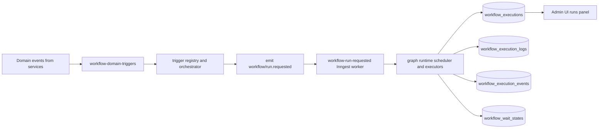

# Repo Baseline and Gap Map

## Objective

Map the current workflow engine footprint and identify what must change for the appointment-journey big-bang rebuild.

## Current System Baseline

The current implementation is a generic event-driven graph runtime:

- Trigger ingest and orchestration are handled by workflow trigger services.
- Execution is driven by a graph runtime with action executors and wait-state persistence.
- Inngest transport uses internal `workflow/run.requested` and `workflow/run.cancel.requested` events.
- Admin UI is a React Flow graph editor with trigger and action node config UIs.
- Persistence is spread across workflow definition, execution, logs, events, and wait-state tables.

## High-Impact Coupling Points

1. Event taxonomy coupling:
   - Domain-event typing is tied to webhook event typing.
   - Appointment event rename ripples through emitters, Inngest subscribers, fanout, and Svix catalog sync.

2. Runtime model coupling:
   - API service and UI contracts assume serialized graph structure and branch-capable actions.
   - Current runtime semantics are not linear-journey-native.

3. Storage model coupling:
   - Existing DB constraints and indexes are tuned for workflow executions and wait states.
   - Rebuild requires new deterministic uniqueness and cancellation identity for deliveries.

4. UI contract coupling:
   - Builder and runs panel depend on workflow graph and execution-specific API shapes.
   - Backend cutover requires synchronized UI contract replacement.

## Gap Matrix (Current -> Target)

| Area | Current | Target | Gap |
|---|---|---|---|
| Trigger model | Generic domain trigger routing | Appointment lifecycle journey trigger + filters | Replace trigger config schema and evaluator |
| Runtime | Graph scheduler/executors | Planner + delivery worker | Replace runtime modules and internal events |
| Storage | Workflow execution tables | Journey run and delivery model | Replace tables, relations, and indexes |
| UI builder | Graph editor with extra node types | Linear journey builder | Remove non-v1 actions and branch behavior |
| Runs observability | Workflow execution-centric | Journey run/delivery-centric | Adapt runs panel and status model |
| Taxonomy | Appointment created/updated/deleted patterns | Appointment scheduled/rescheduled/canceled | Update emitters, DTOs, fanout, webhook catalog |

## Replace or Retire Checklist

1. Replace workflow DTO contracts with journey-specific definition and run contracts.
2. Replace workflow API service/repository contracts with journey contracts.
3. Retire legacy graph runtime services and workflow Inngest functions.
4. Replace internal runtime events from `workflow/run.*` to journey delivery events.
5. Replace workflow DB runtime artifacts with journey artifacts.
6. Cut appointment lifecycle emitters to scheduled/rescheduled/canceled semantics.
7. Keep webhooks functional while updating appointment taxonomy names.
8. Replace admin graph builder UX with linear journey UX.
9. Replace workflow tests/docs with journey runtime tests/docs.
10. Verify no route/nav/runtime path still references legacy workflow engine code.

## Risk Notes

- Partial taxonomy migration can silently break fanout/webhooks.
- Partial runtime migration can leave duplicate processing paths alive.
- Partial UI migration can cause schema mismatch and data loss in editor payloads.
- Missing deterministic delivery identity can cause duplicate sends during reschedule churn.

## Sources

Internal code and docs reviewed:

- `apps/api/src/services/workflows.ts`
- `apps/api/src/services/workflow-domain-triggers.ts`
- `apps/api/src/services/workflow-trigger-registry.ts`
- `apps/api/src/services/workflow-trigger-orchestrator.ts`
- `apps/api/src/services/workflow-run-requested.ts`
- `apps/api/src/inngest/functions/workflow-domain-triggers.ts`
- `apps/api/src/inngest/functions/workflow-run-requested.ts`
- `apps/api/src/inngest/runtime-events.ts`
- `apps/api/src/repositories/workflows.ts`
- `apps/api/src/routes/workflows.ts`
- `apps/api/src/services/appointments.ts`
- `apps/api/src/services/jobs/emitter.ts`
- `apps/api/src/inngest/functions/integration-fanout.ts`
- `apps/api/src/services/svix-event-catalog.ts`
- `packages/dto/src/schemas/workflow.ts`
- `packages/dto/src/schemas/workflow-graph.ts`
- `packages/dto/src/schemas/domain-event.ts`
- `packages/dto/src/schemas/webhook.ts`
- `packages/db/src/schema/index.ts`
- `packages/db/src/relations.ts`
- `packages/db/src/migrations/20260208064434_init/migration.sql`
- `apps/admin-ui/src/features/workflows/*`
- `docs/guides/workflow-engine-domain-events.md`
- `docs/guides/workflow-execution-lifecycle.md`
- `PLAN.md`
- `specs/workflow-engine-rebuild-appointment-journeys/requirements.md`
