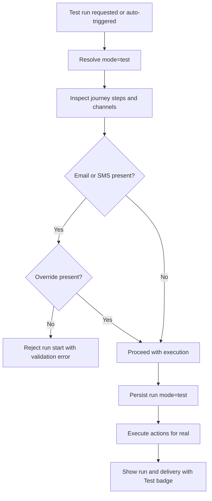

# Test Mode and Safety Evaluation

## Objective

Define a safe and simple v1 testing model that matches requirements:

- end-to-end workflow testing with real data and real action execution
- clear separation of test and live runs
- required destination overrides for Email (and future SMS), no required override for Slack
- test-only journey state with clear UI labeling

## Current Baseline

Current workflow system supports manual execution and a `dryRun` flag:

- execute endpoint accepts `dryRun`.
- UI exposes `Run` and `Dry run`.
- execution samples are generated from existing records.

But current dry run does not satisfy the requested test mode:

- dry run marks execution success without real delivery behavior.
- there is no test-only journey state.
- there is no run `mode` separation (`test` vs `live`).
- there is no destination override safety control.

## Gap to Required Behavior

| Requirement | Current | Gap |
|---|---|---|
| Real action execution in tests | Dry run simulation exists | Need true test execution mode |
| Test-only journey state | Not present | Add journey state |
| Test/live separation | `isDryRun` only | Add explicit mode and UI filters |
| Destination override safety | Not present | Add required Email override checks |
| Auto-trigger test-only runs | Not present | Add planner behavior for test-only state |

## Recommended v1 Model

### 1) Execution mode

- Replace `dryRun` as the primary concept with `mode`:
  - `live`
  - `test`

- Keep backward-compatible API handling only during transition if needed internally, but target contract should be explicit `mode`.

### 2) Test-only journey state

- Journey state set includes:
  - `draft`
  - `published`
  - `paused`
  - `test_only`

- `test_only` journeys auto-trigger from lifecycle events, but all resulting runs are marked `mode=test`.

### 3) Destination override policy

- Required for client-facing channels:
  - Email: required in v1
  - SMS: required when SMS exists (future)

- Not required for Slack in v1.

- Run start must fail fast with clear error if required test override is missing for a step that uses a required channel.

### 4) UI and observability

- Show prominent `Test` badge on journey cards and detail headers.
- Show `mode` badge per run and delivery row.
- Provide list filters for mode and state.

### 5) Appointment selection for manual test start

- Manual test start should choose an existing appointment, as requested.
- Auto-trigger test-only runs should still use real lifecycle events.

## Safety Flow

## Design Notes

- Because limits are out of scope, no separate rate-limit behavior is required for test mode in this rebuild.
- Test mode still needs full logs/events and clear labeling to avoid confusion in operations.
- Required override validation should happen at run planning time and again right before send for defense in depth.

## Sources

Internal:

- `packages/dto/src/schemas/workflow.ts`
- `apps/api/src/routes/workflows.ts`
- `apps/api/src/services/workflows.ts`
- `apps/admin-ui/src/routes/_authenticated/workflows/$workflowId.tsx`
- `apps/admin-ui/src/features/workflows/workflow-toolbar.tsx`
- `apps/api/src/services/integrations/app-managed.ts`
- `specs/workflow-engine-rebuild-appointment-journeys/requirements.md`

External:

- None required for this topic; this evaluation is based on project requirements and current implementation.
